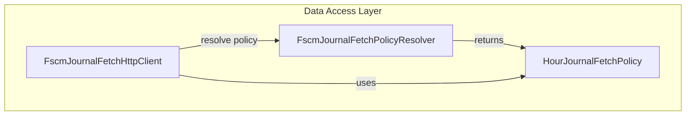

# Hour Journal Fetch Policy Feature Documentation

## Overview

The **HourJournalFetchPolicy** class defines OData metadata and mapping rules for fetching hour-based journal entries from FSCM. It specifies which entity set and fields to select, and how to extract hours and unit price values.

This policy integrates with the journal fetch client to normalize hour journal data. It enables the orchestrator to retrieve and interpret hour entries consistently across FSCM environments.

## Architecture Overview



## Component Structure

### 3. Data Access Layer

#### **HourJournalFetchPolicy** (`src/Rpc.AIS.Accrual.Orchestrator.Infrastructure/Adapters/Fscm/Clients/FscmJournalPolicies/HourJournalFetchPolicy.cs`)

- **Purpose and Responsibilities**- Encapsulates OData query configuration for hour journals.
- Maps JSON rows into quantity and unit price values.
- Supports fallback parsing of different field names.

- **Key Properties**- `JournalType`- Type: `JournalType`
- Returns `JournalType.Hour`.
- `EntitySet`- Type: `string`
- Returns `"JournalTrans"`.
- `Select`- Type: `string`
- Comma-separated list of OData fields to retrieve:- `RPCWorkOrderGuid`
- `RPCWorkOrderLineGuid`
- `ProjectID`
- `Hours`
- `SalesPrice`
- `LineProperty`
- `DimensionDisplayValue`
- `ProjectDate`

- **Key Methods**- `GetQuantity(JsonElement row)`- Type: `decimal`
- Extracts hours from `"Hours"`, `"Qty"`, or `"Quantity"`.
- Returns `0m` if all fields are missing.
- `GetUnitPrice(JsonElement row)`- Type: `decimal?`
- Extracts unit price from `"SalesPrice"` or `"ProjectSalesPrice"`.

```csharp
public override decimal GetQuantity(JsonElement row);
public override decimal? GetUnitPrice(JsonElement row);
```

## Integration Points

- **FscmJournalFetchHttpClient**- Invokes `PolicyResolver.Resolve(JournalType.Hour)` to obtain this policy.
- Uses `EntitySet` and `Select` to build OData queries.
- Calls `GetQuantity` and `GetUnitPrice` for each JSON row.

- **FscmJournalFetchPolicyResolver**- Registers all `IFscmJournalFetchPolicy` implementations.
- Throws if no policy matches `JournalType.Hour`.

## Key Classes Reference

| Class | Location | Responsibility |
| --- | --- | --- |
| HourJournalFetchPolicy | src/.../FscmJournalPolicies/HourJournalFetchPolicy.cs | Defines OData mapping for hour journal entries |
| FscmJournalFetchPolicyBase | src/.../FscmJournalPolicies/FscmJournalFetchPolicyBase.cs | Provides shared select fallback and decimal parsing |
| IFscmJournalFetchPolicy | src/.../FscmJournalPolicies/IFscmJournalFetchPolicy.cs | Interface for journal fetch policies |


## Dependencies

- **Namespace Imports**- `System.Text.Json` (for `JsonElement`)
- `Rpc.AIS.Accrual.Orchestrator.Core.Domain` (for `JournalType`)
- **Base Classes & Interfaces**- Inherits from `FscmJournalFetchPolicyBase`
- Implements `IFscmJournalFetchPolicy`

## Integration Points

- Registered via DI in `Program.cs` under HTTP client “fscm-journal-fetch”
- Consumed by any component needing hour journal history, such as accrual orchestrator services.