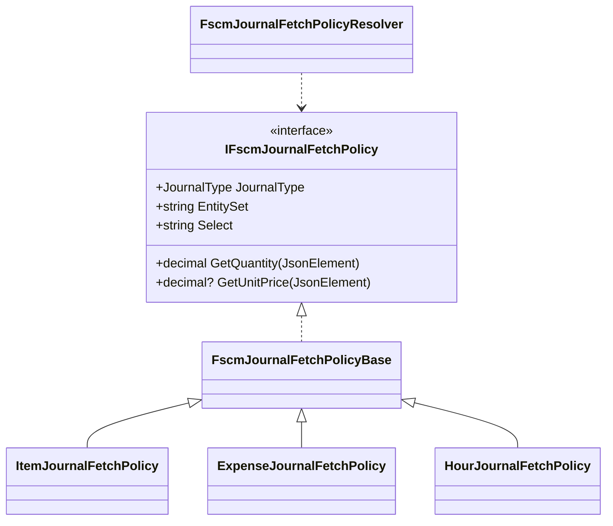

# FSCM Journal Fetch Policy Interface

## Overview

The `IFscmJournalFetchPolicy` interface defines a contract for mapping **FSCM** (Finance and Supply Chain Management) OData journal entities to a normalized form. It encapsulates:

- **Metadata**: Specifies the OData entity set and the `$select` query fields.
- **Mapping Rules**: Extracts the core values—**quantity** and **unit price**—from each returned JSON row.

By implementing this interface for each journal type, the codebase eliminates cumbersome type‐switch logic in the HTTP fetch client and adheres to the  (OCP) .

## Interface Definition

```csharp
namespace Rpc.AIS.Accrual.Orchestrator.Infrastructure.Clients.FscmJournalPolicies;

using System.Text.Json;
using Rpc.AIS.Accrual.Orchestrator.Core.Domain;

/// <summary>
/// Journal-type specific FSCM OData metadata and mapping rules for journal history fetch.
/// OCP: eliminates journal-type switches in FscmJournalFetchHttpClient.
/// </summary>
public interface IFscmJournalFetchPolicy
{
    /// <summary>Journal type this policy applies to.</summary>
    JournalType JournalType { get; }

    /// <summary>FSCM OData entity set (e.g., JournalTrans).</summary>
    string EntitySet { get; }

    /// <summary>Comma-separated $select list.</summary>
    string Select { get; }

    /// <summary>
    /// Extracts the quantity/hours for this journal type.
    /// Must return a non-null value (0 if missing).
    /// </summary>
    decimal GetQuantity(JsonElement row);

    /// <summary>Extracts the unit price for this journal type (nullable).</summary>
    decimal? GetUnitPrice(JsonElement row);
}
```

## Interface Members

| Member | Type | Description |
| --- | --- | --- |
| JournalType | `JournalType` | Identifies the journal category (Item, Expense, Hour) |
| EntitySet | `string` | OData entity set name to query |
| Select | `string` | Fields to `$select` in the OData call |
| GetQuantity() | `decimal GetQuantity(JsonElement row)` | Parses and returns the quantity or hours from a JSON element |
| GetUnitPrice() | `decimal? GetUnitPrice(JsonElement row)` | Parses and returns the unit price (nullable) from a JSON element |


## Policy Hierarchy

### FscmJournalFetchPolicyBase

An abstract base with shared helpers and a **fallback** `$select` mechanism for missing fields .

```csharp
public abstract class FscmJournalFetchPolicyBase : IFscmJournalFetchPolicy
{
    public abstract JournalType JournalType { get; }
    public abstract string EntitySet { get; }
    public abstract string Select { get; }

    /// <summary>
    /// Optional fallback $select when primary fields are unavailable.
    /// Defaults to <see cref="Select"/>.
    /// </summary>
    public virtual string SelectFallback => Select;

    public abstract decimal GetQuantity(JsonElement row);
    public abstract decimal? GetUnitPrice(JsonElement row);

    protected static decimal? TryGetDecimal(JsonElement obj, string propName) { /* ... */ }
}
```

Key responsibilities:

- Defines core members.
- Provides `SelectFallback` to retry with fewer fields on OData errors.
- Supplies `TryGetDecimal` helper for robust numeric parsing.

## Concrete Implementations

Each sealed class targets one `JournalType`, specifying its entity set, `$select` list, and parsing logic.

| Class | JournalType | EntitySet |
| --- | --- | --- |
| **ItemJournalFetchPolicy** | Item | ProjectItemJournalTrans |
| **ExpenseJournalFetchPolicy** | Expense | ExpenseJournalLines |
| **HourJournalFetchPolicy** | Hour | JournalTrans |


### ItemJournalFetchPolicy 📦

- **JournalType**: `JournalType.Item`
- **EntitySet**: `"ProjectItemJournalTrans"`
- **Select**: Comma-separated fields including `Quantity`, `ProjectSalesPrice`, optional amounts, and dimensions.
- **SelectFallback**: Omits `RPCFSAMarkupAmt` if metadata lacks it.
- **GetQuantity**: Reads `"Quantity"` or `"Qty"`.
- **GetUnitPrice**: Normalizes between `ProjectSalesPrice` and extended `Amount`.

### ExpenseJournalFetchPolicy 💸

- **JournalType**: `JournalType.Expense`
- **EntitySet**: `"ExpenseJournalLines"`
- **Select**: Fields like `ProjectSalesPrice`, `RPCFSAUnitPrice`, `DimensionDisplayValue`, etc.
- **SelectFallback**: Removes optional fields (`ProjectCategory`, warehouse/site IDs, markup).
- **GetQuantity**: Reads `"Quantity"` or `"Qty"`.
- **GetUnitPrice**: Mirrors Item’s normalization logic.

### HourJournalFetchPolicy ⏱️

- **JournalType**: `JournalType.Hour`
- **EntitySet**: `"JournalTrans"`
- **Select**: Includes `"Hours"`, `"SalesPrice"`, date and dimension fields.
- **GetQuantity**: Checks `"Hours"`, `"Qty"`, then `"Quantity"`.
- **GetUnitPrice**: Reads `"SalesPrice"` or `"ProjectSalesPrice"`.

## Policy Resolver

The `FscmJournalFetchPolicyResolver` registers all `IFscmJournalFetchPolicy` instances in DI and resolves by `JournalType`. It throws on duplicates or missing registrations .

```csharp
public sealed class FscmJournalFetchPolicyResolver
{
    public FscmJournalFetchPolicyResolver(IEnumerable<IFscmJournalFetchPolicy> policies) { /* builds _map */ }
    public IFscmJournalFetchPolicy Resolve(JournalType journalType) { /* lookup or throw */ }
}
```

## Class Diagram



## Integration with Fetch Client

- **Registration**: Each policy is added to DI as `IFscmJournalFetchPolicy`.
- **Usage**: `FscmJournalFetchHttpClient` injects `FscmJournalFetchPolicyResolver`, calls `Resolve(...)` per `JournalType`, and uses `EntitySet` & `Select` to build OData queries.
- **Fallback Logic**: On missing-field errors, the client retries using `SelectFallback`.

## Key Classes Reference

| Class | Location (relative) | Responsibility |
| --- | --- | --- |
| IFscmJournalFetchPolicy | src/.../FscmJournalPolicies/IFscmJournalFetchPolicy.cs | Defines metadata & mapping contract for journals |
| FscmJournalFetchPolicyBase | src/.../FscmJournalPolicies/FscmJournalFetchPolicyBase.cs | Shares helpers and fallback logic |
| ItemJournalFetchPolicy | src/.../FscmJournalPolicies/ItemJournalFetchPolicy.cs | Policy for Item journals |
| ExpenseJournalFetchPolicy | src/.../FscmJournalPolicies/ExpenseJournalFetchPolicy.cs | Policy for Expense journals |
| HourJournalFetchPolicy | src/.../FscmJournalPolicies/HourJournalFetchPolicy.cs | Policy for Hour journals |
| FscmJournalFetchPolicyResolver | src/.../FscmJournalPolicies/FscmJournalFetchPolicyResolver.cs | Resolves policies by JournalType |


---

This documentation captures the role of `IFscmJournalFetchPolicy` and its implementations in driving FSCM OData fetch behavior, ensuring each journal type is handled consistently and extendably.