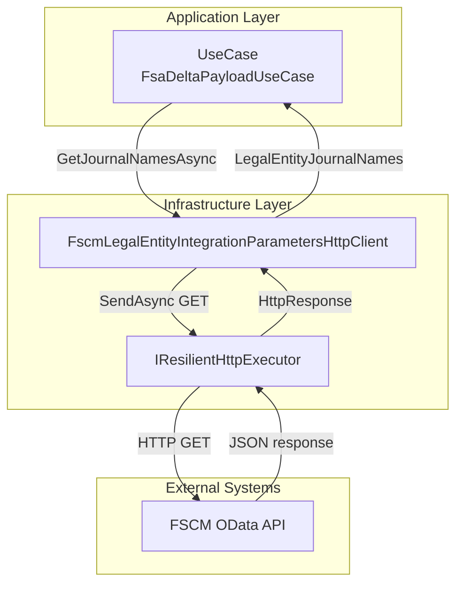
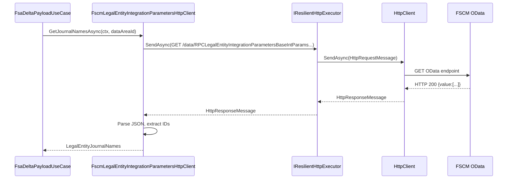

# FSCM Legal Entity Integration Parameters Feature Documentation

## Overview

This feature provides the ability to retrieve per-legal-entity journal name identifiers from the FSCM system using OData endpoints. Journals in the accrual orchestration require specific identifiers (expense, hour, inventory) per legal entity (DataAreaId). By centralizing this logic, AIS can enrich work-order payloads with correct journal names before posting.

The integration encapsulates:

- **Configuration-driven URL resolution** (`FscmOptions`)
- **Resilient HTTP execution** (`IResilientHttpExecutor`)
- **Automatic fallback** between preferred and legacy entity sets
- **Structured error handling** for auth failures and transient errors

This component is consumed by higher-level orchestrators (e.g., `FsaDeltaPayloadUseCase`) to inject journal names into payloads before journal creation.

## Architecture Overview



## Component Structure

### 1. Business Layer

#### **IFscmLegalEntityIntegrationParametersClient** (`src/Rpc.AIS.Accrual.Orchestrator.Application/Ports/Common/Abstractions/IFscmLegalEntityIntegrationParametersClient.cs`)

- Defines a contract for fetching journal name identifiers per legal entity.

Methods:

| Method | Description | Returns |
| --- | --- | --- |
| GetJournalNamesAsync(ctx, dataAreaId, ct) | Fetches journal name IDs (expense, hour, inventory) for a given DataAreaId. | `Task<LegalEntityJournalNames>` |


### 2. Data Access Layer

#### **FscmLegalEntityIntegrationParametersHttpClient** (`src/Rpc.AIS.Accrual.Orchestrator.Infrastructure/Adapters/Fscm/Clients/FscmLegalEntityIntegrationParametersHttpClient.cs`)

- Implements `IFscmLegalEntityIntegrationParametersClient` via FSCM OData.
- Resolves the FSCM base URL using `FscmUrlBuilder`.
- Queries the **preferred** entity set `RPCLegalEntityIntegrationParametersBaseIntParams`; if no rows, falls back to `LegalEntityIntegrationParametersBaseIntParamTables`.
- Parses JSON to coalesce column variations across environments.
- Handles:- 401/403 → throws `HttpRequestException` (fail-fast)
- Other 4xx → logs warning and returns `null` to trigger fallback
- 429/5xx → thrown for durable retry

Key methods:

- **GetJournalNamesAsync**

Validates inputs and orchestrates the two-step fetch .

- **TryFetchAsync**

Builds OData URL, logs start/end, executes HTTP GET via `_executor`, parses JSON, and extracts journal name IDs .

### 3. Data Models

#### **LegalEntityJournalNames**

A simple record holding journal identifiers per legal entity .

| Property | Type | Description |
| --- | --- | --- |
| ExpenseJournalNameId | string? | Expense journal name identifier |
| HourJournalNameId | string? | Hour journal name identifier |
| InventJournalNameId | string? | Inventory journal name identifier |


### 4. API Integration

#### Fetch Journal Names (Preferred Entity Set)

```api
{
    "title": "Fetch Legal Entity Integration Parameters (Preferred)",
    "description": "Retrieves journal name identifiers for the specified legal entity using the RPCLegalEntityIntegrationParametersBaseIntParams entity set.",
    "method": "GET",
    "baseUrl": "https://{fscm_base_url}",
    "endpoint": "/data/RPCLegalEntityIntegrationParametersBaseIntParams",
    "headers": [
        {
            "key": "Authorization",
            "value": "Bearer <token>",
            "required": true
        },
        {
            "key": "x-run-id",
            "value": "<ctx.RunId>",
            "required": false
        },
        {
            "key": "x-correlation-id",
            "value": "<ctx.CorrelationId>",
            "required": false
        }
    ],
    "queryParams": [
        {
            "key": "$select",
            "value": "dataAreaId,RPCItemJournalNameId,RPCHourJournalNameId,RPCExpenseJournalNameId",
            "required": true
        },
        {
            "key": "cross-company",
            "value": "true",
            "required": true
        },
        {
            "key": "$filter",
            "value": "dataAreaId eq '{company}'",
            "required": true
        },
        {
            "key": "$top",
            "value": "1",
            "required": true
        }
    ],
    "pathParams": [],
    "bodyType": "none",
    "requestBody": "",
    "formData": [],
    "rawBody": "",
    "responses": {
        "200": {
            "description": "Success",
            "body": "{\n  \"value\": [\n    {\n      \"dataAreaId\": \"425\",\n      \"RPCItemJournalNameId\": \"INV_JNL\",\n      \"RPCHourJournalNameId\": \"HR_JNL\",\n      \"RPCExpenseJournalNameId\": \"EXP_JNL\"\n    }\n  ]\n}"
        },
        "401": {
            "description": "Unauthorized",
            "body": "{ \"error\": { \"message\": \"Authentication failed.\" } }"
        },
        "403": {
            "description": "Forbidden",
            "body": "{ \"error\": { \"message\": \"Access denied.\" } }"
        },
        "4xx": {
            "description": "Client error",
            "body": "{ \"error\": { \"message\": \"Client error.\" } }"
        },
        "5xx": {
            "description": "Server error",
            "body": "{ \"error\": { \"message\": \"Server error.\" } }"
        }
    }
}
```

#### Fetch Journal Names (Legacy Entity Set)

```api
{
    "title": "Fetch Legal Entity Integration Parameters (Legacy)",
    "description": "Fallback fetch using the legacy LegalEntityIntegrationParametersBaseIntParamTables entity set.",
    "method": "GET",
    "baseUrl": "https://{fscm_base_url}",
    "endpoint": "/data/LegalEntityIntegrationParametersBaseIntParamTables",
    "headers": [
        {
            "key": "Authorization",
            "value": "Bearer <token>",
            "required": true
        },
        {
            "key": "x-run-id",
            "value": "<ctx.RunId>",
            "required": false
        },
        {
            "key": "x-correlation-id",
            "value": "<ctx.CorrelationId>",
            "required": false
        }
    ],
    "queryParams": [
        {
            "key": "$select",
            "value": "dataAreaId,RPCItemJournalNameId,RPCHourJournalNameId,RPCExpenseJournalNameId",
            "required": true
        },
        {
            "key": "cross-company",
            "value": "true",
            "required": true
        },
        {
            "key": "$filter",
            "value": "dataAreaId eq '{company}'",
            "required": true
        },
        {
            "key": "$top",
            "value": "1",
            "required": true
        }
    ],
    "pathParams": [],
    "bodyType": "none",
    "requestBody": "",
    "formData": [],
    "rawBody": "",
    "responses": {
        "200": {
            "description": "Success",
            "body": "{...same as preferred example...}"
        },
        "4xx": {
            "description": "Client error",
            "body": "{ ... }"
        },
        "5xx": {
            "description": "Server error",
            "body": "{ ... }"
        }
    }
}
```

### 5. Feature Flows

#### Fetch Journal Names Flow



## Error Handling

- **Auth failures (401/403)**

Thrown immediately as `HttpRequestException` to fail fast .

- **Client errors (4xx)**

Logged as warnings; `null` returned to trigger fallback or propagate empty result .

- **Transient errors (429/5xx)**

Thrown for durable retry; upstream policies handle retries.

```csharp
if (resp.StatusCode is HttpStatusCode.Unauthorized or HttpStatusCode.Forbidden)
    throw new HttpRequestException(...);

if ((int)resp.StatusCode >= 400 && (int)resp.StatusCode <= 499)
    _logger.LogWarning(...);

if (resp.StatusCode == (HttpStatusCode)429 || (int)resp.StatusCode >= 500)
    throw new HttpRequestException(...);
```

## Dependencies

- **HttpClient**

BaseAddress set to FSCM `BaseUrl`; AAD token attached via `FscmAuthHandler`.

- **FscmOptions**

Holds `BaseUrl` and any legacy overrides.

- **IResilientHttpExecutor**

Encapsulates Polly retry/timeout policies.

- **ILogger**

Structured logging for start/end, durations, payload sizes.

## Key Classes Reference

| Class | Location | Responsibility |
| --- | --- | --- |
| FscmLegalEntityIntegrationParametersHttpClient | src/Rpc.AIS.Accrual.Orchestrator.Infrastructure/Adapters/Fscm/Clients/FscmLegalEntityIntegrationParametersHttpClient.cs | Implements journal name fetch via FSCM OData |
| IFscmLegalEntityIntegrationParametersClient | src/Rpc.AIS.Accrual.Orchestrator.Application/Ports/Common/Abstractions/IFscmLegalEntityIntegrationParametersClient.cs | Defines abstraction for retrieving integration parameters |
| LegalEntityJournalNames | src/Rpc.AIS.Accrual.Orchestrator.Core.Domain/LegalEntityJournalNames.cs | Model holding expense, hour, and inventory journal identifiers |


## Testing Considerations

- **Preferred vs Fallback:** Simulate empty response for the preferred entity set and verify fallback kicks in.
- **Auth Failures:** Mock 401/403 to ensure exception is thrown.
- **Transient Errors:** Mock 429/500 to ensure exceptions propagate for retry.
- **No Rows:** Return HTTP 200 with empty `value`; expect `LegalEntityJournalNames(null,null,null)`.

```card
{
    "title": "Fallback Behavior",
    "content": "If the preferred entity set yields no rows, the client automatically queries the legacy set and defaults to empty identifiers."
}
```

This documentation equips developers with clear insights into the FSCM legal-entity integration parameters feature, its architecture, key classes, integration points, and error-handling patterns.