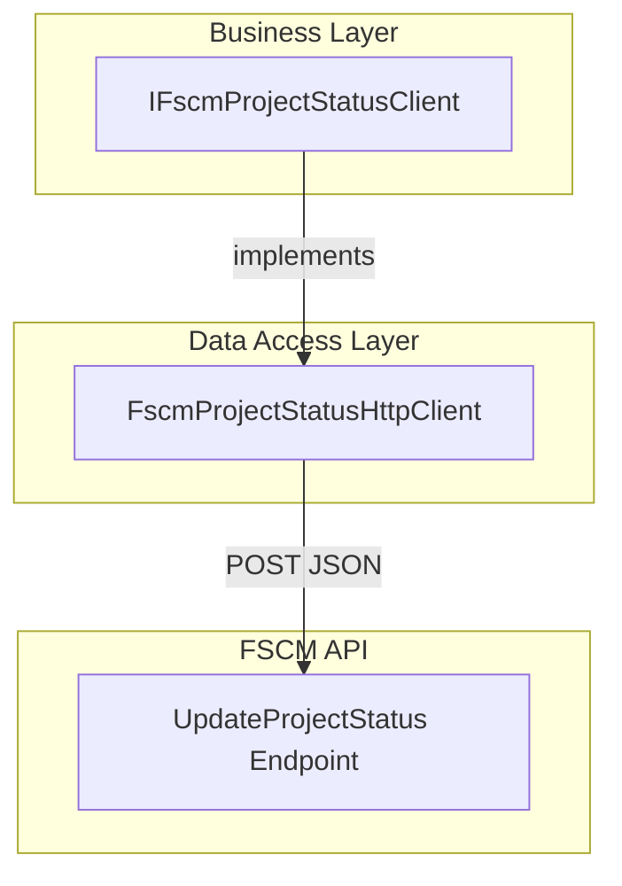

# 🔄 Project Status Update Feature Documentation

## Overview

The **Project Status Update** feature provides an interface to update the lifecycle stage of a specific FSCM subproject work order. It ensures that downstream systems have accurate status information by invoking a custom FSCM endpoint with a structured JSON payload. This operation is critical for orchestrating end-to-end accrual workflows, marking when field service work orders transition to “Posted”, “Cancelled”, or other status codes.

At runtime, business logic components invoke the `IFscmProjectStatusClient` abstraction. The concrete `FscmProjectStatusHttpClient` implementation handles HTTP communication, token propagation, logging, and error handling against the FSCM API  .

## Architecture Overview



## Component Structure

### 1. Business Layer

#### **IFscmProjectStatusClient** (src/Rpc.AIS.Accrual.Orchestrator.Core.Abstractions/IFscmProjectStatusClient.cs)

- **Purpose:** Defines a contract to update FSCM project/subproject status or stage.
- **Methods:**

| Method Signature | Description | Returns |
| --- | --- | --- |
| UpdateAsync(RunContext, string company,<br/>string subProjectId,<br/>Guid workOrderGuid,<br/>string workOrderId,<br/>int status, CancellationToken ct) | Preferred overload targeting WO + SubProjectId. | `Task<FscmProjectStatusUpdateResult>` |
| UpdateAsync(RunContext, Guid subprojectId, string newStatus, CancellationToken ct) | Legacy overload mapping GUID SubProjectId. | `Task<FscmProjectStatusUpdateResult>` |
| UpdateAsync(RunContext, string company, string subProjectId, string newStatus, CancellationToken ct) | Legacy overload mapping textual status. | `Task<FscmProjectStatusUpdateResult>` |


### 2. Data Access Layer

#### **FscmProjectStatusHttpClient** (src/Rpc.AIS.Accrual.Orchestrator.Infrastructure.Adapters.Fscm.Clients/FscmProjectStatusHttpClient.cs)

- **Purpose:** Thin HTTP client for the FSCM custom project status update endpoint. It serializes payloads, attaches headers, logs timing and payload sizes, and handles HTTP status codes according to the FSCM contract .
- **Key Properties:**- `_http` (HttpClient): Injected HTTP client configured with base address and auth handler.
- `_opt` (FscmOptions): Holds `BaseUrl` and `UpdateProjectStatusPath` configuration.
- `_log` (ILogger): Structured logging of request/response details.
- **Key Methods:**- `UpdateAsync(RunContext ctx, string company, string subProjectId, Guid workOrderGuid, string workOrderId, int status, CancellationToken ct)`: Sends the primary JSON payload.
- Legacy overloads delegate to the preferred overload by mapping textual statuses to numeric codes or supplying placeholders.

## Data Models

### FscmProjectStatusUpdateResult

Represents the outcome of the project status update operation.

| Property | Type | Description |
| --- | --- | --- |
| IsSuccess | bool | `true` if HTTP status is in the 2xx range; otherwise `false`. |
| HttpStatus | int | Raw HTTP status code returned by the FSCM endpoint. |
| Body | string? | Raw response body (if any). Useful for diagnostics or error messages. |


## API Integration 🔌

### Update Project Status

```api
{
    "title": "Update Project Status",
    "description": "Updates the status of a specific subproject work order in FSCM.",
    "method": "POST",
    "baseUrl": "https://<FSCM_BASE_URL>",
    "endpoint": "/<UpdateProjectStatusPath>",
    "headers": [
        {
            "key": "Content-Type",
            "value": "application/json",
            "required": true
        },
        {
            "key": "x-run-id",
            "value": "Unique orchestration run identifier",
            "required": false
        },
        {
            "key": "x-correlation-id",
            "value": "Correlation identifier for distributed tracing",
            "required": false
        }
    ],
    "queryParams": [],
    "pathParams": [],
    "bodyType": "json",
    "requestBody": "{\n  \"_request\": {\n    \"Company\": \"425\",\n    \"SubProjectId\": \"425-P0000001-00001\",\n    \"WorkOrderGUID\": \"{3F2504E0-4F89-11D3-9A0C-0305E82C3301}\",\n    \"WorkOrderID\": \"WO12345\",\n    \"ProjectStatus\": 5\n  }\n}",
    "formData": [],
    "rawBody": "",
    "responses": {
        "200": {
            "description": "Success. Returns FSCM\u2019s response payload.",
            "body": "{\n  \"parmSubProjectId\": \"425-P0000001-00002\"\n}"
        },
        "401": {
            "description": "Unauthorized or Forbidden access.",
            "body": "{\n  \"error\": \"Unauthorized\"\n}"
        },
        "4xx": {
            "description": "Client error. Non-transient failures.",
            "body": "{\n  \"error\": \"Invalid request payload\"\n}"
        },
        "429": {
            "description": "Too Many Requests. Suggest durable retry.",
            "body": "{\n  \"error\": \"Rate limit exceeded\"\n}"
        },
        "5xx": {
            "description": "Server error. Suggest durable retry.",
            "body": "{\n  \"error\": \"Internal Server Error\"\n}"
        }
    }
}
```

## Error Handling

- **401/403 Unauthorized:** Throws `UnauthorizedAccessException` immediately.
- **429 / 5xx (Transient):** Throws `HttpRequestException` to trigger retry policies.
- **Other 4xx (Non-transient):** Returns a failed `FscmProjectStatusUpdateResult` without exception, preserving the FSCM response body for logging.

## Dependencies

- **HttpClient** configured with `FscmAuthHandler` for AAD bearer token injection.
- **FscmOptions** for `BaseUrl` and `UpdateProjectStatusPath` (must be set or skip update with warning).
- **ILogger<FscmProjectStatusHttpClient>** for structured logging.
- **Newtonsoft.System.Text.Json** for payload serialization with explicit naming policy disabled.

## Testing Considerations

- **Success Path:** Verify `UpdateAsync` returns `IsSuccess = true` and the correct HTTP status when FSCM responds 2xx.
- **Client Errors:** Mock a 400 response and assert `IsSuccess = false`, capturing `HttpStatus`.
- **Unauthorized:** Simulate 401/403 and assert that `UnauthorizedAccessException` is thrown.
- **Transient Failures:** Simulate 429 or 500 and verify that `HttpRequestException` is thrown for retry logic.
- **Configuration Missing:** Omit `UpdateProjectStatusPath` and ensure the method logs a warning and returns a success result without calling HTTP.

## Key Classes Reference

| Class | Location | Responsibility |
| --- | --- | --- |
| IFscmProjectStatusClient | src/Rpc.AIS.Accrual.Orchestrator.Core.Abstractions/IFscmProjectStatusClient.cs | Defines status update contract and legacy overloads. |
| FscmProjectStatusUpdateResult | src/Rpc.AIS.Accrual.Orchestrator.Core.Abstractions/IFscmProjectStatusClient.cs | Carries HTTP outcome and response body. |
| FscmProjectStatusHttpClient | src/Rpc.AIS.Accrual.Orchestrator.Infrastructure.Adapters.Fscm.Clients/FscmProjectStatusHttpClient.cs | Implements HTTP communication, payload envelope, and logging. |
