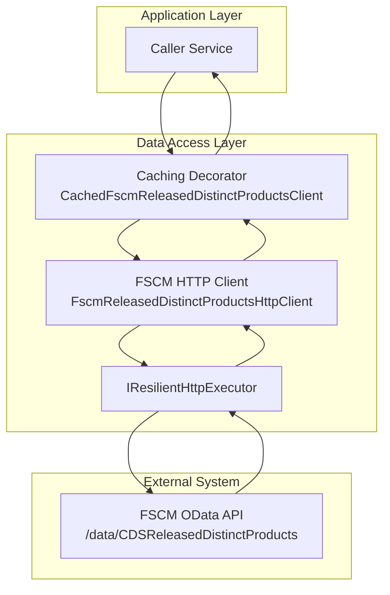
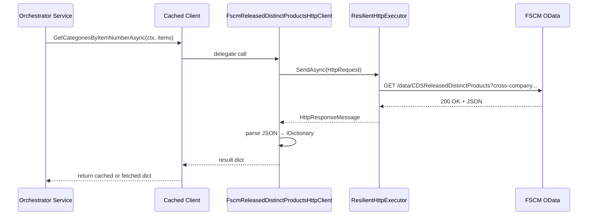

# Released Distinct Products Retrieval Feature Documentation

## Overview

This feature provides a dedicated HTTP client for fetching project category identifiers from the FSCM OData endpoint **CDSReleasedDistinctProducts** by item number. It enables the orchestrator to derive both `ProjCategoryId` and `RPCProjCategoryId` for each released distinct product. By centralizing this logic, the system avoids repeated OData calls and ensures consistent parsing and error handling.

Business value:

- Reduces direct OData call complexity across services.
- Encapsulates URL construction, pagination via OR‐filter chunking, and resilient retry logic.
- Integrates with a caching decorator to dramatically lower latency on warm hosts.

## Architecture Overview



## Component Structure

### Data Access Layer

#### **FscmReleasedDistinctProductsHttpClient** (`src/Rpc.AIS.Accrual.Orchestrator.Infrastructure/Adapters/Fscm/Clients/FscmReleasedDistinctProductsHttpClient.cs`)

- **Purpose**

Implements `IFscmReleasedDistinctProductsClient` to call the FSCM OData endpoint, parse JSON responses, and return mappings from `ItemNumber` to `ReleasedDistinctProductCategory` .

- **Dependencies**- `HttpClient` for HTTP transport
- `FscmOptions` for base URL and entity‐set configuration
- `IResilientHttpExecutor` for retry and circuit‐breaker policies
- `ILogger<FscmReleasedDistinctProductsHttpClient>` for logging

- **Key Methods**

| Method | Signature | Description |
| --- | --- | --- |
| GetCategoriesByItemNumberAsync | `Task<IReadOnlyDictionary<string, ReleasedDistinctProductCategory>> GetCategoriesByItemNumberAsync(RunContext ctx, IReadOnlyList<string> itemNumbers, CancellationToken ct)` |


- Cleans and deduplicates `itemNumbers`.
- Chunks into OR‐filter groups to avoid URL length limits.
- Builds OData query URL and invokes via `_executor`.
- Parses JSON `value` array, extracts `ItemNumber` and category IDs.
- Handles 401/403 by throwing; logs other non‐success statuses.  |

## Data Models

#### ReleasedDistinctProductCategory

Represents FSCM category identifiers for a released distinct product .

| Property | Type | Description |
| --- | --- | --- |
| **ItemNumber** | string | The product’s item number key. |
| **ProjCategoryId** | string? | FSCM project category identifier. |
| **RpcProjCategoryId** | string? | RPC‐formatted project category ID. |


## API Integration

### GET CDSReleasedDistinctProducts

```api
{
    "title": "Fetch Released Distinct Products Categories",
    "description": "Retrieves ProjCategoryId and RPCProjCategoryId for a list of ItemNumbers via the CDSReleasedDistinctProducts OData endpoint.",
    "method": "GET",
    "baseUrl": "https://<fscm-base-url>",
    "endpoint": "/data/{entitySet}",
    "headers": [
        {
            "key": "Accept",
            "value": "application/json",
            "required": true
        }
    ],
    "queryParams": [
        {
            "key": "cross-company",
            "value": "true to query across all data areas",
            "required": true
        },
        {
            "key": "$select",
            "value": "ItemNumber,RPCProjCategoryId",
            "required": true
        },
        {
            "key": "$filter",
            "value": "OR\u2010combined ItemNumber eq '{value}' clauses (chunked)",
            "required": true
        }
    ],
    "pathParams": [],
    "bodyType": "none",
    "requestBody": "",
    "formData": [],
    "rawBody": "",
    "responses": {
        "200": {
            "description": "Success; returns JSON with 'value' array.",
            "body": "{\n  \"value\": [\n    { \"ItemNumber\": \"ABC123\", \"RPCProjCategoryId\": \"CAT001\" }\n  ]\n}"
        },
        "401": {
            "description": "Unauthorized. Authentication failed.",
            "body": "{ \"error\": \"Authentication required.\" }"
        },
        "403": {
            "description": "Forbidden. Access denied.",
            "body": "{ \"error\": \"Access denied.\" }"
        },
        "4XX": {
            "description": "Other client errors are logged and skipped.",
            "body": "{ \"error\": \"Bad request or OData filter error.\" }"
        },
        "5XX": {
            "description": "Server error; handled by resilient executor retries.",
            "body": "{ \"error\": \"Internal server error.\" }"
        }
    }
}
```

## Feature Flow

### 1. Retrieve Categories by Item Number



## Error Handling

- **Unauthorized/Forbidden (401/403):**

Throws `HttpRequestException` with trimmed response body to fail fast .

- **Other non‐success (4XX):**

Logged via `LogWarning`; the client continues to next chunk without throwing.

- **Empty input list:**

Returns an empty dictionary immediately.

## Caching Strategy

This HTTP client is typically decorated by `CachedFscmReleasedDistinctProductsClient` which:

- Uses `IMemoryCache` with TTL for positive entries and negative caching.
- Prevents cache stampedes via a `SemaphoreSlim`.
- Limits maximum item count per call based on `FscmReleasedDistinctProductsCacheOptions`.

## Dependencies

- **Rpc.AIS.Accrual.Orchestrator.Core.Abstractions.IFscmReleasedDistinctProductsClient**
- **Rpc.AIS.Accrual.Orchestrator.Infrastructure.Options.FscmOptions** for base URL and entity‐set names
- **Rpc.AIS.Accrual.Orchestrator.Infrastructure.Resilience.IResilientHttpExecutor** for retry policies
- **Rpc.AIS.Accrual.Orchestrator.Core.Utilities.FscmUrlBuilder** for URL assembly
- **Microsoft.Extensions.Logging.ILogger<T>** for structured logging

## Key Classes Reference

| Class | Location | Responsibility |
| --- | --- | --- |
| FscmReleasedDistinctProductsHttpClient | src/Rpc.AIS.Accrual.Orchestrator.Infrastructure/Adapters/Fscm/Clients/FscmReleasedDistinctProductsHttpClient.cs | Implements OData calls to CDSReleasedDistinctProducts endpoint. |
| IFscmReleasedDistinctProductsClient | src/Rpc.AIS.Accrual.Orchestrator.Core/Ports/Common/Abstractions/IFscmReleasedDistinctProductsClient.cs | Defines contract for fetching product category mappings. |
| ReleasedDistinctProductCategory | same as above | DTO for item‐to‐category mappings. |
| CachedFscmReleasedDistinctProductsClient | src/Rpc.AIS.Accrual.Orchestrator.Infrastructure/Adapters/Fscm/Clients/CachedFscmReleasedDistinctProductsClient.cs | Caching decorator for the HTTP client. |
