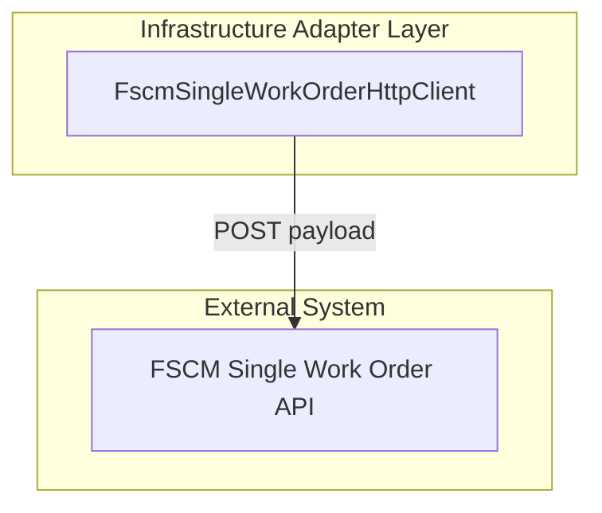

# Single Work Order Posting Feature Documentation

## Overview

The Single Work Order Posting feature enables submitting a single AIS work order payload to the FSCM system via HTTP. It encapsulates configuration, request construction, logging, and error handling. Business processes trigger this client to synchronize individual work orders with the downstream financial system.

## Architecture Overview



## Component Structure

### Data Access Layer

#### **FscmSingleWorkOrderHttpClient** (`src/Rpc.AIS.Accrual.Orchestrator.Infrastructure/Adapters/Fscm/Clients/FscmSingleWorkOrderHttpClient.cs`)

- **Purpose and responsibilities**- Builds and sends HTTP POST requests for single work order payloads.
- Manages endpoint resolution, headers, payload serialization.
- Logs request/response metadata and enforces retry vs. fail-fast semantics.
- **Constructor dependencies**- `HttpClient http` – underlying HTTP transport.
- `FscmOptions opt` – holds base URL, path, and override settings.
- `ILogger<FscmSingleWorkOrderHttpClient> logger` – logs at Info, Warning, Error levels.
- **Configuration values**- `FscmOptions.BaseUrl` – preferred unified FSCM host.
- `FscmOptions.SingleWorkOrderBaseUrlOverride` – fallback per-endpoint URL.
- `FscmOptions.SingleWorkOrderPath` – relative path for single work order posting.

## Methods

| Method Signature | Description | Returns |
| --- | --- | --- |
| `Task<PostSingleWorkOrderResponse> PostAsync(string rawJsonBody, CancellationToken ct)` | Convenience overload; builds a default `RunContext` and delegates to the main `PostAsync`. | `PostSingleWorkOrderResponse` |
| `Task<PostSingleWorkOrderResponse> PostAsync(RunContext context, string rawJsonBody, CancellationToken ct)` | Sends the HTTP POST, logs metrics, and processes status codes for success, non-transient failures, and retries. | `PostSingleWorkOrderResponse` or throws exception |
| `private string ResolveBaseUrl(string? legacyBaseUrl, string legacyName)` | Chooses between unified host and legacy override; throws if neither configured. | `string` |
| `private static string BuildUrl(string baseUrl, string path)` | Concatenates base URL and path into a full endpoint URL. | `string` |
| `private static string Trim(string? s)` | Truncates long response bodies to 4000 characters for logging. | `string` |


## API Integration

### POST Single Work Order

```api
{
    "title": "Post Single Work Order",
    "description": "Submits a single work order payload to the FSCM system.",
    "method": "POST",
    "baseUrl": "<FSCM BaseUrl from FscmOptions>",
    "endpoint": "<SingleWorkOrderPath from FscmOptions>",
    "headers": [
        {
            "key": "Content-Type",
            "value": "application/json",
            "required": true
        },
        {
            "key": "x-run-id",
            "value": "<RunContext.RunId>",
            "required": false
        },
        {
            "key": "x-correlation-id",
            "value": "<RunContext.CorrelationId>",
            "required": false
        }
    ],
    "queryParams": [],
    "pathParams": [],
    "bodyType": "json",
    "requestBody": "{\n  /* rawJsonBody */\n}",
    "formData": [],
    "rawBody": "",
    "responses": {
        "200": {
            "description": "Success",
            "body": "{\n  \"isSuccess\": true,\n  \"statusCode\": 200,\n  \"body\": \"<FSCM response>\"\n}"
        },
        "400": {
            "description": "Client error - non-transient failure",
            "body": "{\n  \"isSuccess\": false,\n  \"statusCode\": 400,\n  \"body\": \"<error details>\"\n}"
        },
        "401": {
            "description": "Unauthorized - fails fast",
            "body": ""
        },
        "403": {
            "description": "Forbidden - fails fast",
            "body": ""
        },
        "429": {
            "description": "Too Many Requests - triggers retry",
            "body": ""
        },
        "500": {
            "description": "Server error - triggers retry",
            "body": ""
        }
    }
}
```

## Error Handling

- **401 Unauthorized / 403 Forbidden**- Logged at Error level.
- Throws `UnauthorizedAccessException` to halt processing immediately.

- **429 Too Many Requests / ≥500 Server Errors**- Logged at Warning level.
- Throws `HttpRequestException` to allow durable retry policies.

- **400–499 Other Client Errors**- Logged at Warning level.
- Returns a failed `PostSingleWorkOrderResponse` without throwing.

- **Success (2xx)**- Returns `PostSingleWorkOrderResponse` with `IsSuccess=true` and raw body.

## Dependencies

| Dependency | Role |
| --- | --- |
| `HttpClient` | Executes HTTP requests |
| `Rpc.AIS.Accrual.Orchestrator.Infrastructure.Options.FscmOptions` | Supplies base URL, path, and overrides |
| `Microsoft.Extensions.Logging.ILogger<T>` | Logs telemetry including payload and timing data |
| `Rpc.AIS.Accrual.Orchestrator.Core.Domain.RunContext` | Propagates run and correlation identifiers |
| `Rpc.AIS.Accrual.Orchestrator.Core.Domain.PostSingleWorkOrderResponse` | Encapsulates status, success flag, and body |


## Integration Points

- Invoked by **PostSingleWorkOrderHandler** in durable orchestration to post individual work orders.
- Registered via dependency injection as `ISingleWorkOrderPostingClient`.

## Key Classes Reference

| Class | Location | Responsibility |
| --- | --- | --- |
| `FscmSingleWorkOrderHttpClient` | `src/Rpc.AIS.Accrual.Orchestrator.Infrastructure/Adapters/Fscm/Clients/FscmSingleWorkOrderHttpClient.cs` | Implements single work order posting over HTTP to FSCM. |
| `RunContext` | `Rpc.AIS.Accrual.Orchestrator.Core.Domain` | Carries run and correlation identifiers for tracing. |
| `PostSingleWorkOrderResponse` | `Rpc.AIS.Accrual.Orchestrator.Core.Domain` | Represents FSCM response status and payload content. |


## Testing Considerations

- No direct unit tests provided for this client; behavior validated through durable function integration tests.
- Key scenarios:- Missing configuration (`SingleWorkOrderPath`) returns 500 error response.
- Successful 2xx responses propagate success.
- 401/403 throw `UnauthorizedAccessException`.
- 429/5xx throw `HttpRequestException` for retries.
- 4xx non-auth errors return failed response without exception.