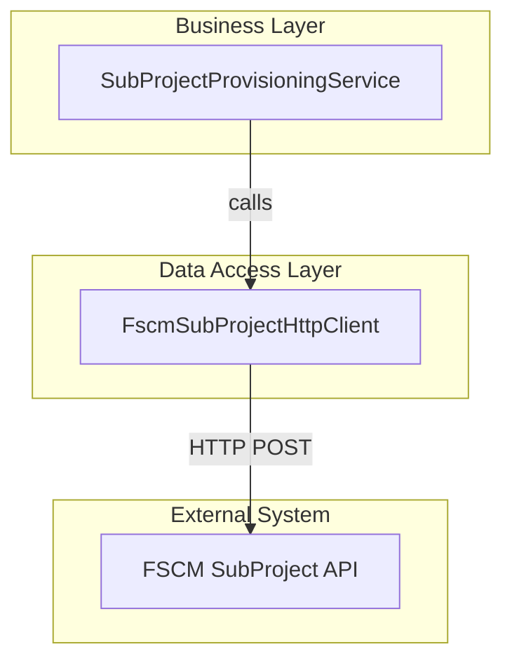

# SubProject Creation Feature Documentation

## Overview

The **SubProject Creation** feature provides the orchestration necessary to create subprojects in the FSCM system as part of the accrual orchestration. At runtime, a canonical request model (`SubProjectCreateRequest`) is built and sent to the FSCM subproject endpoint. Successful responses yield a new subproject identifier, while error responses are classified by severity to drive retry or fail-fast logic.

This component delivers business value by automating the provisioning of subprojects—key organizational units in FSCM—enabling downstream journal posting and status updates. It fits into the **Data Access Layer** of the Accrual Orchestrator and is consumed by the `SubProjectProvisioningService` in the Core Services layer.

## Architecture Overview



## Component Structure

### Data Access Layer 🚀

#### **FscmSubProjectHttpClient** (`src/Rpc.AIS.Accrual.Orchestrator.Infrastructure/Adapters/Fscm/Clients/FscmSubProjectHttpClient.cs`)

- **Purpose**: Implements `IFscmSubProjectClient` to send subproject creation requests to FSCM.
- **Dependencies**:- `HttpClient` for HTTP calls
- `IFscmTokenProvider` to acquire AAD tokens
- `FscmOptions` for endpoint configuration
- `ILogger` for structured logging
- **Key Methods**:

| Method | Description | Returns |
| --- | --- | --- |
| `CreateSubProjectAsync(RunContext context, SubProjectCreateRequest request, CancellationToken ct)` | Builds JSON payload, obtains token, sends HTTP POST to `{BaseUrl}{SubProjectPath}`, handles errors per policy | `SubProjectCreateResult` |


## Data Models

### SubProjectCreateRequest

| Property | Type | Description |
| --- | --- | --- |
| DataAreaId | string | **Required.** Legal entity identifier. |
| ParentProjectId | string | **Required.** Existing project under which to create the subproject. |
| ProjectName | string | **Required.** Display name of the new subproject. |
| CustomerReference | string? | Optional customer reference field. |
| InvoiceNotes | string? | Optional notes for invoicing purposes. |
| ActualStartDate | string? | Optional actual start date (ISO format). |
| ActualEndDate | string? | Optional actual end date (ISO format). |
| AddressName | string? | Optional billing/shipping address name. |
| Street | string? | Optional street address. |
| City | string? | Optional city. |
| State | string? | Optional state/province. |
| County | string? | Optional county/district. |
| CountryRegionId | string? | Optional country code. |
| WellLocale | string? | Optional locale for well operations. |
| WellName | string? | Optional well name. |
| WellNumber | string? | Optional well number. |
| ProjectStatus | int? | Optional initial status code for the new subproject. |
| WorkOrderGuid | string? | Optional FSA work order GUID, serialized when present. |
| IsFsaProject | int? | Optional flag indicating Field Service project. |
| ProjectStatus | int? | Optional override of default project status. |


### SubProjectCreateResult & SubProjectError

| Property | Type | Description |
| --- | --- | --- |
| IsSuccess | bool | Indicates whether creation succeeded. |
| parmSubProjectId | string? | Returned subproject identifier on success. |
| Message | string? | Human-readable status message. |
| Errors | `IReadOnlyList<SubProjectError>` | List of errors when `IsSuccess` is false. |


**SubProjectError**

| Property | Type | Description |
| --- | --- | --- |
| Code | string | Machine error code |
| Message | string | Detailed message |


## Integration Points

- **Core Abstraction**: `IFscmSubProjectClient` defines the contract consumed by business services .
- **Business Consumer**: `SubProjectProvisioningService` invokes this client to create subprojects in FSCM .
- **Dependency Injection**: Registered in Azure Functions via:

```csharp
  services.AddHttpClient<FscmSubProjectHttpClient>(...)
          .AddHttpMessageHandler<FscmAuthHandler>();
  services.AddSingleton<IFscmSubProjectClient>(sp => sp.GetRequiredService<FscmSubProjectHttpClient>());
```

## Key Classes Reference

| Class | Location | Responsibility |
| --- | --- | --- |
| FscmSubProjectHttpClient | `Infrastructure/Adapters/Fscm/Clients/FscmSubProjectHttpClient.cs` | Sends subproject creation requests to FSCM with auth and logging |
| IFscmSubProjectClient | `Core/Abstractions/IFscmSubProjectClient.cs` | Defines contract for subproject creation client |
| SubProjectCreateRequest | `Core/Domain/SubProjectModels.cs` | Canonical request model for subproject creation |
| SubProjectCreateResult | `Core/Domain/SubProjectModels.cs` | Result model carrying success flag, ID, message, and errors |
| SubProjectError | `Core/Domain/SubProjectModels.cs` | Error detail carrying code and message |


## Error Handling

- **401/403**: Throws `UnauthorizedAccessException` to fail-fast on auth issues.
- **400–499**: Logs warning and returns `SubProjectCreateResult` with `IsSuccess=false`.
- **429 or ≥500**: Throws `HttpRequestException` to trigger retry policies.
- **Invalid Config**: Throws `InvalidOperationException` when critical endpoints are missing.

## Dependencies

- Microsoft.Extensions.Http
- Microsoft.Extensions.Logging
- System.Text.Json
- Azure AD token service (`IFscmTokenProvider`)
- Configuration via `FscmOptions`

## Testing Considerations

Key scenarios to validate include:

- Successful creation returns a non-null `parmSubProjectId`.
- 4xx client errors return a result with `IsSuccess=false` and proper error codes.
- 5xx or 429 responses throw exceptions for retry logic.
- Missing configuration (e.g., `SubProjectPath`) throws `InvalidOperationException`.