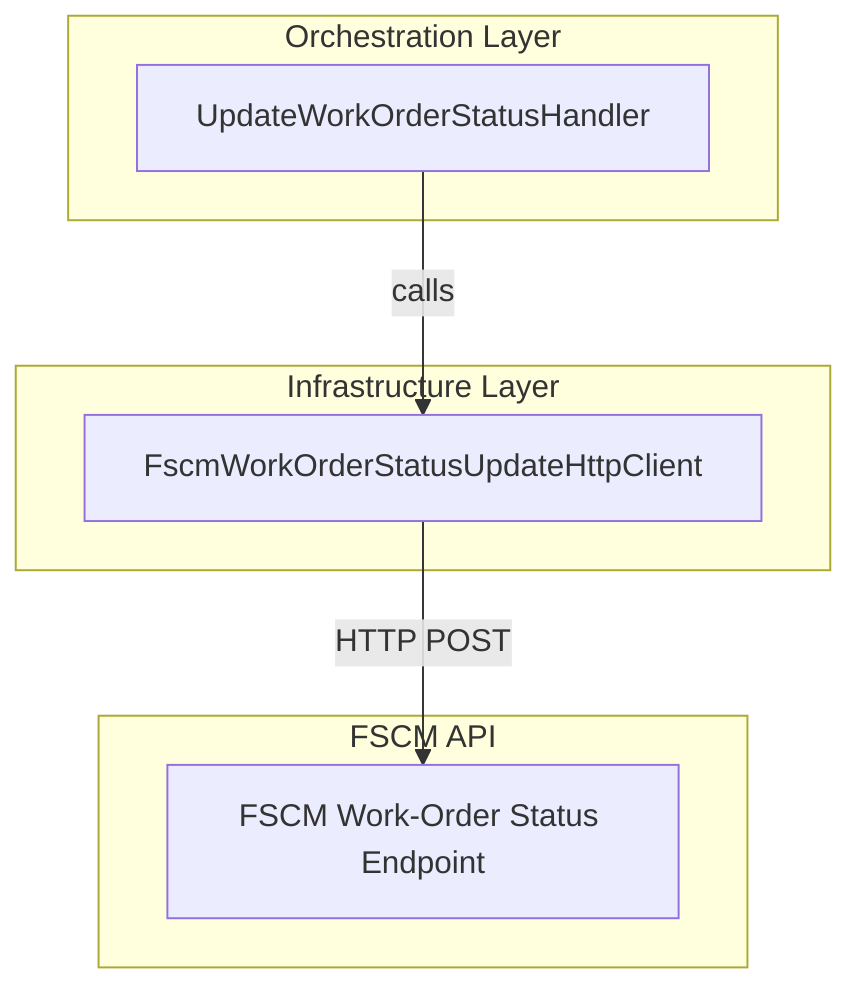
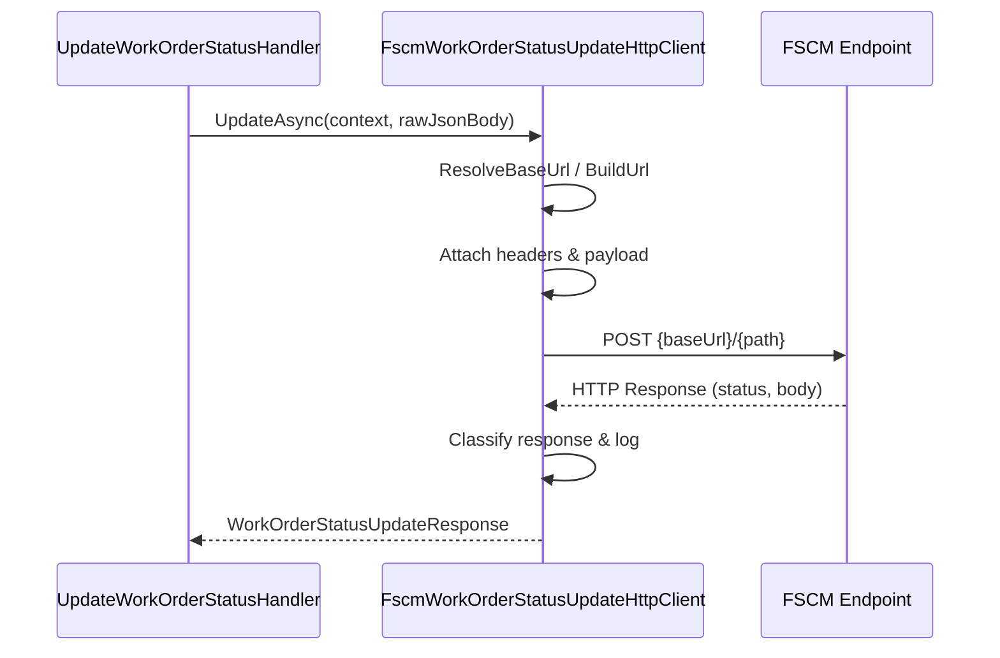

# Work-Order Status Update Feature Documentation

## Overview 🚀

This feature enables the Accrual Orchestrator to report work-order posting status to the FSCM system. It exposes a dedicated HTTP client that forwards raw JSON payloads and handles retries, error classification, and logging.

By centralizing FSCM interaction logic, it ensures consistent configuration lookup, correlation propagation, and resilience across durable workflows.

## Architecture Overview 🏗



## Component Structure

### 1. Orchestration Layer

#### **UpdateWorkOrderStatusHandler** (`src/Rpc.AIS.Accrual.Orchestrator.Functions/Durable/Activities/Handlers/UpdateWorkOrderStatusHandler.cs`)

- **Purpose**

Coordinates durable activity to update FSCM with work-order status.

- **Dependencies**- `IWorkOrderStatusUpdateClient _woStatus`
- `IAisLogger _ais`
- `ILogger<UpdateWorkOrderStatusHandler> _logger`
- **Key Method**- **HandleAsync**(WorkOrderStatusUpdateInputDto input, RunContext runCtx, CancellationToken ct)

### 2. Infrastructure Layer

#### **FscmWorkOrderStatusUpdateHttpClient** (`src/Rpc.AIS.Accrual.Orchestrator.Infrastructure/Adapters/Fscm/Clients/FscmWorkOrderStatusUpdateHttpClient.cs`)

- **Implements**

`IWorkOrderStatusUpdateClient`

- **Purpose**

Sends work-order status update JSON to FSCM, with correlation headers, logging, and error handling.

- **Dependencies**- `HttpClient _http` (configured with `FscmAuthHandler`)
- `FscmOptions _opt` (endpoint configuration)
- `ILogger<FscmWorkOrderStatusUpdateHttpClient> _logger`
- **Configuration Keys**- `Fscm:BaseUrl`
- `Fscm:WorkOrderStatusUpdateBaseUrlOverride`
- `Fscm:WorkOrderStatusUpdatePath`
- **Methods**

| **Method** | **Description** | **Returns** |
| --- | --- | --- |
| **UpdateAsync**(string rawJsonBody, CancellationToken ct) | Legacy overload; builds a default `RunContext` and calls the main overload. | `WorkOrderStatusUpdateResponse` |
| **UpdateAsync**(RunContext context, string rawJsonBody, CancellationToken ct) | Constructs and sends HTTP POST; logs metrics; classifies errors; returns a response wrapper. | `WorkOrderStatusUpdateResponse` |
| **ResolveBaseUrl**(string? legacyBaseUrl, string legacyName) | Chooses `FscmOptions.BaseUrl` or falls back to legacy override; throws if neither is set. | `string` |
| **BuildUrl**(string baseUrl, string path) | Concatenates base URL and path with proper slashes. | `string` |
| **Trim**(string? s) | Truncates a long string to 4000 characters for safe logging. | `string` |


### 3. Domain Models

#### **WorkOrderStatusUpdateResponse** (`src/Rpc.AIS.Accrual.Orchestrator.Core.Domain/WorkOrderStatusUpdateResponse.cs`)

- **Properties**

| Property | Type | Description |
| --- | --- | --- |
| **IsSuccess** | bool | Indicates whether the HTTP response was successful (2xx). |
| **StatusCode** | int | The raw HTTP status code returned by FSCM. |
| **Body** | string? | Raw response body from FSCM as a JSON string. |


## Sequence Flow 🔄



## Error Handling

- **401 / 403**

Logged as error; throws `UnauthorizedAccessException` for fail-fast authentication failures.

- **429 or ≥500**

Logged as warning; throws `HttpRequestException` to trigger retry by durable orchestration.

- **400–499** (except 401/403)

Logged as warning; returns a `WorkOrderStatusUpdateResponse` with `IsSuccess = false`.

## Dependencies

- Microsoft.Extensions.Logging
- System.Net.Http.HttpClient (with `FscmAuthHandler`)
- Rpc.AIS.Accrual.Orchestrator.Infrastructure.Options.FscmOptions
- Rpc.AIS.Accrual.Orchestrator.Core.Abstractions.IWorkOrderStatusUpdateClient
- Rpc.AIS.Accrual.Orchestrator.Core.Domain.WorkOrderStatusUpdateResponse

## Configuration Example

```json
{
  "Fscm": {
    "BaseUrl": "https://fscm.example.com",
    "WorkOrderStatusUpdateBaseUrlOverride": null,
    "WorkOrderStatusUpdatePath": "/api/workorder/status/update"
  }
}
```

## Key Classes Reference

| Class | Location | Responsibility |
| --- | --- | --- |
| **FscmWorkOrderStatusUpdateHttpClient** | `src/Rpc.AIS.Accrual.Orchestrator.Infrastructure/Adapters/Fscm/Clients/FscmWorkOrderStatusUpdateHttpClient.cs` | HTTP client for posting work-order status updates to FSCM |
| **IWorkOrderStatusUpdateClient** | `src/Rpc.AIS.Accrual.Orchestrator.Application/Ports/Common/Abstractions/IWorkOrderStatusUpdateClient.cs` | Abstraction for FSCM status update client |
| **WorkOrderStatusUpdateResponse** | `src/Rpc.AIS.Accrual.Orchestrator.Core.Domain/WorkOrderStatusUpdateResponse.cs` | Domain model encapsulating the FSCM update response |
| **UpdateWorkOrderStatusHandler** | `src/Rpc.AIS.Accrual.Orchestrator.Functions/Durable/Activities/Handlers/UpdateWorkOrderStatusHandler.cs` | Durable Functions activity handler invoking the client |
| **FscmOptions** | `src/Rpc.AIS.Accrual.Orchestrator.Infrastructure/Options/FscmOptions.cs` | Configuration model for FSCM endpoints |
