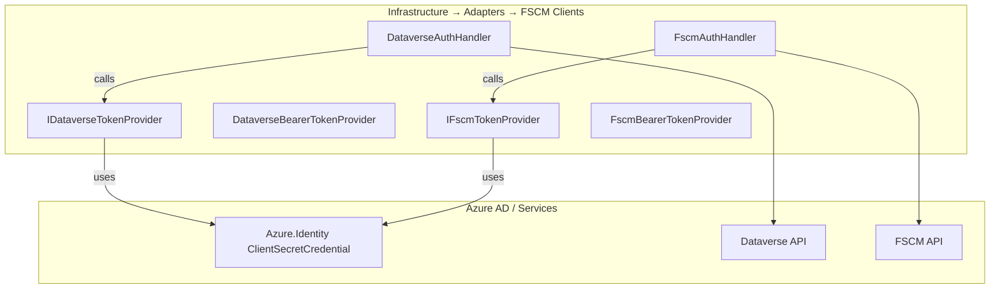
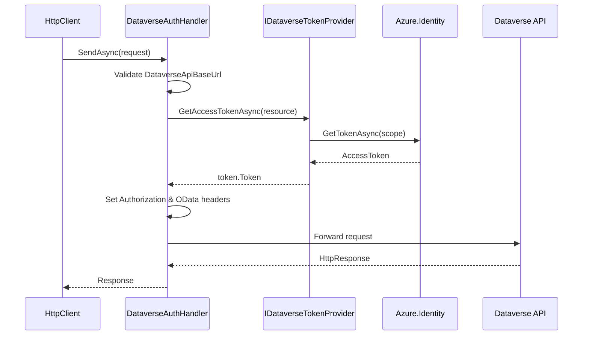
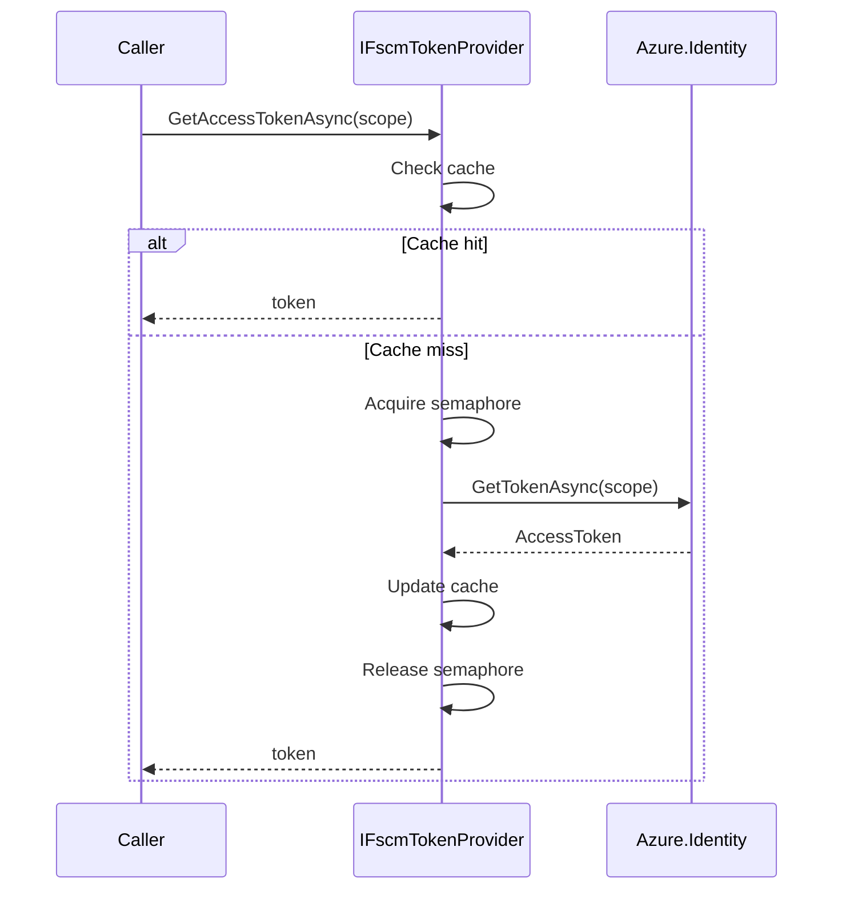

# FSCM & Dataverse Token Provision Feature Documentation

## Overview

This feature centralizes **Azure AD token acquisition** and **HTTP authentication** for both Microsoft Dataverse and FSCM APIs. It defines contracts for token providers, implements caching and concurrency control, and injects bearer tokens into outgoing HTTP requests. This ensures efficient, secure communication with external services without scattering credential logic across the codebase.

By abstracting token handling into dedicated providers and HTTP message handlers, the application achieves:

- **Separation of concerns**: Authentication logic stays in the Infrastructure layer.
- **Performance**: Tokens are cached per resource/scope and refreshed just before expiry.
- **Reliability**: Concurrency controls prevent duplicate token requests under load.

This feature sits in the **Infrastructure**–**Data Access Layer**, supporting higher-level orchestration and domain services in the accrual orchestrator.

## Architecture Overview



## Component Structure

### Data Access Layer 🔧

#### **IDataverseTokenProvider** (`src/Rpc.AIS.Accrual.Orchestrator.Infrastructure/Adapters/Fscm/Clients/IDataverseTokenProvider.cs`)

- **Purpose:** Contract for obtaining a Dataverse bearer token for a given resource (authority).
- **Key Method:**

| Method | Description | Returns |
| --- | --- | --- |
| `GetAccessTokenAsync(resource, ct)` | Acquire an AAD token for the specified resource. | `Task<string>` |


```csharp
public interface IDataverseTokenProvider
{
    Task<string> GetAccessTokenAsync(string resource, CancellationToken ct);
}
```

#### **DataverseBearerTokenProvider** (`src/Rpc.AIS.Accrual.Orchestrator.Infrastructure/Adapters/Fscm/Clients/DataverseBearerTokenProvider.cs`)

- **Purpose:** Implements `IDataverseTokenProvider` using `ClientSecretCredential` and in-memory caching.
- **Cache:** `ConcurrentDictionary<string, AccessToken>` keyed by scope.
- **Behavior:**- Validates `resource` is non-empty.
- Builds scope as `"{resource.TrimEnd('/')}/.default"`.
- Returns cached token if not expiring within 2 minutes.
- Otherwise, acquires a new token and updates cache.

```csharp
public sealed class DataverseBearerTokenProvider : IDataverseTokenProvider
{
    private readonly ClientSecretCredential _credential;
    private readonly ConcurrentDictionary<string, AccessToken> _cache = new();

    public DataverseBearerTokenProvider(IOptions<FsOptions> opt) { /* ... */ }

    public async Task<string> GetAccessTokenAsync(string resource, CancellationToken ct)
    {
        if (string.IsNullOrWhiteSpace(resource))
            throw new ArgumentException("Resource must not be empty.", nameof(resource));

        var scope = resource.TrimEnd('/') + "/.default";
        if (_cache.TryGetValue(scope, out var cached) &&
            cached.ExpiresOn > DateTimeOffset.UtcNow.AddMinutes(2))
        {
            return cached.Token;
        }

        var token = await _credential.GetTokenAsync(
            new TokenRequestContext(new[] { scope }), ct);

        _cache[scope] = token;
        return token.Token;
    }
}
```

#### **DataverseAuthHandler** (`src/Rpc.AIS.Accrual.Orchestrator.Infrastructure/Adapters/Fscm/Clients/DataverseAuthHandler.cs`)

- **Purpose:** HTTP message handler that injects Dataverse bearer tokens and OData headers.
- **Dependencies:** `IDataverseTokenProvider`, `IOptions<FsOptions>`, `ILogger<DataverseAuthHandler>`.
- **Workflow:**1. Read `DataverseApiBaseUrl` from `FsOptions`.
2. Validate URL and derive authority as resource.
3. Acquire token via `IDataverseTokenProvider`.
4. Set `Authorization: Bearer {token}`.
5. Apply OData headers (`OData-Version`, `Prefer`, `Accept`).
6. Log on debug level.

```csharp
protected override async Task<HttpResponseMessage> SendAsync(
    HttpRequestMessage request, CancellationToken cancellationToken)
{
    var baseUrl = _ingestion.Value.DataverseApiBaseUrl;
    // Validate baseUrl...
    var resource = new Uri(baseUrl, UriKind.Absolute)
                       .GetLeftPart(UriPartial.Authority);

    var token = await _tokens.GetAccessTokenAsync(resource, cancellationToken);
    request.Headers.Authorization = new AuthenticationHeaderValue("Bearer", token);

    // Set OData and Accept headers...
    _log.LogDebug("DataverseAuthHandler: Auth applied. Method={Method} Uri={Uri}",
        request.Method, request.RequestUri);

    return await base.SendAsync(request, cancellationToken);
}
```

#### **IFscmTokenProvider** (`src/Rpc.AIS.Accrual.Orchestrator.Infrastructure/Adapters/Fscm/Clients/IFscmTokenProvider.cs`)

- **Purpose:** Contract for obtaining an FSCM API bearer token for a given scope.
- **Key Method:**

| Method | Description | Returns |
| --- | --- | --- |
| `GetAccessTokenAsync(scope, ct)` | Acquire an AAD token for the specified FSCM scope. | `Task<string>` |


```csharp
public interface IFscmTokenProvider
{
    Task<string> GetAccessTokenAsync(string scope, CancellationToken ct);
}
```

#### **FscmBearerTokenProvider** (`src/Rpc.AIS.Accrual.Orchestrator.Infrastructure/Adapters/Fscm/Clients/FscmBearerTokenProvider.cs`)

- **Purpose:** Implements `IFscmTokenProvider` with per-scope cache and semaphore locks.
- **Cache:** `ConcurrentDictionary<string, AccessToken>` + `ConcurrentDictionary<string, SemaphoreSlim>` for thread safety.
- **Behavior:**- Validates `scope` is non-empty.
- Fast-path cache check (expiry > 2 minutes).
- Semaphore per scope to prevent duplicate requests.
- Double-checked locking before and after credential call.
- Updates cache and returns token.

```csharp
public sealed class FscmBearerTokenProvider : IFscmTokenProvider
{
    private readonly ClientSecretCredential _credential;
    private readonly ConcurrentDictionary<string, AccessToken> _cache;
    private readonly ConcurrentDictionary<string, SemaphoreSlim> _locks;

    public async Task<string> GetAccessTokenAsync(string scope, CancellationToken ct)
    {
        if (_cache.TryGetValue(scope, out var cached) &&
            cached.ExpiresOn > DateTimeOffset.UtcNow.AddMinutes(2))
        {
            return cached.Token;
        }

        var gate = _locks.GetOrAdd(scope, _ => new SemaphoreSlim(1, 1));
        await gate.WaitAsync(ct);
        try
        {
            // double-check...
            var token = await _credential.GetTokenAsync(
                new TokenRequestContext(new[] { scope }), ct);

            _cache[scope] = token;
            return token.Token;
        }
        finally
        {
            gate.Release();
        }
    }
}
```

#### **DataverseSchema** (`src/Rpc.AIS.Accrual.Orchestrator.Infrastructure/Adapters/Fscm/Clients/Refactor/DataverseSchema.cs`)

- **Purpose:** Centralized constants for Dataverse entity sets, lookup fields, aliases, and OData conventions.
- **Key Constants:**

| Constant | Value |
| --- | --- |
| `Nav_ServiceAccount` | `"msdyn_serviceaccount"` |
| `WarehouseEntitySet` | `"msdyn_warehouses"` |
| `ODataFormattedSuffix` | `"@OData.Community.Display.V1.FormattedValue"` |
| `Lookup_LineProperty` | `"rpc_lineproperties"` |
| `FlatSubProjectField` | `"SubProjectId"` |
|  |


```csharp
internal static class DataverseSchema
{
    internal const string Nav_ServiceAccount = "msdyn_serviceaccount";
    internal const string WarehouseEntitySet   = "msdyn_warehouses";
    internal const string ODataFormattedSuffix = "@OData.Community.Display.V1.FormattedValue";
    // …and so on…
}
```

## Feature Flows

### 1. Dataverse API Call Flow



### 2. FSCM Token Acquisition Flow



## Integration Points

- **IOptions\<FsOptions\> & IOptions\<FscmOptions\>:** Configuration for tenant, client ID/secret, base URLs.
- **Azure.Identity:** Underlying AAD credentials.
- **HttpClient Pipeline:**- `DataverseAuthHandler` and `FscmAuthHandler` injected into typed clients.
- Policies applied separately for Dataverse and FSCM HTTP retries.
- **DataverseSchema:** Shared by OData-based enrichers and fetchers.

## Key Classes Reference

| Class | Location | Responsibility |
| --- | --- | --- |
| IDataverseTokenProvider | `Adapters/Fscm/Clients/IDataverseTokenProvider.cs` | Token contract for Dataverse |
| DataverseBearerTokenProvider | `Adapters/Fscm/Clients/DataverseBearerTokenProvider.cs` | AAD client credential + cache for Dataverse tokens |
| DataverseAuthHandler | `Adapters/Fscm/Clients/DataverseAuthHandler.cs` | HTTP handler injecting Dataverse tokens and OData headers |
| IFscmTokenProvider | `Adapters/Fscm/Clients/IFscmTokenProvider.cs` | Token contract for FSCM |
| FscmBearerTokenProvider | `Adapters/Fscm/Clients/FscmBearerTokenProvider.cs` | AAD token provider with per-scope locking and cache |
| DataverseSchema | `Adapters/Fscm/Clients/Refactor/DataverseSchema.cs` | Constants for Dataverse entity sets, fields, and OData suffixes |


## Error Handling

- **Argument Validation:** Providers throw `ArgumentException` if `resource`/`scope` is empty.
- **Configuration Errors:** `DataverseAuthHandler` throws `InvalidOperationException` if `DataverseApiBaseUrl` is missing or invalid.
- **Logging:** Authentication failures are logged with `LogError`; successful header application is logged at `LogDebug`.

## Caching Strategy

- **Scope-based cache keys** ensure tokens per authority/scope.
- **Expiry Buffer:** Tokens refreshed if expiring within 2 minutes.
- **Concurrency Control (FSCM):** Per-scope `SemaphoreSlim` prevents stampede under parallel loads.

## Dependencies

- Azure.Core
- Azure.Identity
- Microsoft.Extensions.Options
- Microsoft.Extensions.Logging
- System.Net.Http.Headers

## Testing Considerations

- **Unit Tests:**- `GetAccessTokenAsync` with valid/invalid inputs; caching behavior; semaphore lock safety.
- `DataverseAuthHandler.SendAsync` header injection and error paths (missing config, invalid URL).
- **Integration Tests:**- HttpClient pipeline with actual AAD or mocked `ClientSecretCredential`.
- OData header and token propagation in downstream requests.