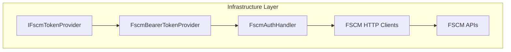

# FSCM Token Provider Feature Documentation

## Overview

The **FSCM Token Provider** defines a contract for obtaining Azure AD bearer tokens scoped to FSCM endpoints. It decouples authentication logic from HTTP client implementations, enabling reusable and testable token acquisition across the Infrastructure layer. This interface underpins secure calls to various FSCM custom and OData APIs within the accrual orchestration system.

## Architecture Overview



## Interface Definition

### IFscmTokenProvider (`src/Rpc.AIS.Accrual.Orchestrator.Infrastructure/Adapters/Fscm/Clients/IFscmTokenProvider.cs`)

- **Purpose:** Abstracts retrieval of AAD bearer tokens for FSCM scopes.
- **Location:** Infrastructure → Adapters → Fscm → Clients.

```csharp
namespace Rpc.AIS.Accrual.Orchestrator.Infrastructure.Clients;

/// <summary>
/// Defines FSCM token provider behavior.
/// </summary>
public interface IFscmTokenProvider
{
    /// <summary>
    /// Retrieves an access token for the specified scope.
    /// </summary>
    /// <param name="scope">The OAuth2 scope or resource URI.</param>
    /// <param name="ct">Cancellation token.</param>
    /// <returns>JWT bearer token string.</returns>
    Task<string> GetAccessTokenAsync(string scope, CancellationToken ct);
}
```

## Method Summary

| Method | Description | Returns |
| --- | --- | --- |
| GetAccessTokenAsync(scope, ct) | Asynchronously fetches a bearer token for the given FSCM scope. | `Task<string>` |


## Implementations

- **FscmBearerTokenProvider** (`FscmBearerTokenProvider.cs`)

Caches per-scope tokens using `Azure.Identity.ClientSecretCredential`.

- **[Custom implementations]** may exist (e.g., for testing or alternative auth flows).

## Integration Points

- **FscmAuthHandler**

An `HttpMessageHandler` that invokes `IFscmTokenProvider` to attach `Authorization: Bearer <token>` to outgoing requests.

- **HttpClient registrations**

In `Program.cs`, HTTP clients for FSCM (SubProject, BaselineFetcher, etc.) use `FscmAuthHandler` in their pipeline.

- **FSCM HTTP Clients**

All infrastructure clients that call FSCM APIs depend on this interface for authentication.

## Dependencies

- **Azure.Core** (`AccessToken`, `TokenRequestContext`)
- **Azure.Identity** (`ClientSecretCredential`)
- **Microsoft.Extensions.Options** (`IOptions<FscmOptions>`)
- **System.Threading** (`CancellationToken`)
- **System.Threading.Tasks** (`Task<T>`)

## Key Classes Reference

| Class | Location | Responsibility |
| --- | --- | --- |
| IFscmTokenProvider | src/.../Adapters/Fscm/Clients/IFscmTokenProvider.cs | Defines contract for obtaining FSCM AAD bearer tokens. |
| FscmBearerTokenProvider | src/.../Adapters/Fscm/Clients/FscmBearerTokenProvider.cs | Implements token caching and retrieval via client credentials. |
| FscmAuthHandler | src/.../Adapters/Fscm/Clients/FscmAuthHandler.cs | Delegating handler that attaches bearer token to HTTP requests. |


## Usage Example

```csharp
// In Program.cs (dependency injection):
services.AddSingleton<IFscmTokenProvider, FscmBearerTokenProvider>();
services.AddHttpClient<FscmSubProjectHttpClient>(...)
        .AddHttpMessageHandler<FscmAuthHandler>();
```

This configuration ensures that any FSCM HTTP client automatically acquires and attaches valid bearer tokens before sending requests.