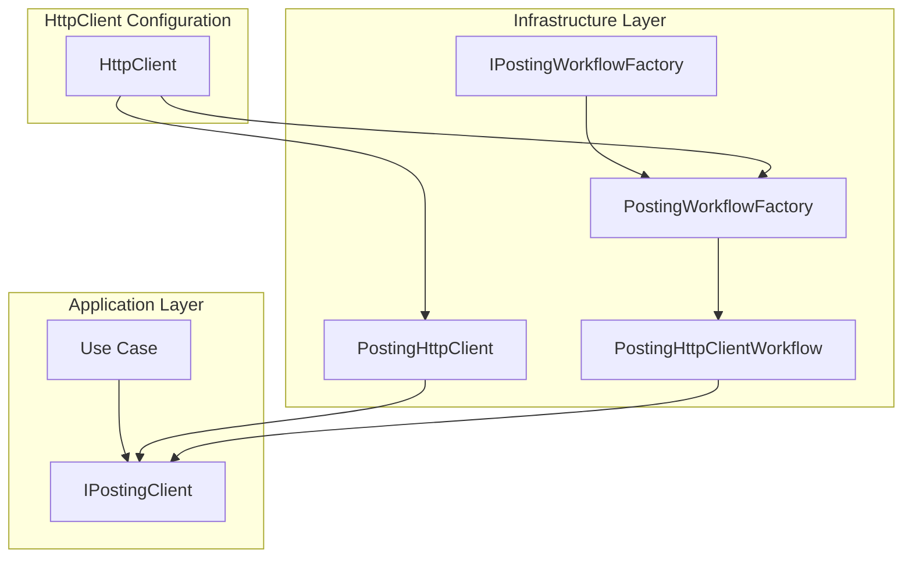

# Posting Workflow Factory Feature Documentation 🚀

## Overview

The **Posting Workflow Factory** encapsulates the construction of a complete posting pipeline for FSCM journals. It decouples orchestration logic from HTTP concerns by using a typed `HttpClient` instance to build an `IPostingClient`. This enables the application to configure resilience, logging, and payload preparation in one place, promoting consistency and testability.

By centralizing the creation of posting workflows, developers can easily register and resolve posting clients via dependency injection. The factory ensures all collaborators—such as request factories, validation engines, and response parsers—are wired together to form a cohesive workflow.

## Architecture Overview



## Component Structure

### Infrastructure Layer

#### **IPostingWorkflowFactory** (`src/Rpc.AIS.Accrual.Orchestrator.Infrastructure/Adapters/Fscm/Clients/IPostingWorkflowFactory.cs`)

- **Purpose and responsibilities**

Defines a factory for building an `IPostingClient` workflow using a provided `HttpClient` instance, allowing typed client configuration and dependency cohesion.

- **Key Methods**

| Method | Description | Returns |
| --- | --- | --- |
| `Create(HttpClient httpClient)` | Builds and returns a configured `IPostingClient` instance using the supplied `HttpClient`. | `IPostingClient` |


### Application Layer

#### **IPostingClient** (`src/Rpc.AIS.Accrual.Orchestrator.Application/Ports/Common/Abstractions/IPostingClient.cs`)

- **Purpose**

Contract for posting accrual staging data or raw WO payloads to FSCM, handling validation, batching, and error propagation.

- **Methods**

| Method | Description | Returns |
| --- | --- | --- |
| `PostAsync(RunContext, JournalType, List<AccrualStagingRef>, CancellationToken)` |
| Posts staging record references for a single journal type. | `Task<PostResult>` |
| `PostFromWoPayloadAsync(RunContext, JournalType, string, CancellationToken)` |
| Validates and filters a raw WO payload JSON, then posts for one journal type. | `Task<PostResult>` |
| `PostValidatedWoPayloadAsync(RunContext, JournalType, string, IReadOnlyList<PostError>, string?, CancellationToken)` |
| Posts a pre-validated WO payload, carrying forward any prior errors. | `Task<PostResult>` |
| `ValidateOnceAndPostAllJournalTypesAsync(RunContext, string, CancellationToken)` |
| Validates the full WO payload once, then posts each detected journal type in sequence. | `Task<List<PostResult>>` |


### Clients Implementation

#### **PostingWorkflowFactory** (`src/Rpc.AIS.Accrual.Orchestrator.Infrastructure/Adapters/Fscm/Clients/PostingWorkflowFactory.cs`)

- **Purpose**

Sealed implementation of `IPostingWorkflowFactory` that composes:

- `FscmJournalPoster` for HTTP posting
- `FscmWoPayloadValidationClient` for remote validation
- `WoPostingPreparationPipeline` for payload normalization, shape guarding, validation, and projection
- `PostOutcomeProcessor` for handling HTTP responses and result handlers
- Logging via `ILoggerFactory`

- **Create Workflow**1. Instantiate `FscmJournalPoster` and `FscmWoPayloadValidationClient` using the provided `HttpClient`.
2. Build a `WoPostingPreparationPipeline` with normalization, validation, notification, projection, and date adjustment.
3. Create a `PostOutcomeProcessor` with response parsing and error aggregation.
4. Return a new `PostingHttpClientWorkflow` that orchestrates preparation and outcome processing.

## Integration Points

- **Dependency Injection**

The factory is registered as a singleton:

```csharp
  services.AddSingleton<IPostingWorkflowFactory, PostingWorkflowFactory>();
  services.AddHttpClient<PostingHttpClient>();
  services.AddSingleton<IPostingClient>(sp =>
      sp.GetRequiredService<PostingHttpClient>());
```

- **Typed HttpClient Facade**

`PostingHttpClient` delegates to the workflow built by `IPostingWorkflowFactory`, keeping the DI surface minimal.

```card
{
    "title": "DI Registration",
    "content": "IPostingWorkflowFactory is registered as a singleton and used by the PostingHttpClient facade."
}
```

## Key Classes Reference

| Class | Location | Responsibility |
| --- | --- | --- |
| `IPostingWorkflowFactory` | src/Rpc.AIS.Accrual.Orchestrator.Infrastructure/Adapters/Fscm/Clients/IPostingWorkflowFactory.cs | Defines the factory contract for creating posting workflows. |
| `PostingWorkflowFactory` | src/Rpc.AIS.Accrual.Orchestrator.Infrastructure/Adapters/Fscm/Clients/PostingWorkflowFactory.cs | Implements the factory, wiring all collaborators into one workflow. |
| `PostingHttpClient` | src/Rpc.AIS.Accrual.Orchestrator.Infrastructure/Adapters/Fscm/Clients/PostingHttpClient.Facade.cs | Typed HttpClient facade for posting, delegates to the workflow. |
| `PostingHttpClientWorkflow` | src/Rpc.AIS.Accrual.Orchestrator.Infrastructure/Adapters/Fscm/Clients/PostingHttpClient.cs | Orchestrates preparation pipeline and post outcome processing. |
| `IPostingClient` | src/Rpc.AIS.Accrual.Orchestrator.Application/Ports/Common/Abstractions/IPostingClient.cs | Business-layer contract for posting operations. |


## Error Handling

- **Null Checks**

The `Create` method and constructor parameters throw `ArgumentNullException` for any missing dependencies.

- **HttpClient Validation**

Implementations guard against a `null` `HttpClient`, ensuring pipeline creation fails fast if misconfigured.

## Dependencies

- **Framework**: .NET `System.Net.Http`
- **DI and Logging**: `Microsoft.Extensions.Logging`, built-in DI container
- **Core Abstractions**: `Rpc.AIS.Accrual.Orchestrator.Core.Abstractions`

## Testing Considerations

- **Factory Behavior**- Verify `Create` returns a non-null `IPostingClient` for a valid `HttpClient`.
- Assert `ArgumentNullException` is thrown when `HttpClient` is `null`.
- **Workflow Composition**- Use mocks for `IFscmPostRequestFactory`, `IResilientHttpExecutor`, and other collaborators to confirm they are passed correctly into `PostingHttpClientWorkflow`.
- **Integration Scenario**- Configure an in-memory `HttpClient` to return a stubbed response and verify the full posting pipeline executes without errors.

> 