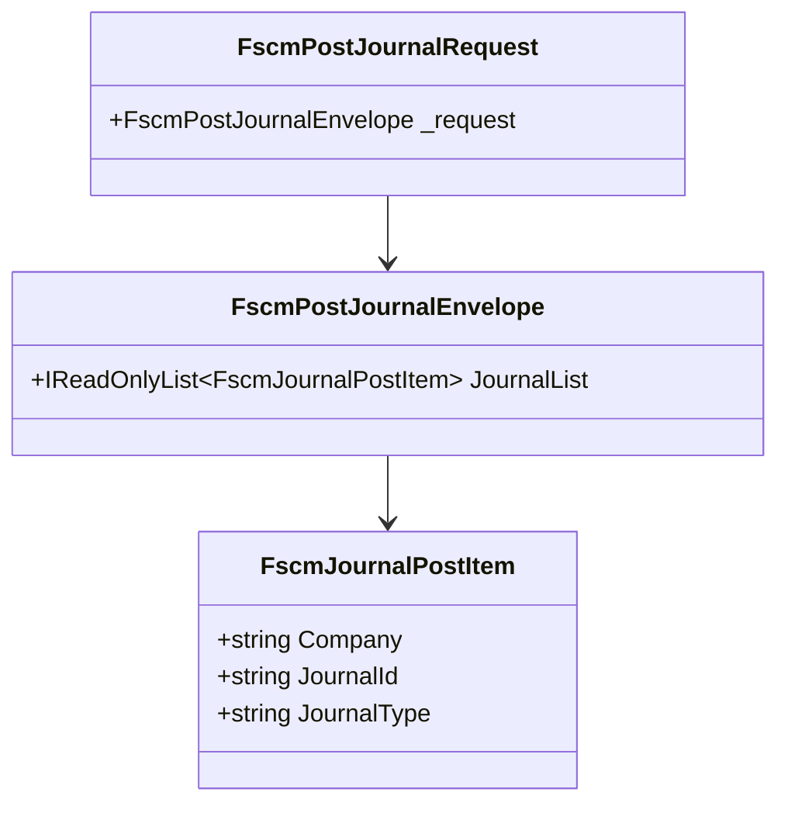

# FSCM Journal Posting DTOs Feature Documentation

## Overview

The **FSCM Journal Posting DTOs** encapsulate the JSON contract used to post journal entries (Item, Expense, Hour) from the Accrual Orchestrator into the FSCM system.

These records define a strongly-typed shape for the HTTP payload sent by `FscmJournalPoster`, ensuring property names and nesting match FSCM’s expectations.

By centralizing these DTOs, the application minimizes manual JSON construction errors and eases maintenance when the FSCM contract evolves.

## Architecture Overview



## Component Structure

### Data Models

#### **FscmPostJournalRequest** (`src/Rpc.AIS.Accrual.Orchestrator.Infrastructure/Adapters/Fscm/Clients/Posting/FscmJournalPostDtos.cs`)

- **Purpose:** Top-level wrapper for the posting payload.
- **Properties:**

| Property | Type | Description |
| --- | --- | --- |
| _request | FscmPostJournalEnvelope | Container for the list of journal entries. |


#### **FscmPostJournalEnvelope** (`.../FscmJournalPostDtos.cs`)

- **Purpose:** Represents the FSCM contract envelope under the `_request` JSON key.
- **Properties:**

| Property | Type | Description |
| --- | --- | --- |
| JournalList | IReadOnlyList\<FscmJournalPostItem\> | Array of individual journals. |


#### **FscmJournalPostItem** (`.../FscmJournalPostDtos.cs`)

- **Purpose:** Defines each journal entry’s company, identifier, and type.
- **Properties:**

| Property | JSON Name | Type | Description |
| --- | --- | --- | --- |
| Company | `company` | string | FSCM company code for the Work Order. |
| JournalId | `journalId` | string | Identifier of the created journal in FSCM. |
| JournalType | `journalType` | string | One of “Item”, “Expense”, or “Hour” to route correctly. |


### API Integration

The DTOs implement the payload contract for the following FSCM service:

### POST /api/services/RPCJournalPostingWOIntServGrp/RPCJournalPostingWOIntServ/postJournal

```api
{
    "title": "Post Journals to FSCM",
    "description": "Submits a batch of journal entries (Item/Expense/Hour) to the FSCM posting endpoint.",
    "method": "POST",
    "baseUrl": "{FscmPostingBaseUrl}",
    "endpoint": "/api/services/RPCJournalPostingWOIntServGrp/RPCJournalPostingWOIntServ/postJournal",
    "headers": [
        {
            "key": "Content-Type",
            "value": "application/json",
            "required": true
        },
        {
            "key": "x-run-id",
            "value": "<RunContext.RunId>",
            "required": true
        },
        {
            "key": "x-correlation-id",
            "value": "<RunContext.CorrelationId>",
            "required": true
        }
    ],
    "queryParams": [],
    "pathParams": [],
    "bodyType": "json",
    "requestBody": "{\n  \"_request\": {\n    \"JournalList\": [\n      {\n        \"company\": \"425\",\n        \"journalId\": \"425-JNUM-00000191\",\n        \"journalType\": \"Expense\"\n      }\n    ]\n  }\n}",
    "formData": [],
    "rawBody": "",
    "responses": {
        "200": {
            "description": "Journals posted successfully.",
            "body": "{ \"ok\": true }"
        },
        "400": {
            "description": "Bad request (e.g., missing required property).",
            "body": "{ \"error\": \"Endpoint request validation failed.\", \"endpoint\": \"JournalPost\", \"errors\": [\"AIS_JournalPost_MISSING_COMPANY\"] }"
        },
        "500": {
            "description": "Server error or FSCM create/post failure.",
            "body": "{ \"error\": \"FSCM create did not return any JournalIds; cannot post journals.\" }"
        }
    }
}
```

### Implementation Note

```card
{
    "title": "JSON Naming",
    "content": "Property names are explicitly lower-cased via [JsonPropertyName] to match FSCM's contract exactly."
}
```

## Key Classes Reference

| Class | Location | Responsibility |
| --- | --- | --- |
| FscmPostJournalRequest | src/Rpc.AIS.Accrual.Orchestrator.Infrastructure/Adapters/Fscm/Clients/Posting/FscmJournalPostDtos.cs | Encapsulates the `_request` envelope for posting journals. |
| FscmPostJournalEnvelope | src/.../FscmJournalPostDtos.cs | Holds the array of `FscmJournalPostItem` under `JournalList`. |
| FscmJournalPostItem | src/.../FscmJournalPostDtos.cs | Defines individual journal entry fields and JSON mappings. |


---

*All details are based on the FSCM DTO definitions in FscmJournalPostDtos.cs.*