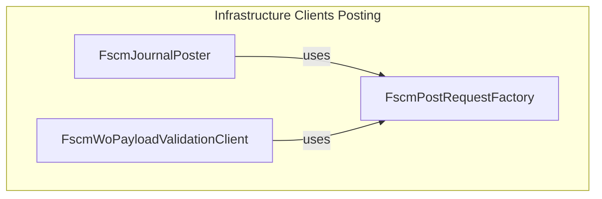

# FSCM Post Request Factory Feature Documentation

## Overview

The **FscmPostRequestFactory** encapsulates the creation of HTTP POST requests for FSCM services. It ensures each request uses JSON content, sets the `Accept` header to `application/json`, and propagates run and correlation identifiers. By centralizing header and body setup, it promotes consistency across all FSCM posting and validation clients .

## Architecture Overview



This diagram shows how posting clients delegate HTTP request construction to the factory.

## Component Structure

### 3. Data Access Layer

#### **FscmPostRequestFactory** (`src/Rpc.AIS.Accrual.Orchestrator.Infrastructure/Adapters/Fscm/Clients/Posting/FscmPostRequestFactory.cs`)

- **Purpose**- Build `HttpRequestMessage` instances for JSON POST calls.
- Standardize headers and content setup for FSCM endpoints.

- **Responsibilities**- Validate method arguments (`RunContext`, URL, payload).
- Add `Accept: application/json` header.
- Include `x-run-id` and `x-correlation-id` headers.
- Create `StringContent` with UTF-8 JSON payload.

- **Key Methods**

| Method | Description | Returns |
| --- | --- | --- |
| `CreateJsonPost(RunContext, string, string)` | Validates inputs and constructs a JSON POST `HttpRequestMessage`. | `HttpRequestMessage` |


```csharp
public HttpRequestMessage CreateJsonPost(RunContext ctx, string url, string payloadJson)
{
    if (ctx is null) throw new ArgumentNullException(nameof(ctx));
    if (string.IsNullOrWhiteSpace(url)) throw new ArgumentException("URL is empty.", nameof(url));
    if (payloadJson is null) throw new ArgumentNullException(nameof(payloadJson));

    var req = new HttpRequestMessage(HttpMethod.Post, url);
    req.Headers.Accept.Add(new MediaTypeWithQualityHeaderValue("application/json"));
    req.Headers.TryAddWithoutValidation("x-run-id", ctx.RunId);
    req.Headers.TryAddWithoutValidation("x-correlation-id", ctx.CorrelationId);
    req.Content = new StringContent(payloadJson, Encoding.UTF8, "application/json");
    return req;
}
```

## Integration Points

- **Dependency Injection**

Registered as the implementation for `IFscmPostRequestFactory` in the HTTP client setup:

```csharp
  services.AddSingleton<IFscmPostRequestFactory, FscmPostRequestFactory>();
```

- **Usage by Posting Clients**- `FscmJournalPoster`
- `FscmWoPayloadValidationClient`

Both inject `IFscmPostRequestFactory` to build their POST requests.

## Key Classes Reference

| Class | Location | Responsibility |
| --- | --- | --- |
| **IFscmPostRequestFactory** | `src/.../Clients/Posting/FscmPostRequestFactory.cs` | Defines the contract for creating JSON POST requests. |
| **FscmPostRequestFactory** | `src/.../Clients/Posting/FscmPostRequestFactory.cs` | Implements the factory, sets headers and content. |


## Error Handling

The factory validates its inputs and throws on invalid arguments:

- `ArgumentNullException` if `ctx` or `payloadJson` is `null`.
- `ArgumentException` if `url` is empty or whitespace.

## Dependencies

- **Namespaces**- `System.Net.Http`
- `System.Net.Http.Headers`
- `System.Text`
- `Rpc.AIS.Accrual.Orchestrator.Core.Domain` (`RunContext`)

- **Domain Model**- `RunContext`: carries run identifiers and correlation information for logging and tracing.