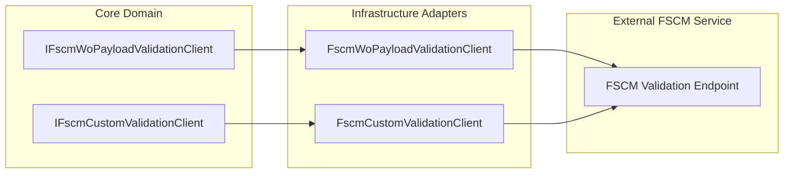

# FSCM Work Order Payload Validation Feature Documentation

## Overview

The **FscmWoPayloadValidationClient** integrates with an external FSCM validation service to verify the schema and business rules of Work Order (WO) payloads before posting. It ensures that any payload errors are caught early, preserving data integrity and preventing invalid journal postings.

This feature sits in the **Infrastructure** layer, implements a **Core** abstraction, and plugs into the WO posting pipeline. It logs detailed request/response traces and handles transport, HTTP, and parsing errors in a resilient, fail-closed manner.

## Architecture Overview



## Component Structure

### Interfaces

#### **IFscmWoPayloadValidationClient** (`src/.../Posting/IFscmWoPayloadValidationClient.cs`)

Defines the contract for remote WO payload validation.

| Method | Signature | Description |
| --- | --- | --- |
| ValidateAsync | `Task<RemoteWoPayloadValidationResult> ValidateAsync(RunContext ctx, JournalType journalType, string normalizedWoPayloadJson, CancellationToken ct)` | Calls the FSCM WO validation endpoint and parses the result. |


#### **IFscmCustomValidationClient** (`src/.../Clients/FscmCustomValidationClient.cs`)

Defines a generic FSCM custom validation contract, used by reference validators.

| Method | Signature | Description |
| --- | --- | --- |
| ValidateAsync | `Task<IReadOnlyList<WoPayloadValidationFailure>> ValidateAsync(RunContext context, JournalType journalType, string company, string woPayloadJson, CancellationToken ct)` | Validates company-scoped WO payloads via FSCM. |


### Models 📦

#### **RemoteWoPayloadValidationResult**

Represents the result of a remote WO validation call.

| Property | Type | Description |
| --- | --- | --- |
| **IsSuccessStatusCode** | `bool` | Indicates HTTP 2xx status. |
| **StatusCode** | `int` | HTTP response code or synthetic code on exceptions. |
| **FilteredPayloadJson** | `string` | WO payload after FSCM filtering; original if no filtering. |
| **Failures** | `IReadOnlyList<WoPayloadValidationFailure>` | List of validation failures reported by FSCM. |
| **RawResponse** | `string?` | Full response body or exception message on error. |
| **ElapsedMs** | `long` | Milliseconds taken for the HTTP round trip and parsing. |
| **Url** | `string` | Fully qualified URL that was called. |


### Implementations

#### **FscmWoPayloadValidationClient** (`src/.../Posting/FscmWoPayloadValidationClient.cs`)

Handles the end-to-end flow of sending a normalized WO payload JSON to FSCM and parsing its response.

- **Dependencies**- `HttpClient _http`
- `FscmOptions _endpoints`
- `IFscmPostRequestFactory _reqFactory`
- `IResilientHttpExecutor _executor`
- `IAisLogger _aisLogger`
- `IAisDiagnosticsOptions _diag`
- `ILogger<FscmWoPayloadValidationClient> _logger`

- **ValidateAsync Workflow**1. **Empty payload**: Returns a 204-like success with empty JSON.
2. **Path not set**: Logs and returns original payload as success.
3. **Build URL**: Combines base URL and configured path.
4. **Log outbound**: Sends JSON payload to AIS logger.
5. **HTTP call**: Uses resilient executor to POST JSON.
6. **Error catch**: On exception, logs error and returns fail-closed result.
7. **Read response**: Logs inbound JSON; marks error levels ≥500 for full body logging.
8. **Status check**: Non-2xx yields warning/error and returns failure; 2xx proceeds.
9. **Parse**: Extracts WO Headers, errors, and builds failure list; original payload remains.
10. **Exception in parsing**: Logs error and returns fail-closed result.

```csharp
public async Task<RemoteWoPayloadValidationResult> ValidateAsync(
    RunContext ctx,
    JournalType journalType,
    string normalizedWoPayloadJson,
    CancellationToken ct)
{
    if (string.IsNullOrWhiteSpace(normalizedWoPayloadJson))
    {
        return new RemoteWoPayloadValidationResult(
            true, 204, "{}", Array.Empty<WoPayloadValidationFailure>(), null, 0, "");
    }

    if (string.IsNullOrWhiteSpace(_endpoints.WoPayloadValidationPath))
    {
        _logger.LogInformation("Validation path not configured. Skipping.");
        return new RemoteWoPayloadValidationResult(
            true, 200, normalizedWoPayloadJson, Array.Empty<WoPayloadValidationFailure>(), null, 0, "");
    }

    var url = CombineUrl(_endpoints.BaseUrl, _endpoints.WoPayloadValidationPath);
    // ...execute HTTP, log, parse, return result...
}
```

#### **FscmCustomValidationClient** (`src/.../Clients/FscmCustomValidationClient.cs`)

Provides a **best-effort** parsing of various customer-specific validation schemas. It:

- Validates non-empty **company** and JSON.
- Posts to `/api/services/AIS/Validate` (configurable).
- On non-2xx, returns a single transport failure with disposition based on policy.
- Parses `failures`, `errors`, `validationErrors`, or `{ isValid:false }` shapes into `WoPayloadValidationFailure` objects.

### Options

#### **FscmOptions** (`src/.../Infrastructure/Options/FscmOptions.cs`)

Configures FSCM endpoints.

| Property | Type | Default | Description |
| --- | --- | --- | --- |
| **BaseUrl** | `string` | — | Root URL of FSCM service. |
| **WoPayloadValidationPath** | `string` | — | Path to WO payload validation endpoint. |


#### **PayloadValidationOptions** (`src/.../Application/Options/PayloadValidationOptions.cs`)

Controls local and remote validation behavior.

| Property | Type | Default | Description |
| --- | --- | --- | --- |
| **EnableFscmCustomEndpointValidation** | `bool` | `false` | Toggle calling custom FSCM endpoint after local validation. |
| **FailClosedOnFscmCustomValidationError** | `bool` | `true` | Treat remote call failures as FailFast (`true`) or Retryable (`false`). |
| **DropWholeWorkOrderOnAnyInvalidLine** | `bool` | `true` | Exclude entire WO if any line is invalid locally. |
| **RetryMaxAttempts** | `int` | `3` | Max retry attempts on retryable failures. |
| **RetryDelaysMinutes** | `int[]` | `[5,15,30]` | Delay schedule for retries (minutes). |


### Pipeline Integration

- **WoPostingPreparationPipeline** injects `IFscmWoPayloadValidationClient` to perform remote WO validation within the preparation steps.
- **FscmReferenceValidator** calls `IFscmCustomValidationClient` to validate by company grouping after local AIS checks.

### Testing 🔍

#### **FscmWoPayloadValidationClientContractTests** (`tests/.../FscmWoPayloadValidationClientContractTests.cs`)

- Verifies **skip logic** when validation path is empty.
- Confirms **URL construction** and a single POST when the path is configured.

## Error Handling

- **Transport Exceptions**: Caught in `ValidateAsync`, logged as errors, and yield `IsSuccessStatusCode=false` with `RawResponse=exception.Message`.
- **HTTP Non-2xx**: Logged as warning (`4xx`) or error (`5xx`). Returns original payload and empty failures.
- **Parsing Errors**: Any JSON shape mismatch throws `InvalidOperationException` or other. Caught and logged, with fail-closed result.

## Dependencies

- `System.Net.Http.HttpClient`
- `Rpc.AIS.Accrual.Orchestrator.Infrastructure.Options.FscmOptions`
- `Rpc.AIS.Accrual.Orchestrator.Infrastructure.Resilience.IResilientHttpExecutor`
- `Rpc.AIS.Accrual.Orchestrator.Core.Abstractions.IFscmPostRequestFactory`
- `Rpc.AIS.Accrual.Orchestrator.Core.Abstractions.IAisLogger`
- `Rpc.AIS.Accrual.Orchestrator.Core.Utilities.LogText`
- `Microsoft.Extensions.Logging.ILogger<T>`

## Key Classes Reference

| Class | Location | Responsibility |
| --- | --- | --- |
| IFscmWoPayloadValidationClient | `Infrastructure/Adapters/Fscm/Clients/Posting/IFscmWoPayloadValidationClient.cs` | Contract for remote WO payload validation. |
| RemoteWoPayloadValidationResult | `Core/Abstractions/IFscmWoPayloadValidationClient.cs` | Data model for validation result. |
| FscmWoPayloadValidationClient | `Infrastructure/Adapters/Fscm/Clients/Posting/FscmWoPayloadValidationClient.cs` | Implements WO payload validation over HTTP. |
| IFscmCustomValidationClient | `Application/Ports/Common/Abstractions/IFscmCustomValidationClient.cs` | Contract for custom FSCM validation by company. |
| FscmCustomValidationClient | `Infrastructure/Adapters/Fscm/Clients/FscmCustomValidationClient.cs` | Parses various custom validation schemas from FSCM. |
| PayloadValidationOptions | `Application/Options/PayloadValidationOptions.cs` | Configures local and remote validation behaviors. |
| FscmOptions | `Infrastructure/Options/FscmOptions.cs` | Holds FSCM service URLs and paths. |


---

*📖 This documentation covers the FSCM WO payload validation components, their contracts, implementations, models, configuration options, and integration points.*