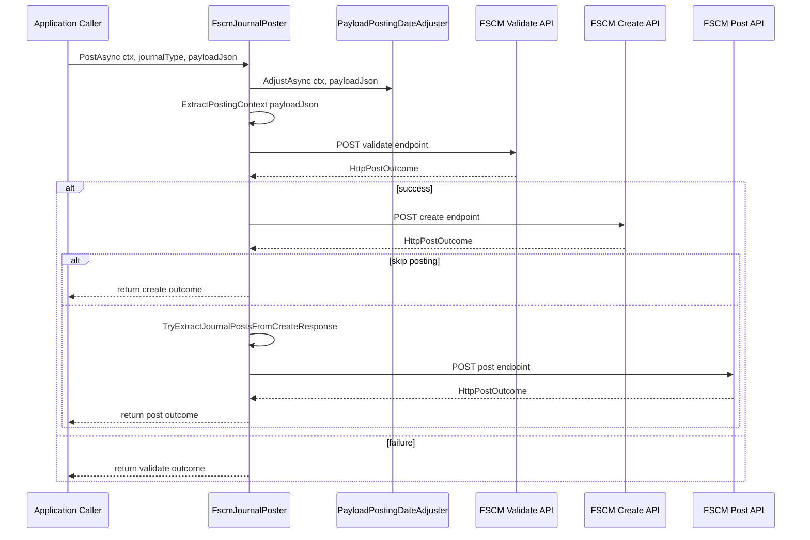

# FSCM Journal Poster Feature Documentation

## Overview

The **FSCM Journal Poster** component orchestrates the posting of work‐order journals to an external FSCM service. It ensures that:

- Payload dates align with open accounting periods.
- Required context fields (`Company`, `SubProjectId`) are present.
- Sequential HTTP calls are made to FSCM: Validate → Create → Post.
- Certain triggers (e.g., scheduled runs) skip the final post step to avoid side-effects.

This feature adds business value by centralizing FSCM journal posting logic, enforcing contract validation, and providing resilience and diagnostics for each HTTP interaction .

## Architecture Overview

```mermaid
flowchart LR
    subgraph Application Layer
        App[Caller Application]
    end
    subgraph Infrastructure – FSCM Client
        Poster[FscmJournalPoster]
        ValidateAPI[(Validate API)]
        CreateAPI[(Create API)]
        PostAPI[(Post API)]
    end
    subgraph External System
        FSCMService[FSCM Service]
    end

    App -->|PostAsync| Poster
    Poster -->|FSCM_JOURNAL_VALIDATE| ValidateAPI
    Poster -->|FSCM_JOURNAL_CREATE| CreateAPI
    Poster -->|FSCM_JOURNAL_POST| PostAPI
    ValidateAPI & CreateAPI & PostAPI --> FSCMService
```

## Component Structure

### 1. Contract

#### **IFscmJournalPoster** (`src/Rpc.AIS.Accrual.Orchestrator.Infrastructure/Adapters/Fscm/Clients/Posting/IFscmJournalPoster.cs`)

- Defines the contract for posting journals to FSCM.
- Method:- `Task<HttpPostOutcome> PostAsync(RunContext ctx, JournalType journalType, string payloadJson, CancellationToken ct);`

### 2. Data Models

#### **HttpPostOutcome** (`src/.../IFscmJournalPoster.cs`)

Represents the result of an HTTP post operation .

| Property | Type | Description |
| --- | --- | --- |
| `StatusCode` | HttpStatusCode | HTTP response status |
| `Body` | string | Raw response payload |
| `ElapsedMs` | long | Time taken in milliseconds |
| `Url` | string | Full request URL |
| `IsSuccessStatusCode` | bool | True if status code is in 200–299 range |


#### **FSCM Posting DTOs** (`src/Rpc.AIS.Accrual.Orchestrator.Infrastructure/Adapters/Fscm/Clients/Posting/FscmJournalPostDtos.cs`)

Strongly‐typed request models for the final post call .

- **FscmPostJournalRequest**

Wraps the envelope in the `_request` property.

- **FscmPostJournalEnvelope**

Contains the `JournalList` array.

- **FscmJournalPostItem**

Represents an individual journal entry:

| Property | Type | JSON Name |
| --- | --- | --- |
| `Company` | string | `"company"` |
| `JournalId` | string | `"journalId"` |
| `JournalType` | string | `"journalType"` |


## 3. Posting Orchestrator

#### **FscmJournalPoster** (`src/Rpc.AIS.Accrual.Orchestrator.Infrastructure/Adapters/Fscm/Clients/Posting/FscmJournalPoster.cs`)

Coordinates the multi‐step posting workflow: Validate → Create → Post .

- **Dependencies**- `HttpClient`
- `FscmOptions` (endpoint configuration)
- `IFscmPostRequestFactory` (builds JSON `HttpRequestMessage`)
- `IResilientHttpExecutor` (retry/resilience)
- `PayloadPostingDateAdjuster` (adjusts posting dates)
- `IAisLogger` + `IAisDiagnosticsOptions` (JSON payload logging)
- `ILogger<FscmJournalPoster>` (structured logs)

- **Key Members**- `SkipJournalPostingTriggers`

Triggers that skip the final post (e.g., `"Timer"`, `"AdHocSingle"`) .

- `JsonOpts`

Controls JSON serialization (indentation disabled) .

- **Key Methods**

| Method | Description |
| --- | --- |
| `PostAsync(...)` | Main orchestration entry point; validates, creates, optionally skips post, then posts journals. |
| `ExtractPostingContext(string)` | Parses `payloadJson` to extract `Company` and `SubProjectId`. |
| `TryValidateEndpoint(FscmEndpointType, …)` | Pre‐validates presence of required context fields; returns 400 outcome if missing. |
| `CallStepAsync(...)` | Executes a named HTTP POST step, logs payload/response, handles auth and timing. |
| `TryExtractJournalPostsFromCreateResponse(...)` | Parses the create response JSON to collect all journal IDs for posting. |
| `TryAddSectionJournal(...)` | Helper to extract `JournalId` from a section JSON object. |
| `ShouldSkipJournalPosting(RunContext)` | Determines if final post step is skipped based on trigger. |
| `TryGetFirstWorkOrderIdentity(string)` | Retrieves first WorkOrder GUID/ID for logging context. |


## Patterns & Design

- **Orchestration Pattern**

Single class orchestrates sequential service calls .

- **Resilience**

Delegates HTTP execution to `IResilientHttpExecutor`.

- **Pre-validation**

Validates context fields locally before any remote call.

- **Trigger-based Skipping**

Conditional bypass of the post call for non-posting triggers.

- **DTO Serialization**

Uses well‐defined record types to enforce JSON contract .

## API Integration

### POST /api/validate

```api
{
    "title": "Journal Validate",
    "description": "Validates the WO payload before journal creation.",
    "method": "POST",
    "baseUrl": "{BaseUrl}",
    "endpoint": "{JournalValidatePath}",
    "headers": [
        {
            "key": "Content-Type",
            "value": "application/json",
            "required": true
        }
    ],
    "queryParams": [],
    "pathParams": [],
    "bodyType": "json",
    "requestBody": "{\n  \"_request\": { ... }\n}",
    "formData": [],
    "rawBody": "",
    "responses": {
        "200": {
            "description": "Validation succeeded.",
            "body": "{ \"ok\": true }"
        },
        "400": {
            "description": "Missing required context fields.",
            "body": "{ \"error\": \"Endpoint request validation failed.\", \"errors\": [\"AIS_JournalValidate_MISSING_COMPANY\"] }"
        },
        "500": {
            "description": "Server error during validation.",
            "body": "{ \"error\": \"boom\" }"
        }
    }
}
```

### POST /api/create

```api
{
    "title": "Journal Create",
    "description": "Creates journal entries for the work orders.",
    "method": "POST",
    "baseUrl": "{BaseUrl}",
    "endpoint": "{JournalCreatePath}",
    "headers": [
        {
            "key": "Content-Type",
            "value": "application/json",
            "required": true
        }
    ],
    "queryParams": [],
    "pathParams": [],
    "bodyType": "json",
    "requestBody": "{\n  \"_request\": { ... }\n}",
    "formData": [],
    "rawBody": "",
    "responses": {
        "200": {
            "description": "Creation succeeded.",
            "body": "{ \"WOList\": [ { \"WOExpLines\": { \"JournalId\": \"425-JNUM-00000191\" } } ] }"
        },
        "400": {
            "description": "Missing required context fields.",
            "body": "{ \"error\": \"Endpoint request validation failed.\", \"errors\": [\"AIS_JournalCreate_MISSING_SUBPROJECTID\"] }"
        },
        "500": {
            "description": "Server error during creation.",
            "body": "{ \"error\": \"unable to create\" }"
        }
    }
}
```

### POST /api/post

```api
{
    "title": "Journal Post",
    "description": "Posts created journal entries in batch.",
    "method": "POST",
    "baseUrl": "{BaseUrl}",
    "endpoint": "{JournalPostPath}",
    "headers": [
        {
            "key": "Content-Type",
            "value": "application/json",
            "required": true
        }
    ],
    "queryParams": [],
    "pathParams": [],
    "bodyType": "json",
    "requestBody": "{\n  \"_request\": {\n    \"JournalList\": [ { \"company\": \"425\", \"journalId\": \"425-JNUM-00000191\", \"journalType\": \"Expense\" } ]\n  }\n}",
    "formData": [],
    "rawBody": "",
    "responses": {
        "200": {
            "description": "Posting succeeded.",
            "body": "{ \"ok\": true }"
        },
        "400": {
            "description": "Missing company for post.",
            "body": "{ \"error\": \"Endpoint request validation failed.\", \"errors\": [\"AIS_JournalPost_MISSING_COMPANY\"] }"
        },
        "500": {
            "description": "Server error during posting.",
            "body": "{ \"error\": \"unable to post journals\" }"
        }
    }
}
```

## Feature Flows

### Journal Posting Flow



## Error Handling

- **Pre-validation**: Missing `Company` or `SubProjectId` returns 400 via `TryValidateEndpoint` .
- **5xx Block**: A 5xx from validate stops the workflow to prevent duplicates .
- **Unauthorized**: 401/403 from any step throws `HttpRequestException` in `CallStepAsync` .
- **Missing Journal IDs**: Create success with no `JournalId` results in a 500 outcome.

## Dependencies

- **FscmOptions**: Holds `BaseUrl` and endpoint paths.
- **IFscmPostRequestFactory**: Constructs JSON HTTP requests.
- **IResilientHttpExecutor**: Executes HTTP calls with retry logic.
- **PayloadPostingDateAdjuster**: Adjusts dates around closed periods.
- **IAisLogger** & **IAisDiagnosticsOptions**: Control JSON payload logging.
- **ILogger<FscmJournalPoster>**: Structured log output.
- **FscmUrlBuilder**: Resolves base URLs and paths.

## Key Classes Reference

| Class | Location | Responsibility |
| --- | --- | --- |
| **IFscmJournalPoster** | `.../Posting/IFscmJournalPoster.cs` | Contract for journal posting to FSCM. |
| **HttpPostOutcome** | `.../Posting/IFscmJournalPoster.cs` | Captures HTTP response details and success flag. |
| **FscmJournalPoster** | `.../Posting/FscmJournalPoster.cs` | Orchestrates FSCM validate/create/post workflow. |
| **FscmPostJournalRequest** | `.../Posting/FscmJournalPostDtos.cs` | Root DTO for batch journal post. |
| **FscmPostJournalEnvelope** | `.../Posting/FscmJournalPostDtos.cs` | Envelope wrapping the journal list. |
| **FscmJournalPostItem** | `.../Posting/FscmJournalPostDtos.cs` | Represents an individual journal entry (company, id, type). |


## Testing Considerations

- **End-to-End Success**: Validate → Create → Post returns HTTP 2xx and correct JournalList payload  .
- **Validate 5xx**: Blocks subsequent calls and surfaces the validate outcome  .
- **Trigger Skip**: When `RunContext.TriggeredBy` is in the skip list, only validate and create are invoked  .
- **Context Missing**: Absence of `Company` or `SubProjectId` returns a 400 Bad Request.
- **Empty Journal IDs**: Create response without any IDs yields a 500 Internal Server Error.

## Integration Points

- Consumed by `PostOutcomeProcessor` to fulfill the `IPostingClient` contract in `PostingHttpClientWorkflow`.
- Works alongside:- `FscmWoPayloadValidationClient` (remote WO validation)
- `WoPostingPreparationPipeline` (payload normalization, projection, local validation)
- `PostOutcomeProcessor` (outcome aggregation and `PostResult` creation)