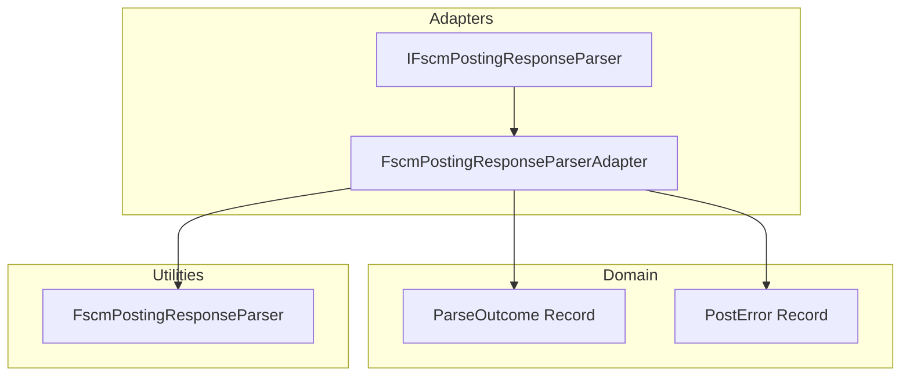

# FSCM Posting Response Parser Feature Documentation

## Overview

This feature encapsulates the logic for interpreting responses from the FSCM “JournalAsync” posting endpoint. It defines a clear contract (`IFscmPostingResponseParser`) for parsing raw JSON responses into a domain-friendly shape (`ParseOutcome`). By extracting JSON parsing into a dedicated adapter and utility class, the design adheres to the Single Responsibility Principle and facilitates unit testing of parsing behavior separate from HTTP orchestration.

## Architecture Overview

## Component Structure

### IFscmPostingResponseParser (src/Rpc.AIS.Accrual.Orchestrator.Infrastructure/Adapters/Fscm/Clients/Posting/IFscmPostingResponseParser.cs)

- **Purpose:** Defines the contract for parsing an FSCM posting response body into a `ParseOutcome`.
- **Method:**- `Parse(string responseBody)`: Returns a `ParseOutcome` representing success flag, journal ID, message, and parse errors.

### FscmPostingResponseParserAdapter (same path)

- **Purpose:** Implements `IFscmPostingResponseParser` by delegating to the static utility `FscmPostingResponseParser.TryParse`.
- **Behavior:**- Calls `TryParse(responseBody)` to obtain a tuple `(ok, journalId, message, parseErrors)`.
- Wraps tuple into `new ParseOutcome(ok, journalId, message…, parseErrors…)`.

### FscmPostingResponseParser (src/Rpc.AIS.Accrual.Orchestrator.Infrastructure/CrossCutting/Common/FscmPostingResponseParser.cs)

- **Purpose:** Static helper parsing raw JSON into `(bool Ok, string? JournalId, string? Message, List<PostError> ParseErrors)`.
- **Key Logic:**- Honors explicit success flags (`isSuccess`, `success`, etc.).
- Applies FSCM schema rules around `StatusCode`, `Error`, and `Response`.
- Extracts journal ID from common keys (`journalId`, `JournalId`, `JournalID`).
- Catches JSON parse failures to treat HTTP 2xx as success but emits a `PostError`.

## Data Models

### ParseOutcome

| Property | Type | Description |
| --- | --- | --- |
| Ok | bool | Indicates whether the response is considered successful. |
| JournalId | string? | FSCM-returned journal identifier, if present. |
| Message | string | Informational or error message extracted from the response. |
| ParseErrors | IReadOnlyList<PostError> | Details of any parsing errors encountered. |

### PostError

| Property | Type | Description |
| --- | --- | --- |
| Code | string | Machine-readable error code. |
| Message | string | Human-readable description of the error. |
| StagingId | string? | Optional staging record identifier. |
| JournalId | string? | Optional journal ID related to this error. |
| JournalDeleted | bool | Indicates if the journal was deleted as part of error handling. |
| DeleteMessage | string? | Raw message when journal deletion occurred. |

## Key Classes Reference

| Class | Location | Responsibility |
| --- | --- | --- |
| IFscmPostingResponseParser | src/Rpc.AIS.Accrual.Orchestrator.Infrastructure/Adapters/Fscm/Clients/Posting/IFscmPostingResponseParser.cs | Defines parsing contract for posting responses. |
| FscmPostingResponseParserAdapter | same as above | Adapter mapping tuple to `ParseOutcome`. |
| ParseOutcome | same as above | Carries parsing result. |
| FscmPostingResponseParser | src/Rpc.AIS.Accrual.Orchestrator.Infrastructure/CrossCutting/Common/FscmPostingResponseParser.cs | Static JSON parsing logic. |
| PostError | src/Rpc.AIS.Accrual.Orchestrator.Core/Domain/PostResult.cs | Domain representation of a parsing or posting error. |

## Error Handling

- The static parser wraps all JSON exceptions, ensuring HTTP 2xx responses are treated as “OK” even if parsing fails.
- In catch-all scenarios, it returns `(true, null, "Posting completed (response parsing skipped).", [PostError…])` with code `FSCM_POST_RESPONSE_PARSE_SKIPPED`.
- The adapter preserves the `ok` flag and substitutes a default message `"OK"` or `"Parse failed"` as needed.

## Integration Points

- **Posting Workflow:** Injected into `PostOutcomeProcessor` to interpret FSCM responses before converting to `PostResult`.
- **Dependency Injection:** Registered as `IFscmPostingResponseParser` ⇒ `FscmPostingResponseParserAdapter` in startup.

## Testing Considerations

- The adapter and static parser can be unit tested in isolation by supplying various JSON payloads and verifying `ParseOutcome`.
- Separation from HTTP concerns allows mocking network errors and focusing on parsing logic.

## Caching Strategy

## API Integration