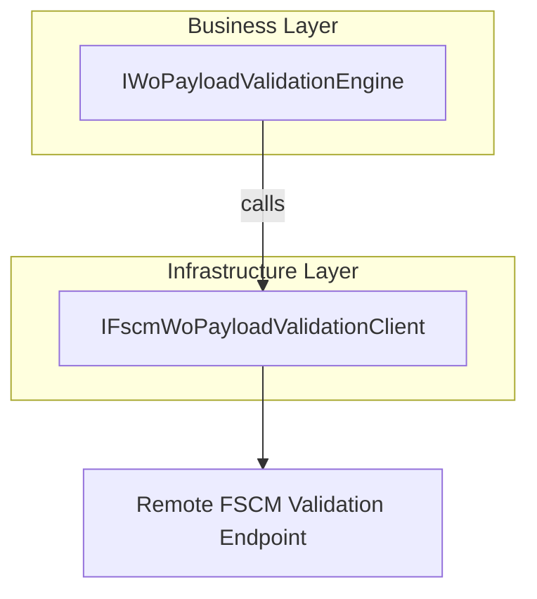

# FSCM WO Payload Validation Feature Documentation

## Overview

The **FSCM WO Payload Validation** feature provides an abstraction for performing remote validation of Work Order (WO) payloads against a custom FSCM endpoint. It ensures that complex validation rules maintained by FSCM are applied before any posting operations, preventing downstream errors and enforcing external business policies.

This feature sits between the local validation engine and the FSCM service in the orchestration pipeline. Consumer components invoke the `IFscmWoPayloadValidationClient` to submit normalized WO JSON and receive a filtered payload along with detailed failure information, if any.

## Architecture Overview



## Component Structure

### Data Access Layer

#### **IFscmWoPayloadValidationClient** (`src/Rpc.AIS.Accrual.Orchestrator.Infrastructure/Adapters/Fscm/Clients/Posting/IFscmWoPayloadValidationClient.cs`)

- **Purpose**

Defines the contract for calling FSCM’s custom WO payload validation endpoint.

- **Key Method**- `ValidateAsync(RunContext ctx, JournalType journalType, string normalizedWoPayloadJson, CancellationToken ct) : Task<RemoteWoPayloadValidationResult>`

```csharp
public interface IFscmWoPayloadValidationClient
{
    Task<RemoteWoPayloadValidationResult> ValidateAsync(
        RunContext ctx,
        JournalType journalType,
        string normalizedWoPayloadJson,
        CancellationToken ct);
}
```

## Data Models

#### **RemoteWoPayloadValidationResult**

Encapsulates the outcome of a remote validation call, including any filtered payload and validation failures.

| Property | Type | Description |
| --- | --- | --- |
| **IsSuccessStatusCode** | bool | True if FSCM returned an HTTP 2xx status. |
| **StatusCode** | int | Actual HTTP status code from the FSCM response. |
| **FilteredPayloadJson** | string | JSON payload after FSCM has filtered out invalid work orders. |
| **Failures** | IReadOnlyList<WoPayloadValidationFailure> | List of validation failures identified by FSCM. |
| **RawResponse** | string? | Unprocessed response body (nullable). |
| **ElapsedMs** | long | Milliseconds elapsed during the HTTP call. |
| **Url** | string | Full URL of the FSCM validation endpoint that was invoked. |


```csharp
public sealed record RemoteWoPayloadValidationResult(
    bool IsSuccessStatusCode,
    int StatusCode,
    string FilteredPayloadJson,
    IReadOnlyList<WoPayloadValidationFailure> Failures,
    string? RawResponse,
    long ElapsedMs,
    string Url);
```

## Key Classes Reference

| Class | Location | Responsibility |
| --- | --- | --- |
| **IFscmWoPayloadValidationClient** | `src/Rpc.AIS.Accrual.Orchestrator.Infrastructure/Adapters/Fscm/Clients/Posting/IFscmWoPayloadValidationClient.cs` | Defines the remote validation contract for WO payloads. |
| **RemoteWoPayloadValidationResult** | `src/Rpc.AIS.Accrual.Orchestrator.Infrastructure/Adapters/Fscm/Clients/Posting/IFscmWoPayloadValidationClient.cs` | Carries details of the validation outcome. |


## Dependencies

- **RunContext** (`Rpc.AIS.Accrual.Orchestrator.Core.Domain`)

Carries metadata (RunId, CorrelationId) for traceability.

- **JournalType** (`Rpc.AIS.Accrual.Orchestrator.Core.Domain`)

Enumeration indicating the target journal (Item, Expense, Hour).

- **WoPayloadValidationFailure** (`Rpc.AIS.Accrual.Orchestrator.Core.Domain.Validation`)

Represents an individual validation error returned by FSCM.