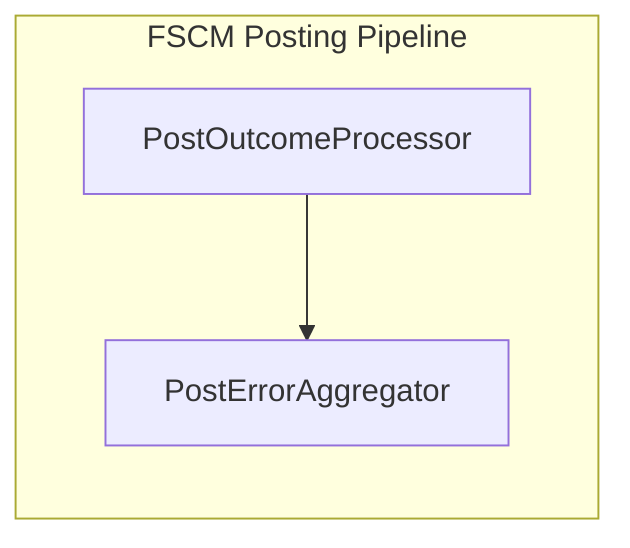

# PostError Aggregation Feature Documentation

## Overview

The **PostError Aggregator** collects and consolidates errors encountered during FSCM journal posting. It merges validation failures, HTTP errors, and parse errors into a unified list of `PostError` instances. This component ensures consistent error reporting across the posting pipeline.

## Component Location

- **Path:** `src/Rpc.AIS.Accrual.Orchestrator.Infrastructure/Adapters/Fscm/Clients/Posting/IPostErrorAggregator.cs`

## Architecture Overview



## Component Structure

### 1. Interface: IPostErrorAggregator

Defines the contract for error aggregation in the posting workflow.

| Method Signature | Description |
| --- | --- |
| `List<PostError> Build(IReadOnlyList<PostError> validationErrors, int removedDueToNoSection, JournalType journalType)` | Combine validation errors and add pruning info. |
| `List<PostError> AddHttpError(List<PostError> errors, HttpPostOutcome outcome)` | Append an HTTP error if status code indicates failure. |
| `List<PostError> AddParseErrors(List<PostError> errors, IReadOnlyList<PostError> parseErrors)` | Append parsing errors returned by the response parser. |


```csharp
public interface IPostErrorAggregator
{
    List<PostError> Build(
        IReadOnlyList<PostError> validationErrors,
        int removedDueToNoSection,
        JournalType journalType);

    List<PostError> AddHttpError(
        List<PostError> errors,
        HttpPostOutcome outcome);

    List<PostError> AddParseErrors(
        List<PostError> errors,
        IReadOnlyList<PostError> parseErrors);
}
```

### 2. Implementation: PostErrorAggregator

Provides the default behavior for `IPostErrorAggregator`.

#### Build Method

- Merges incoming validation errors.
- Adds a pruning warning when sections are removed.

```csharp
public List<PostError> Build(
    IReadOnlyList<PostError> validationErrors,
    int removedDueToNoSection,
    JournalType journalType)
{
    var list = (validationErrors ?? Array.Empty<PostError>()).ToList();
    if (removedDueToNoSection > 0)
    {
        list.Add(new PostError(
            Code: "WO_SECTION_PRUNED",
            Message: $"Projected payload for {journalType} pruned {removedDueToNoSection} work orders with missing/empty journal section.",
            StagingId: null,
            JournalId: null,
            JournalDeleted: false,
            DeleteMessage: null));
    }
    return list;
}
```

#### AddHttpError Method

- Ensures `errors` is non-null.
- Checks HTTP status; on failure, logs a `FSCM_POST_HTTP_ERROR`.

```csharp
public List<PostError> AddHttpError(List<PostError> errors, HttpPostOutcome outcome)
{
    errors ??= new List<PostError>();
    if (outcome.StatusCode is >= System.Net.HttpStatusCode.OK and <= (System.Net.HttpStatusCode)299)
        return errors;

    errors.Add(new PostError(
        Code: "FSCM_POST_HTTP_ERROR",
        Message: $"FSCM posting returned HTTP {(int)outcome.StatusCode} ({outcome.StatusCode}). Url={outcome.Url}",
        StagingId: null,
        JournalId: null,
        JournalDeleted: false,
        DeleteMessage: outcome.Body));

    return errors;
}
```

#### AddParseErrors Method

- Ensures `errors` is non-null.
- Appends any parser-detected errors to the list.

```csharp
public List<PostError> AddParseErrors(List<PostError> errors, IReadOnlyList<PostError> parseErrors)
{
    errors ??= new List<PostError>();
    if (parseErrors is { Count: > 0 })
        errors.AddRange(parseErrors);
    return errors;
}
```

## Integration Points

- **Injected Into:** `PostOutcomeProcessor` as part of the posting workflow.
- **Collaborates With:**- `IFscmJournalPoster` (performs HTTP post)
- `IFscmPostingResponseParser` (parses success responses)
- `IPostResultHandler` implementations (post-processing handlers)

## Key Classes Reference

| Class | Location | Responsibility |
| --- | --- | --- |
| IPostErrorAggregator | `.../Clients/Posting/IPostErrorAggregator.cs` | Defines error aggregation contract |
| PostErrorAggregator | `.../Clients/Posting/IPostErrorAggregator.cs` | Implements error aggregation logic |


## Dependencies

- **Rpc.AIS.Accrual.Orchestrator.Core.Domain.PostError**: Error model carrying code, message, and context.
- **HttpPostOutcome**: Represents HTTP response details (status, body, URL).

## Error Handling Pattern

1. **Validation Errors**: Collected and enriched with section pruning info via `Build()`.
2. **HTTP Errors**: Status codes outside 200–299 yield a `FSCM_POST_HTTP_ERROR`.
3. **Parse Errors**: Parser-generated errors appended after failed parse of a successful HTTP response.

## Usage Example

```csharp
var aggregator = new PostErrorAggregator();
var errors = aggregator.Build(preErrors, 3, JournalType.Item);
errors = aggregator.AddHttpError(errors, httpOutcome);
errors = aggregator.AddParseErrors(errors, parseErrors);
```