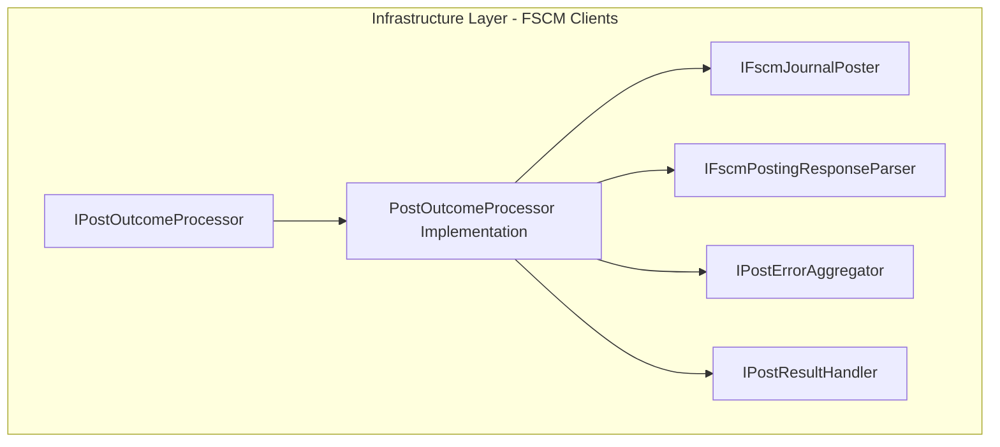

# Post Outcome Processor Feature Documentation

## Overview

The **Post Outcome Processor** component defines a contract for executing posting operations against FSCM journals and transforming the raw HTTP responses into domain-level results. Its primary responsibility is to

- accept a prepared work-order payload,
- invoke the HTTP post,
- aggregate errors (validation, HTTP, parse), and
- trigger any configured post-result handlers (e.g., notifications, compensations, retries)

This interface allows the posting workflow to remain open for extension (via `IPostResultHandler`) while keeping HTTP concerns and error-mapping logic encapsulated in one place .

## Architecture Overview

## Component Structure

### 1. Infrastructure Layer

#### **IPostOutcomeProcessor** (`src/Rpc.AIS.Accrual.Orchestrator.Infrastructure/Adapters/Fscm/Clients/Posting/IPostOutcomeProcessor.cs`)

- **Purpose:**

Defines the contract for processing the outcome of FSCM journal posts. Implementations must handle HTTP calls, map the responses into `PostResult`, aggregate errors, and invoke any registered result handlers .

- **Key Method:**

| Method | Signature | Description |
| --- | --- | --- |
| PostAndProcessAsync | `Task<PostResult> PostAndProcessAsync(RunContext ctx, PreparedWoPosting prepared, CancellationToken ct)` | Executes the HTTP post for a prepared payload and returns a `PostResult`, including error aggregation and handler invocation. |

## Integration Points

- **Implementation:**

The default implementation is `PostOutcomeProcessor` (`src/.../PostOutcomeProcessor.cs`), which orchestrates HTTP posting, error mapping, and handler execution.

- **Consumers:**

`PostingHttpClientWorkflow` and `PostingHttpClient` invoke `PostAndProcessAsync` to complete the posting pipeline for work-order payloads.

## Dependencies

| Type | Namespace | Role |
| --- | --- | --- |
| RunContext | `Rpc.AIS.Accrual.Orchestrator.Core.Domain` | Carries metadata about the current run (IDs, triggers). |
| PreparedWoPosting | `Rpc.AIS.Accrual.Orchestrator.Infrastructure.Clients.Posting` | Contains the normalized and projected payload plus metadata and pre-validation errors. |
| PostResult | `Rpc.AIS.Accrual.Orchestrator.Core.Domain` | Encapsulates the outcome of a post (success flag, errors, counts). |
| IPostResultHandler | `Rpc.AIS.Accrual.Orchestrator.Core.Abstractions` | Extensibility point for post-processing actions. |

## Error Handling

- **Argument Validation:**

Implementations should throw `ArgumentNullException` if `ctx` or `prepared` are null.

- **Error Aggregation:**

Errors from local validation, missing sections, HTTP failures, and parse failures are collected into a single `List<PostError>` within the returned `PostResult`.

- **Handler Exceptions:**

Exceptions thrown by any `IPostResultHandler` during `HandleAsync` must be caught and logged as warnings to avoid breaking the overall posting flow.

## Testing Considerations

Key scenarios to validate in tests for any `IPostOutcomeProcessor` implementation:

- **Null Arguments:**- Passing `null` for `RunContext` or `PreparedWoPosting` triggers `ArgumentNullException`.
- **HTTP Failure:**- Simulate a non-2xx HTTP status and verify that `PostResult.IsSuccess` is `false` and contains an HTTP error in `Errors`.
- **Parse Failure:**- Simulate a 2xx HTTP status with an invalid body; ensure parse errors are aggregated and `IsSuccess` is `false`.
- **Successful Post:**- Simulate a valid HTTP response and verify `IsSuccess` is `true`, correct counts are set, and the returned `JournalId` appears if provided.
- **Handler Invocation:**- Register mock `IPostResultHandler` instances; confirm `HandleAsync` is called only for handlers where `CanHandle(result)` returns `true`, and exceptions in handlers are logged but do not abort processing.