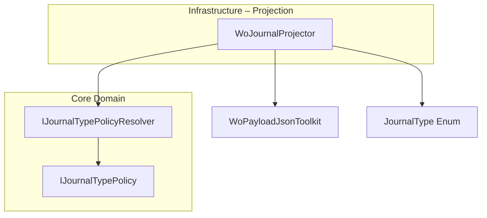
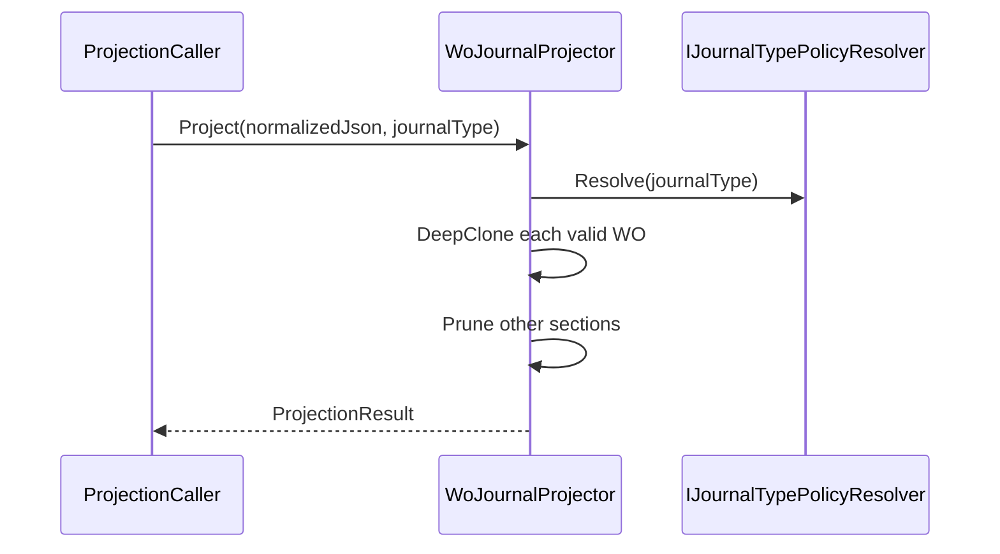

# Work Order Journal Projection Feature Documentation

## Overview

The **Work Order Journal Projection** feature extracts and prepares a normalized work order (WO) payload for posting a single journal type (Item, Expense, or Hour). It prunes work orders that lack the specified journal section or have empty journal lines. This focused projection ensures downstream posting steps receive only relevant WOs, reducing unnecessary processing and preventing FSCM errors.

This feature fits within the broader accrual orchestrator pipeline. After normalization, shape guarding, and validation, the projection isolates the journal type of interest. By adhering to the Open/Closed Principle, it leverages pluggable journal policies to support new journal types without modifying existing code .

## Architecture Overview



## Component Structure

### Domain Interface

#### **IWoJournalProjector** (src/Rpc.AIS.Accrual.Orchestrator.Infrastructure/Adapters/Fscm/Clients/Posting/IWoJournalProjector.cs)

- Defines the contract for projecting a normalized WO payload into a single journal section.
- Signature:

```csharp
  ProjectionResult Project(
      string normalizedWoPayloadJson,
      JournalType journalType);
```

- Ensures separation of projection logic from orchestration.

### Data Model

#### **ProjectionResult** (same file)

Encapsulates the outcome of a projection.

| Property | Type | Description |
| --- | --- | --- |
| PayloadJson | string | The projected WO payload JSON (compact formatting). |
| WorkOrdersBefore | int | Count of WOs before projection. |
| WorkOrdersAfter | int | Count of WOs retained after projection. |
| RemovedDueToMissingOrEmptySection | int | Count of WOs pruned for missing or empty journal data. |


### Implementation

#### **WoJournalProjector** (same file)

Implements `IWoJournalProjector` by delegating journal section resolution to a policy resolver and pruning irrelevant WOs .

- **Constructor Dependencies**- `IJournalTypePolicyResolver policyResolver`
- `IEnumerable<IJournalTypePolicy> policies`

The `policies` collection supplies section keys (`SectionKey`) for all supported journal types. The projector builds `_allSectionKeys` to know which sections to remove when projecting.

- **Fields**- `IJournalTypePolicyResolver _policyResolver`
- `IReadOnlyList<string> _allSectionKeys`
- `const string JournalLinesKey = WoPayloadJsonToolkit.JournalLinesKey`

- **Project Method**

```csharp
  public ProjectionResult Project(
      string normalizedWoPayloadJson,
      JournalType journalType)
```

Steps:

1. **Validate Input**

Throws if payload is null, empty, or not a JSON object.

1. **Count Initial WOs**

Uses `GetWoCountOrZero` on `_request.WOList`.

1. **Resolve Section Key**

`var keepKey = _policyResolver.Resolve(journalType).SectionKey`

1. **Iterate & Filter**- Skip WOs missing the `keepKey` section.
- Skip WOs where `section[JournalLinesKey]` is absent or empty.
- Clone eligible WO objects to avoid parent conflicts.
- Remove all other journal sections based on `_allSectionKeys`.
2. **Serialize Result**

Replace the original `WOList` with the filtered list and serialize without indentation.

1. **Return**

`new ProjectionResult(projectedJson, before, after, removed)`

- **Helper: GetWoCountOrZero**

Safely parses the JSON to count WOs or returns zero on any parsing issue.

## Journal Projection Flow



## Error Handling

- **ArgumentException**- Thrown if `normalizedWoPayloadJson` is null, empty, or whitespace.
- **InvalidOperationException**- Thrown if JSON root is not an object or required keys (`_request`, `WOList`) are missing.

Example:

```csharp
if (string.IsNullOrWhiteSpace(normalizedWoPayloadJson))
    throw new ArgumentException("Payload is empty.", nameof(normalizedWoPayloadJson));
```

## Dependencies

- **System.Text.Json** & **System.Text.Json.Nodes** for JSON parsing and manipulation.
- **Rpc.AIS.Accrual.Orchestrator.Core.Domain.JournalType** enum.
- **Rpc.AIS.Accrual.Orchestrator.Core.Services.JournalPolicies** interfaces:

– `IJournalTypePolicyResolver`

– `IJournalTypePolicy`

- **Rpc.AIS.Accrual.Orchestrator.Core.Utilities.WoPayloadJsonToolkit** for standardized JSON key constants.

## Key Classes Reference

| Class | Location | Responsibility |
| --- | --- | --- |
| IWoJournalProjector | src/Rpc.AIS.Accrual.Orchestrator.Infrastructure/Adapters/Fscm/Clients/Posting/IWoJournalProjector.cs | Contract for projecting WO payloads to a single journal section. |
| ProjectionResult | src/Rpc.AIS.Accrual.Orchestrator.Infrastructure/Adapters/Fscm/Clients/Posting/IWoJournalProjector.cs | Carries projection output JSON and counts before/after pruning. |
| WoJournalProjector | src/Rpc.AIS.Accrual.Orchestrator.Infrastructure/Adapters/Fscm/Clients/Posting/IWoJournalProjector.cs | Implements projection logic using journal policies and JSON toolkit. |


## Testing Considerations

- **Valid Payload**: Verify `Project` retains only WOs with non-empty journal lines for the chosen type.
- **Empty Sections**: Ensure WOs with empty `JournalLines` are pruned.
- **Unknown JournalType**: Confirm behavior when policies do not supply a matching section key.
- **Malformed JSON**: Assert appropriate exceptions for invalid payload shapes.