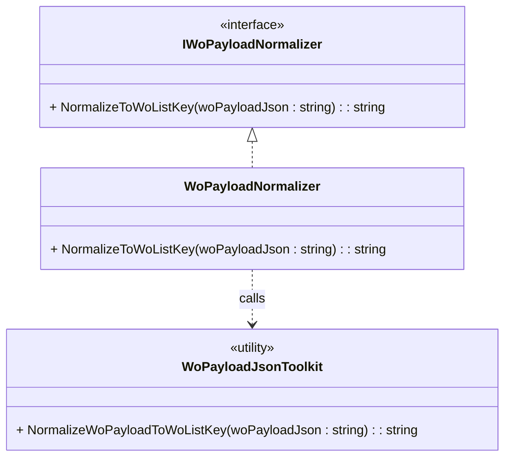

# Work Order Payload Normalizer Feature Documentation

## Overview

The **Work Order Payload Normalizer** ensures incoming Work Order (WO) payload JSON conforms to the canonical AIS envelope shape:

```json
{ 
  "_request": { 
    "WOList": [ /* array of work orders */ ] 
  } 
}
```

This normalization step consolidates common contract variants (e.g. `"request"` vs `"_request"`, `"woList"` vs `"WOList"`) into a single, predictable format. It enables downstream components—such as schema guards, validators, and projectors—to operate on a uniform JSON structure.

## Architecture Overview

🏗️ A simple class relationship underpins this feature:



## Component Structure

### 🔧 IWoPayloadNormalizer (src/Rpc.AIS.Accrual.Orchestrator.Infrastructure/Adapters/Fscm/Clients/Posting/IWoPayloadNormalizer.cs)

- **Purpose:** Defines the contract for normalizing WO payload JSON into the AIS-canonical `_request.WOList` shape.
- **Method:**- `string NormalizeToWoListKey(string woPayloadJson)`- Accepts raw JSON payload.
- Returns a JSON string with unified `"WOList"` key under `"_request"`.

### 🔧 WoPayloadNormalizer (same path)

- **Purpose:** Default implementation of `IWoPayloadNormalizer`.
- **Behavior:**- Delegates normalization to the shared utility `WoPayloadJsonToolkit.NormalizeWoPayloadToWoListKey`.
- **Implementation Snippet:**

```csharp
  public sealed class WoPayloadNormalizer : IWoPayloadNormalizer
  {
      public string NormalizeToWoListKey(string woPayloadJson)
          => WoPayloadJsonToolkit.NormalizeWoPayloadToWoListKey(woPayloadJson);
  }
```

## Dependencies

- **Rpc.AIS.Accrual.Orchestrator.Core.Utilities**- **WoPayloadJsonToolkit**: Contains the static method `NormalizeWoPayloadToWoListKey` that implements the full normalization logic (handling key variants, cloning, and null-section cleanup).

## Usage Example

```csharp
// 1. Instantiate the normalizer (typically via DI)
IWoPayloadNormalizer normalizer = new WoPayloadNormalizer();

// 2. Normalize raw payload
string rawJson = /* incoming JSON from upstream */;
string normalizedJson = normalizer.NormalizeToWoListKey(rawJson);

// 3. Pass 'normalizedJson' to schema guards, validators, and projection pipelines
```

## Key Classes Reference

| Class | Location | Responsibility |
| --- | --- | --- |
| **IWoPayloadNormalizer** | src/Rpc.AIS.Accrual.Orchestrator.Infrastructure/Adapters/Fscm/Clients/Posting/IWoPayloadNormalizer.cs | Contract for normalizing WO payload JSON to canonical shape. |
| **WoPayloadNormalizer** | src/Rpc.AIS.Accrual.Orchestrator.Infrastructure/Adapters/Fscm/Clients/Posting/IWoPayloadNormalizer.cs | Implements normalization by invoking the shared JSON toolkit. |
