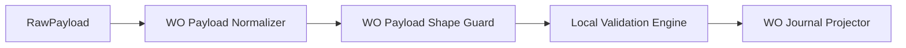

# WO Payload Shape Guard Documentation

## Overview

The **WO Payload Shape Guard** ensures that a normalized work order (WO) payload conforms to the minimal JSON schema required for processing. It performs a “hard fail” check on the payload envelope and essential fields, preventing downstream errors in the posting pipeline. By validating structure early, it safeguards against malformed messages and preserves integrity across the posting workflow.

## Responsibilities

- **Validate JSON envelope**: Confirm root object, `_request` container, and `WOList` array.
- **Enforce required fields**: Verify non-empty strings for key header properties (`Company`, `SubProjectId`, `WorkOrderGUID`, `WorkOrderID`).
- **Check optional sections**: If line sections (`WOExpLines`, `WOHourLines`, `WOItemLines`) are present, ensure they include a `JournalLines` array.
- **Fail fast**: Throw an `ArgumentException` with a clear message on any schema violation.

A shape guard is used immediately after payload normalization and before any validation or projection steps.

---

## Component Structure

### 1. Interface: `IWoPayloadShapeGuard`

Defines a contract for enforcing the minimal JSON shape.

```csharp
public interface IWoPayloadShapeGuard
{
    /// <summary>
    /// Validates the WO payload has the minimum required schema/envelope.
    /// This is a "hard fail" guard (schema issues are not line-filterable).
    /// </summary>
    void EnsureValidShapeOrThrow(string normalizedWoPayloadJson);
}
```

### 2. Implementation: `WoPayloadShapeGuard`

Concrete class that inspects the JSON payload and throws on violations.

```csharp
public sealed class WoPayloadShapeGuard : IWoPayloadShapeGuard
{
    public void EnsureValidShapeOrThrow(string normalizedWoPayloadJson)
    {
        if (string.IsNullOrWhiteSpace(normalizedWoPayloadJson))
            throw new ArgumentException("WO payload is empty.");

        using var doc = JsonDocument.Parse(normalizedWoPayloadJson);
        if (doc.RootElement.ValueKind != JsonValueKind.Object)
            throw new ArgumentException("Payload root must be a JSON object.");

        if (!doc.RootElement.TryGetProperty("_request", out var req) ||
            req.ValueKind != JsonValueKind.Object)
            throw new ArgumentException("Payload must contain _request object.");

        if (!req.TryGetProperty("WOList", out var woList) ||
            woList.ValueKind != JsonValueKind.Array)
            throw new ArgumentException("Payload must contain _request.WOList array.");

        foreach (var wo in woList.EnumerateArray())
        {
            if (wo.ValueKind != JsonValueKind.Object)
                throw new ArgumentException("Each element in _request.WOList must be an object.");

            RequireNonEmptyString(wo, "Company");
            RequireNonEmptyString(wo, "SubProjectId");
            RequireNonEmptyString(wo, "WorkOrderGUID");
            RequireNonEmptyString(wo, "WorkOrderID");

            ValidateSectionIfPresent(wo, "WOExpLines");
            ValidateSectionIfPresent(wo, "WOHourLines");
            ValidateSectionIfPresent(wo, "WOItemLines");
        }
    }

    private static void ValidateSectionIfPresent(JsonElement wo, string sectionKey)
    {
        if (!wo.TryGetProperty(sectionKey, out var section))
            return;

        if (section.ValueKind != JsonValueKind.Object)
            throw new ArgumentException($"{sectionKey} must be an object.");

        if (!section.TryGetProperty("JournalLines", out var lines) ||
            lines.ValueKind != JsonValueKind.Array)
            throw new ArgumentException($"{sectionKey}.JournalLines must be an array.");
    }

    private static void RequireNonEmptyString(JsonElement obj, string name)
    {
        if (!obj.TryGetProperty(name, out var p) ||
            p.ValueKind != JsonValueKind.String ||
            string.IsNullOrWhiteSpace(p.GetString()))
        {
            throw new ArgumentException($"Missing/empty required field: {name}.");
        }
    }
}
```

---

## Validation Steps

| Step | Condition | Exception Message |
| --- | --- | --- |
| 1. Empty payload | Input is `null`, empty, or whitespace | “WO payload is empty.” |
| 2. Root type | JSON root is not an object | “Payload root must be a JSON object.” |
| 3. `_request` object | Missing or not an object | “Payload must contain _request object.” |
| 4. `WOList` array | Missing or not an array | “Payload must contain _request.WOList array.” |
| 5. Each element in `WOList` | Element is not an object | “Each element in _request.WOList must be an object.” |
| 6. Required header fields | Any of `Company`, `SubProjectId`, `WorkOrderGUID`, `WorkOrderID` is missing/empty | “Missing/empty required field: {FieldName}.” |
| 7. Optional section structure (for each of `WOExpLines`, `WOHourLines`, `WOItemLines`) | Section present but not an object, or missing `JournalLines` array | “{Section}.JournalLines must be an array.” |


---

## Integration with Posting Pipeline



1. **Normalize**: Raw FSA payload → canonical shape (`{ "_request": { "WOList": [...] } }`).
2. **Shape Guard**: `EnsureValidShapeOrThrow` ensures minimal schema.
3. **Validate**: Payload lines get filtered; errors are collected.
4. **Project**: Payload is pruned to the specific journal section for posting.

The guard sits immediately after normalization in the `WoPostingPreparationPipeline`, preventing any malformed payload from proceeding further.

---

## Exception Handling

- All schema violations result in an `ArgumentException`.
- Messages are explicit, indicating which part of the payload failed.
- No recovery or line-level filtering is possible for these failures; processing halts.

```csharp
// Example failure when "Company" is empty
throw new ArgumentException("Missing/empty required field: Company.");
```

---

## Dependencies

- **Namespaces**:- `System`
- `System.Text.Json`

---

## Related Components

| Class | Location | Responsibility |
| --- | --- | --- |
| `IWoPayloadShapeGuard` | `src/.../Posting/IWoPayloadShapeGuard.cs` | Defines the payload shape validation contract |
| `WoPayloadShapeGuard` | `src/.../Posting/IWoPayloadShapeGuard.cs` | Implements the hard-fail JSON schema guard |
| `WoPostingPreparationPipeline` | `src/.../Posting/WoPostingPreparationPipeline.cs` | Orchestrates normalization → shape guard → validation → projection |


---

## Key Takeaways

- **Early Fail-Fast**: Prevents malformed payloads from entering complex logic.
- **Clear Error Messages**: Aids troubleshooting by pinpointing missing or mis-typed fields.
- **Lightweight**: Uses minimal JSON inspection via `System.Text.Json` with no external schema library.