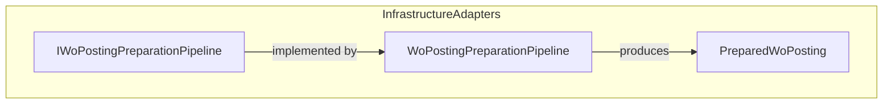
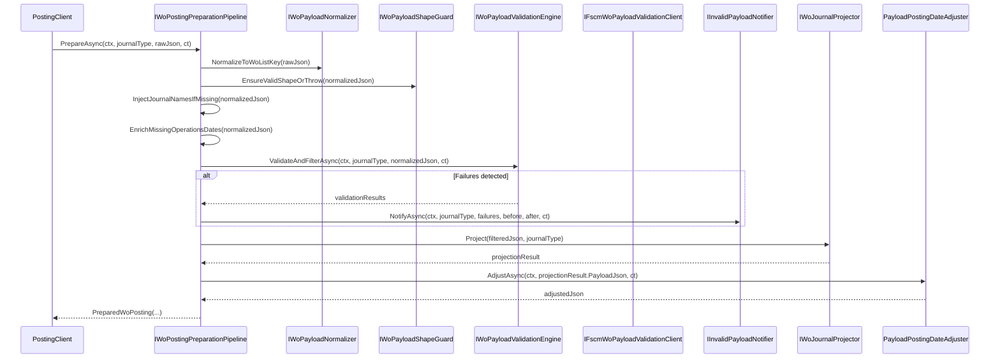
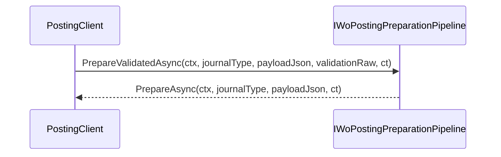

# WO Posting Preparation Pipeline Feature Documentation

## Overview

The **WO Posting Preparation Pipeline** standardizes and validates work order (WO) payloads before posting to the FSCM system. It ensures each payload meets the required shape, filters out invalid entries, enriches missing data, and projects only the relevant journal section for posting.

This pipeline supports both full validation flows and optimized paths for already-validated payloads. It helps downstream components post clean, well-formed JSON to FSCM, reducing errors and simplifying retry logic.

## Architecture Overview

## Component Structure

### Infrastructure/Adapters/Fscm/Clients/Posting

#### **IWoPostingPreparationPipeline** (`src/Rpc.AIS.Accrual.Orchestrator.Infrastructure/Clients/Posting/IWoPostingPreparationPipeline.cs`)

- **Responsibility:** Defines the contract for preparing a WO payload for a single journal type.
- **Workflow Steps:**- Normalize raw JSON
- Validate payload shape
- Perform local validation & filtering
- Optionally invoke remote validation
- Project the specified journal section
- **Methods:**

| Method | Signature | Description |
| --- | --- | --- |
| PrepareAsync | `Task<PreparedWoPosting> PrepareAsync(RunContext ctx, JournalType journalType, string woPayloadJson, CancellationToken ct)` | Full preparation and validation pipeline. |
| PrepareValidatedAsync | `Task<PreparedWoPosting> PrepareValidatedAsync(RunContext ctx, JournalType journalType, string woPayloadJson, string? validationResponseRaw, CancellationToken ct)` | Skips local/remote validation; only projects a pre-validated payload. |

---

#### **PreparedWoPosting** (`src/Rpc.AIS.Accrual.Orchestrator.Infrastructure/Clients/Posting/IWoPostingPreparationPipeline.cs`)

- **Responsibility:** Immutable data model carrying the prepared JSON and metadata for posting.
- **Properties:**

| Property | Type | Description |
| --- | --- | --- |
| `JournalType` | JournalType | Target journal section (Item, Expense, or Hour). |
| `NormalizedPayloadJson` | string | Canonical JSON after normalization. |
| `ProjectedJournalPayloadJson` | string | JSON containing only the chosen journal lines. |
| `WorkOrdersBefore` | int | Count of work orders before projection. |
| `WorkOrdersAfter` | int | Count of work orders after projection. |
| `RemovedDueToMissingOrEmptySection` | int | Number of WOs removed for empty/missing section. |
| `PreErrors` | List<PostError> | Validation errors detected before posting. |
| `ValidationResponseRaw` | string? | Raw response from remote validation, if any. |
| `RetryableWorkOrders` | int | Count of distinct retryable work orders. |
| `RetryableLines` | int | Total number of retryable lines across all WOs. |
| `RetryablePayloadJson` | string? | JSON payload containing only retry-eligible entries. |

## Feature Flows 🔄

### Preparing and Validating a WO Payload

### Projecting an Already-Validated Payload

## Integration Points

- **Implementation:** `WoPostingPreparationPipeline` in the same folder provides the concrete logic.
- **Upstream:** `PostingHttpClientWorkflow` invokes this pipeline before calling FSCM.
- **Collaborators:**- `IWoPayloadNormalizer`
- `IWoPayloadShapeGuard`
- `IWoPayloadValidationEngine`
- `IFscmWoPayloadValidationClient`
- `IInvalidPayloadNotifier`
- `IWoJournalProjector`
- `PayloadPostingDateAdjuster`
- `IFsaLineFetcher?`
- `IFscmLegalEntityIntegrationParametersClient`

## Dependencies

- `System.Threading`
- `System.Threading.Tasks`
- Domain types from `Rpc.AIS.Accrual.Orchestrator.Core.Domain` (e.g., `RunContext`, `JournalType`, `PostError`)

## Key Classes Reference

| Class | Location | Responsibility |
| --- | --- | --- |
| **IWoPostingPreparationPipeline** | `src/Rpc.AIS.Accrual.Orchestrator.Infrastructure/Clients/Posting/IWoPostingPreparationPipeline.cs` | Defines the payload-preparation contract for a journal type |
| **PreparedWoPosting** | `src/Rpc.AIS.Accrual.Orchestrator.Infrastructure/Clients/Posting/IWoPostingPreparationPipeline.cs` | Carries the prepared payload JSON and posting metadata |

## Testing Considerations

- Verify **PrepareAsync** rejects invalid JSON shapes.
- Confirm **PrepareValidatedAsync** delegates to **PrepareAsync**.
- Simulate validation failures to check **PreErrors**, **Retryable** counts, and notifier invocation.
- Assert **WorkOrdersBefore/After** and **RemovedDueToMissingOrEmptySection** match expected filtering.
- Validate that **RetryablePayloadJson** contains only retry-eligible entries.