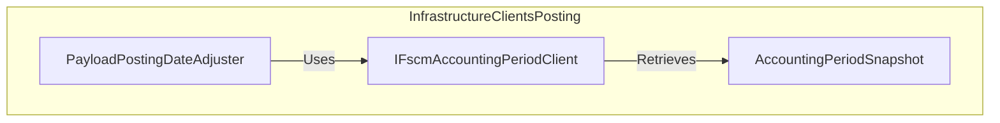
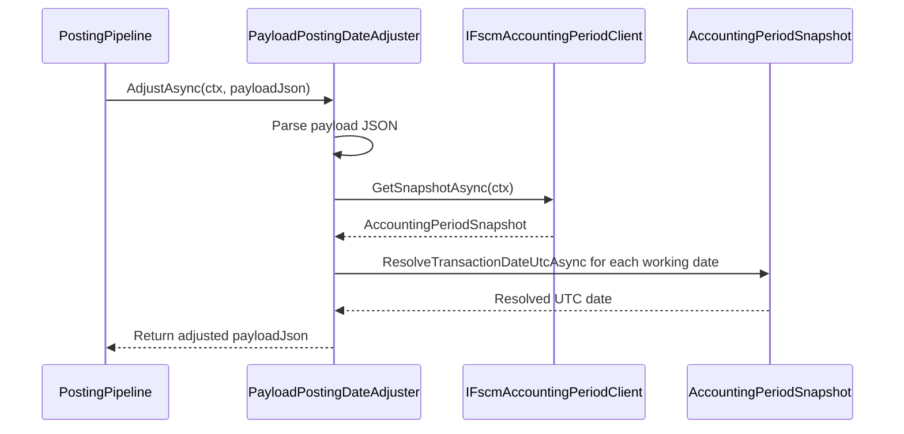

# Payload Posting Date Adjustment Feature Documentation

## Overview

The **Payload Posting Date Adjuster** ensures that journal lines in work order (WO) posting payloads use the correct TransactionDate based on fiscal period status. It preserves the original operations date (RPCWorkingDate) and updates TransactionDate to either the same day (if the period is open) or the start of the next open period (if closed or on hold).

This feature integrates into the FSCM posting pipeline within the orchestrator infrastructure. It calls an accounting period service to retrieve a snapshot, applies period rules per line, and returns a JSON payload ready for FSCM consumption.

## Architecture Overview



## Component Structure

### PayloadPostingDateAdjuster

**Path:** `src/Rpc.AIS.Accrual.Orchestrator.Infrastructure/Adapters/Fscm/Clients/Posting/PayloadPostingDateAdjuster.cs`

- **Purpose**

Applies fiscal period rules to WO posting payloads by adjusting each line’s `TransactionDate`.

- **Dependencies**- `IFscmAccountingPeriodClient` – fetches an `AccountingPeriodSnapshot`.
- `ILogger<PayloadPostingDateAdjuster>` – logs warnings and metrics.
- `RunContext` – carries `RunId`, `CorrelationId`, and optional `DataAreaId`.

- **Key Methods**

| Method | Description | Returns |
| --- | --- | --- |
| `AdjustAsync(RunContext ctx, string payloadJson, CancellationToken ct)` | Entry point. Parses JSON, infers company, retrieves snapshot, iterates WO sections (`WOItemLines`, `WOExpLines`, `WOHourLines`), and updates each line’s dates. Logs summary. | Adjusted JSON payload as `string` |
| `AdjustJournalLinesArrayAsync(JsonObject woNode, string journalKey, AccountingPeriodSnapshot snapshot, RunContext ctx, HashSet<DateOnly> uniqueWorkingDates, CancellationToken ct)` | Processes one journal section. For each line, reads a working date literal, resolves TransactionDate via snapshot, writes back FS-friendly date literals, and counts adjustments. | `(int touched, int adjusted)` tuple |
| `TryParseFscmDateLiteral(string literal, out DateTime utc)` | Parses a `/Date(ms)/` string into UTC `DateTime`. | `bool` indicating success; `utc` output parameter |
| `ToFscmDateLiteral(DateOnly d)` | Converts a `DateOnly` to a `/Date(ms)/` literal at UTC midnight. | ISO-agnostic string in FS literal format |


### Core Domain Types

#### AccountingPeriodSnapshot

- **Purpose**

Represents period status for a legal entity. It resolves a working-date to the correct TransactionDate based on closed or open periods.

- **Key Method**- `ResolveTransactionDateUtcAsync(DateTime workingUtc, CancellationToken ct)` returns the next open period start (UTC) if the period is closed; otherwise returns the working date.

## API Integration

## Feature Flows

### TransactionDate Adjustment Flow



## Error Handling

- **JSON Parse Failures**

The code catches exceptions from `JsonNode.Parse`, logs a warning with `RunId` and `CorrelationId`, and returns the original payload (fail-open).

- **Period Lookup Failures**

If `GetSnapshotAsync` throws, the adjuster logs a warning and returns the unmodified payload.

- **Date Resolution Failures**

If `ResolveTransactionDateUtcAsync` fails for a line, it logs a warning, treats the period as open, and uses the working date.

```card
{
    "title": "Fail-Open Pattern",
    "content": "On JSON or snapshot errors, the adjuster logs a warning and returns the original payload."
}
```

## Caching Strategy

No caching is implemented in this component. Each call to `AdjustAsync` fetches a fresh accounting period snapshot.

## Dependencies

- Microsoft.Extensions.Logging
- System.Text.Json & System.Text.Json.Nodes
- Rpc.AIS.Accrual.Orchestrator.Core.Abstractions (RunContext, IFscmAccountingPeriodClient)
- Rpc.AIS.Accrual.Orchestrator.Core.Domain (AccountingPeriodSnapshot)
- Rpc.AIS.Accrual.Orchestrator.Core.Utilities (JsonLooseKey)

## Key Classes Reference

| Class | Location | Responsibility |
| --- | --- | --- |
| PayloadPostingDateAdjuster | `src/.../Posting/PayloadPostingDateAdjuster.cs` | Adjusts TransactionDate in FSCM WO posting payloads |
| IFscmAccountingPeriodClient | `Rpc.AIS.Accrual.Orchestrator.Core.Abstractions` | Defines method to fetch an accounting period snapshot |
| AccountingPeriodSnapshot | `Rpc.AIS.Accrual.Orchestrator.Core.Domain.Delta` | Provides period rules and resolves next open period dates |


## Testing Considerations

- Validate that `AdjustAsync` returns the original string for null or empty payloads.
- Verify fail-open behavior when JSON parsing throws.
- Simulate `GetSnapshotAsync` throwing to confirm unmodified payload return.
- Test `TryParseFscmDateLiteral` with valid and invalid literals.
- Confirm `ToFscmDateLiteral` formats midnight UTC correctly.
- Exercise scenarios where working dates fall in open vs. closed periods to ensure correct TransactionDate.