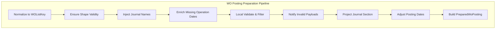

# WO Posting Preparation Pipeline Feature Documentation

## 🚀 Overview

The **WO Posting Preparation Pipeline** transforms raw work order (WO) payloads into valid, enriched JSON ready for FSCM posting. It orchestrates normalization, shape validation, journal name injection, operation date enrichment, local validation, filtering, projection, and date adjustment.

This pipeline ensures consistency, reduces posting errors, and integrates FSA and FSCM data in the Accrual Orchestrator.

## Architecture Overview



## Component Structure

### Class: **WoPostingPreparationPipeline**

**Location:** `src/Rpc.AIS.Accrual.Orchestrator.Infrastructure/Adapters/Fscm/Clients/Posting/WoPostingPreparationPipeline.cs`

Implements `IWoPostingPreparationPipeline` to prepare WO payloads for posting a single journal type.

#### Dependencies

| Interface | Responsibility |
| --- | --- |
| **IWoPayloadNormalizer** | Normalize raw WO JSON to standard `_request.WOList` format |
| **IWoPayloadShapeGuard** | Validate required JSON shape or throw errors |
| **IWoPayloadValidationEngine** | Perform local validation and filter invalid entries |
| **IFscmWoPayloadValidationClient** | (Remote) FSCM payload validation client |
| **IInvalidPayloadNotifier** | Notify stakeholders of invalid payloads |
| **IWoJournalProjector** | Project filtered payload into journal-specific section |
| **PayloadPostingDateAdjuster** | Adjust dates in projected JSON for FSCM |
| **IFsaLineFetcher** | Fetch FSA line data for operation date enrichment |
| **IFscmLegalEntityIntegrationParametersClient** | Retrieve journal name parameters per company |
| **ILogger\<WoPostingPreparationPipeline\>** | Log pipeline operations and diagnostics |


## Public Methods

| Method | Signature | Description |
| --- | --- | --- |
| **PrepareAsync** | `Task<PreparedWoPosting> PrepareAsync(RunContext ctx, JournalType journalType, string woPayloadJson, CancellationToken ct)` | Runs full pipeline: normalize → validate → project → adjust → compose result |
| **PrepareValidatedAsync** | `Task<PreparedWoPosting> PrepareValidatedAsync(RunContext ctx, JournalType journalType, string woPayloadJson, string? validationResponseRaw, CancellationToken ct)` | Alias of `PrepareAsync`; skips remote validation for pre-validated payloads |


```csharp
// Example Usage
IWoPostingPreparationPipeline pipeline = new WoPostingPreparationPipeline(...);
PreparedWoPosting result = await pipeline.PrepareAsync(
    runContext,
    JournalType.Item,
    rawWoJson,
    cancellationToken
);
```

## Private Helpers

### InjectJournalNamesIfMissingAsync

```csharp
Task<string> InjectJournalNamesIfMissingAsync(
    RunContext ctx,
    JournalType journalType,
    string payloadJson,
    CancellationToken ct
)
```

- **Purpose:** Populate missing `JournalName` fields in WO sections.
- **Workflow:**1. Parse JSON and extract distinct `Company` values.
2. Fetch journal name IDs via `_leParams.GetJournalNamesAsync`.
3. For the target `journalType`, inject `JournalName` into non-empty sections (`WOItemLines`, `WOExpLines`, or `WOHourLines`) if blank.

### EnrichMissingOperationsDatesFromFsaAsync

```csharp
Task<string> EnrichMissingOperationsDatesFromFsaAsync(
    RunContext ctx,
    string woPayloadJson,
    CancellationToken ct
)
```

- **Purpose:** Fill empty `OperationDate` and `TransactionDate` on journal lines using FSA data.
- **Workflow:**1. Extract work order GUIDs from `_request.WOList`.
2. Fetch products and services via `_fsaLineFetcher`.
3. Build a GUID→date map (`rpc_operationsdate`).
4. Inject normalized date strings into each line where missing.

### BuildOpsMap

```csharp
static Dictionary<Guid,string> BuildOpsMap(JsonDocument doc, string idField)
```

- Maps each line GUID to its `rpc_operationsdate` value.

### InjectOpsDate

```csharp
static void InjectOpsDate(JsonNode? woNode, string sectionName, Dictionary<Guid,string> map)
```

- Injects dates into individual journal line JSON nodes if missing.

### NormalizeDate

```csharp
static string? NormalizeDate(string raw)
```

- Converts a raw date string into `/Date(milliseconds)/` format.

### CountRetryable

```csharp
static (int RetryableWorkOrders, int RetryableLines) CountRetryable(IReadOnlyList<WoPayloadValidationFailure>? failures)
```

- Counts distinct retryable work orders and total retryable lines.

### ToPostErrors

```csharp
static List<PostError> ToPostErrors(IReadOnlyList<WoPayloadValidationFailure>? failures)
```

- Converts validation failures into `PostError` objects for `PreparedWoPosting.PreErrors`.

## Data Model: **PreparedWoPosting**

| Property | Type | Description |
| --- | --- | --- |
| **JournalType** | `JournalType` | Target journal section (Item, Expense, Hour) |
| **NormalizedPayloadJson** | `string` | JSON after normalization, shape guard, and enrichment |
| **ProjectedJournalPayloadJson** | `string` | Section-specific JSON ready for FSCM posting |
| **WorkOrdersBefore** | `int` | Count of WO entries before filtering |
| **WorkOrdersAfter** | `int` | Count of WO entries after filtering |
| **RemovedDueToMissingOrEmptySection** | `int` | Count of entries removed for empty or missing sections |
| **PreErrors** | `List<PostError>` | Validation errors collected before posting |
| **ValidationResponseRaw** | `string?` | Raw remote validation response (if any) |
| **RetryableWorkOrders** | `int` | Number of WO entries flagged as retryable |
| **RetryableLines** | `int` | Number of lines flagged as retryable |
| **RetryablePayloadJson** | `string?` | JSON containing only retryable entries |


## Error Handling

- **Shape Guard:** Throws if JSON does not match expected schema.
- **Local Validation:** Collects failures in `local.Failures`.
- **Notification:** Invokes `_invalidPayloadNotifier.NotifyAsync` when any failures occur.
- **Retry Logic:** Aggregates retryable failures into separate payload and counters.

## Logging

- Uses `ILogger<WoPostingPreparationPipeline>` to record:- Shape validation steps.
- Journal name injection per company.
- FSA enrichment activities and mapping outcomes.
- Notification triggers for invalid payloads.

---

*This documentation covers all classes, methods, and workflows present in*

`WoPostingPreparationPipeline.cs`

*and its direct data model, ensuring accurate reference for developers and integrators.*