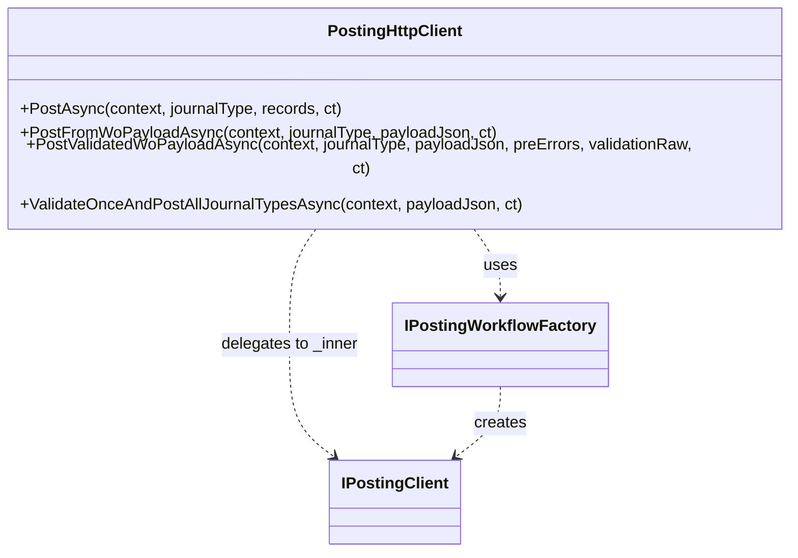

# PostingHttpClient Facade Feature Documentation

## Overview

The **PostingHttpClient** serves as a lightweight facade over a complex posting workflow for Financial Supply Chain Management (FSCM) journal data. It implements the `IPostingClient` interface, keeping the public DI surface minimal by delegating all actual work to an inner workflow built by an `IPostingWorkflowFactory`.

By encapsulating the `HttpClient` and workflow factory logic, this facade simplifies dependency injection, promotes single-responsibility, and ensures consistent construction of posting workflows across the application.

## Architecture Overview



## Component Structure

### Data Access Layer

#### **PostingHttpClient** (`src/Rpc.AIS.Accrual.Orchestrator.Infrastructure/Adapters/Fscm/Clients/PostingHttpClient.Facade.cs`)

- **Purpose**

Acts as a typed `HttpClient` wrapper that implements `IPostingClient`. It hides workflow construction details and delegates posting operations to an inner workflow client.

- **Constructor**

```csharp
  public PostingHttpClient(HttpClient httpClient, IPostingWorkflowFactory factory)
```

- **Parameters**- `HttpClient httpClient`: The HTTP client configured for FSCM.
- `IPostingWorkflowFactory factory`: Factory to build the posting workflow instance.
- **Exceptions**- Throws `ArgumentNullException` if `httpClient` or `factory` is `null`.

- **Public Methods**

| Method | Description | Returns |
| --- | --- | --- |
| `PostAsync(...)` | Posts staging references grouped by `JournalType`. | `Task<PostResult>` |
| `PostFromWoPayloadAsync(...)` | Posts using raw work-order payload JSON. | `Task<PostResult>` |
| `PostValidatedWoPayloadAsync(...)` | Posts a payload already validated; merges any pre-validation errors. | `Task<PostResult>` |
| `ValidateOnceAndPostAllJournalTypesAsync(...)` | Validates the full WO payload once, then posts each detected journal type in sequence. | `Task<List<PostResult>>` |


- **Key Dependencies** 🛠️- `System.Net.Http.HttpClient`
- `Rpc.AIS.Accrual.Orchestrator.Core.Abstractions.IPostingWorkflowFactory`
- `Rpc.AIS.Accrual.Orchestrator.Core.Abstractions.IPostingClient`
- Domain types: `RunContext`, `JournalType`, `AccrualStagingRef`, `PostError`, `PostResult`

## Integration Points 🔗

- **IPostingWorkflowFactory**: Supplies the concrete posting workflow (`IPostingClient`) by invoking `factory.Create(httpClient)`.
- **IPostingClient**: The facade’s interface, consumed by higher layers (e.g., orchestrators or functions).
- **Dependency Injection**:

```csharp
  services
    .AddHttpClient<PostingHttpClient>(...)
    .AddSingleton<IPostingClient>(sp => sp.GetRequiredService<PostingHttpClient>());
```

## Key Classes Reference

| Class | Location | Responsibility |
| --- | --- | --- |
| **PostingHttpClient** | `Infrastructure/Adapters/Fscm/Clients/PostingHttpClient.Facade.cs` | Facade implementing `IPostingClient`, delegates to workflow |
| **IPostingWorkflowFactory** | `Infrastructure/Adapters/Fscm/Clients/IPostingWorkflowFactory.cs` | Factory interface for building posting workflows |
| **IPostingClient** | `Core/Abstractions/IPostingClient.cs` | Defines posting operations contract |


## Error Handling ⚠️

- **Constructor Guards**: Throws `ArgumentNullException` for `null` arguments.
- **Delegation**: All method calls forward exceptions from the inner workflow, preserving original stack traces and error details.

## Testing Considerations 🧪

- **Constructor Null Checks**- Assert that passing `null` for `HttpClient` or `factory` throws `ArgumentNullException`.
- **Delegation Behavior**- Mock `IPostingWorkflowFactory` to return a stubbed `IPostingClient`.
- Verify each facade method (`PostAsync`, etc.) calls the corresponding method on the inner client with the same arguments, including `CancellationToken` propagation.
- **Integration Test**- Wire up a real or in-memory `HttpClient` and a test implementation of `IPostingWorkflowFactory` to ensure end-to-end wiring works in DI.

---

*This documentation covers the **PostingHttpClient** facade, explaining its role, structure, and integration within the FSCM posting infrastructure.*