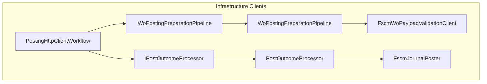

# Posting Workflow Feature Documentation

## Overview

The Posting Workflow feature orchestrates the end-to-end process of preparing and posting accrual work order payloads to FSCM journals. It handles both high-level staging-record posting and detailed work-order payload workflows, including local/remote validation, section projection, date adjustment, and HTTP response processing. This ensures that validated work orders are reliably written to FSCM, with consistent error handling and retry semantics.

By separating concerns into a preparation pipeline and outcome processor, the design adheres to the Single Responsibility and Open/Closed Principles. This modular approach allows for flexible injection of validation, normalization, parsing, and post-result handlers without modifying the core orchestration logic .

## Architecture Overview

## Component Structure

### Orchestration Layer

#### **PostingHttpClientWorkflow** (`src/Rpc.AIS.Accrual.Orchestrator.Infrastructure/Adapters/Fscm/Clients/PostingHttpClient.cs`)

- **Purpose:** Coordinates payload preparation and HTTP outcome processing for journal posting workflows.
- **Responsibilities:**- Delegate payload normalization, validation, section projection, and date adjustment to the preparation pipeline.
- Invoke the outcome processor to execute HTTP posting and map responses to `PostResult`.
- Support multiple entry points: staging-record posting, raw WO payload, pre-validated payload, and multi-journal workflows.
- **Key Constants:**- `RequestKey`, `WoListKey`, `JournalLinesKey` (from `WoPayloadJsonToolkit`)
- Section keys: `WOItemLines`, `WOExpLines`, `WOHourLines`
- **Dependencies:**- `IWoPostingPreparationPipeline _prep`
- `IPostOutcomeProcessor _outcome`
- `ILogger<PostingHttpClientWorkflow> _logger`
- **Error Handling:**- Throws `ArgumentNullException` for null dependencies.
- Returns early `PostResult` for empty input (no records or empty JSON).

#### Methods

| Method | Description | Returns |
| --- | --- | --- |
| PostAsync(context, journalType, records, ct) | Posts a list of staging references by building a minimal journal payload. | `Task<PostResult>` |
| PostFromWoPayloadAsync(context, journalType, woPayloadJson, ct) | Normalizes and validates raw WO JSON, then posts per journal type. | `Task<PostResult>` |
| PostValidatedWoPayloadAsync(context, journalType, woPayloadJson, preErrors, validationResponseRaw, ct) | Skips validation, merges pre-errors, and posts pre-validated payload. | `Task<PostResult>` |
| ValidateOnceAndPostAllJournalTypesAsync(context, woPayloadJson, ct) | Detects present journal types and runs full pipeline for each. | `Task<List<PostResult>>` |

## Data Models

### PreparedWoPosting

Carries a fully prepared payload and metadata for a single journal post.

| Property | Type | Description |
| --- | --- | --- |
| JournalType | `JournalType` | Target journal section (Item/Expense/Hour) |
| NormalizedPayloadJson | `string` | JSON after normalization and shape guarding |
| ProjectedJournalPayloadJson | `string` | JSON containing only the target journal section |
| WorkOrdersBefore | `int` | Count before filtering |
| WorkOrdersAfter | `int` | Count after filtering |
| RemovedDueToMissingOrEmptySection | `int` | Pruned count due to missing sections |
| PreErrors | `List<PostError>` | Errors from validation before HTTP post |
| ValidationResponseRaw | `string?` | Raw remote-validation response |
| RetryableWorkOrders | `int` | Count of retryable work orders |
| RetryableLines | `int` | Count of retryable lines |
| RetryablePayloadJson | `string?` | JSON payload for retryable subset |

### PostResult & PostError

Result of a single journal post attempt, including any errors.

| Property | Type | Description |
| --- | --- | --- |
| JournalType | `JournalType` | Journal section identifier |
| IsSuccess | `bool` | HTTP and business success flag |
| JournalId | `string?` | FSCM-returned journal identifier |
| SuccessMessage | `string?` | Message on success |
| Errors | `IReadOnlyList<PostError>` | Collection of errors (validation, HTTP, parse) |
| WorkOrdersBefore | `int` | Input work order count |
| WorkOrdersPosted | `int` | Number of work orders successfully posted |
| WorkOrdersFiltered | `int` | Count filtered out due to missing sections |
| ValidationResponseRaw | `string?` | Raw payload validation response |
| RetryableWorkOrders | `int` | Work orders marked retryable |
| RetryableLines | `int` | Lines marked retryable |
| RetryablePayloadJson | `string?` | Payload to retry |

| Property | Type | Description |
| --- | --- | --- |
| Code | `string` | Error code |
| Message | `string` | Human-readable error message |
| StagingId | `string?` | Reference staging identifier |
| JournalId | `string?` | FSCM journal identifier (if any) |
| JournalDeleted | `bool` | Indicates if a journal was deleted |
| DeleteMessage | `string?` | Message for deletion operations |

## Key Classes Reference

| Class | Location | Responsibility |
| --- | --- | --- |
| PostingHttpClientWorkflow | `.../PostingHttpClient.cs` | Orchestrates preparation and posting outcome processing |
| IWoPostingPreparationPipeline | `.../IWoPostingPreparationPipeline.cs` | Defines WO payload preparation steps |
| IPostOutcomeProcessor | `.../IPostOutcomeProcessor.cs` | Converts HTTP response to `PostResult` and runs handlers |
| PreparedWoPosting | `.../IWoPostingPreparationPipeline.cs` | Carries prepared payload and metadata |
| PostOutcomeProcessor | `.../PostOutcomeProcessor.cs` | Implements `IPostOutcomeProcessor` and executes HTTP posting |
| WoPostingPreparationPipeline | `.../WoPostingPreparationPipeline.cs` | Implements payload normalization, validation, and projection |
| PostingWorkflowFactory | `.../PostingWorkflowFactory.cs` | Builds the cohesive posting workflow components |

## Error Handling

- **Null Checks:** Constructors and methods validate non-null dependencies and inputs, throwing `ArgumentNullException` or returning a success result for empty payloads .
- **Validation Failures:** Validation errors are surfaced via `PreErrors` and passed through to final `PostResult`.
- **HTTP & Parse Errors:** Outcome processor aggregates HTTP non-2xx responses and parse failures into `PostError` instances.

## Dependencies

- Microsoft.Extensions.Logging for structured logging
- System.Text.Json for JSON manipulation
- Core abstractions: `RunContext`, `JournalType`, `PostResult`, `PostError`
- Infrastructure clients: `IWoPostingPreparationPipeline`, `IPostOutcomeProcessor`

## Integration Points

- **PostingHttpClient Facade:** Entry point in DI that delegates to this workflow via `IPostingWorkflowFactory` .
- **Durable Orchestrations:** Activities invoke `IPostingClient` methods to post work order payloads in Azure Durable Functions.
- **Workflow Factory:** Configures and wires together pipeline, poster, validator, and outcome processor for each `HttpClient` instance.