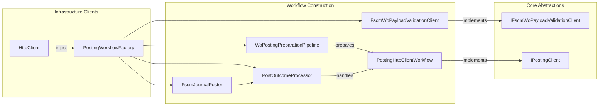
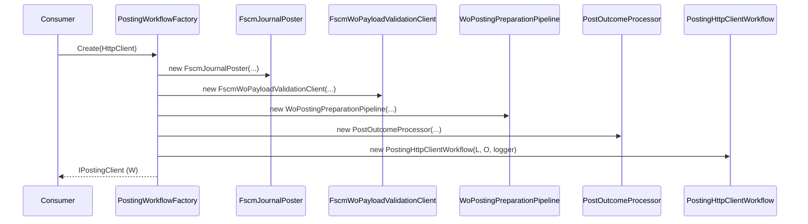

# Posting Workflow Feature Documentation

## Overview

The **Posting Workflow** feature centralizes the orchestration of Financial Supply Chain Management (FSCM) journal posting. It provides a factory that wires together HTTP clients, payload preparation, remote validation, error aggregation, and outcome processing into a cohesive workflow. This enables the Accrual Orchestrator to:

- Abstract FSCM HTTP endpoints and resilience policies.
- Normalize and validate work-order payloads before posting.
- Process posting results into domain-specific `PostResult` objects.

By encapsulating these steps, the factory supports the Open/Closed principle (OCP) and Single Responsibility (SRP), allowing each component to evolve independently while maintaining a clear, testable orchestration.

## Architecture Overview



## Component Structure

### **PostingWorkflowFactory** (`src/Rpc.AIS.Accrual.Orchestrator.Infrastructure/Adapters/Fscm/Clients/PostingWorkflowFactory.cs`)

- **Purpose:**

Builds an end-to-end posting workflow by instantiating and wiring collaborators while preserving the caller’s typed `HttpClient`.

- **Key Responsibilities:**- Validate constructor arguments.
- Instantiate:- `FscmJournalPoster` (HTTP poster)
- `FscmWoPayloadValidationClient` (remote WO validator)
- `WoPostingPreparationPipeline` (normalize & validate payloads)
- `PostOutcomeProcessor` (parse and handle posting responses)
- `PostingHttpClientWorkflow` (orchestrates preparation & outcome)

---

## Dependencies

| Dependency | Role |
| --- | --- |
| FscmOptions | FSCM endpoint configuration |
| IFscmPostRequestFactory | Builds HTTP POST requests |
| IResilientHttpExecutor | Applies timeout & retry policies |
| IWoPayloadValidationEngine | Local (in-process) WO payload validation |
| IInvalidPayloadNotifier | Notifies about invalid payloads |
| IEnumerable<IPostResultHandler> | Handlers to process `PostResult` |
| IWoPayloadNormalizer | Normalizes WO payload structure |
| IWoPayloadShapeGuard | Guards payload shape against contract |
| IWoJournalProjector | Projects payload sections per journal type |
| IFscmPostingResponseParser | Parses FSCM posting HTTP responses |
| IPostErrorAggregator | Aggregates errors into `PostError` |
| PayloadPostingDateAdjuster | Adjusts posting dates based on integration parameters |
| IFsaLineFetcher? | Optional enrichment of FSA lines |
| IFscmLegalEntityIntegrationParametersClient | Provides legal-entity parameters for payload date adjustment |
| IAisLogger | AIS-specific logging abstraction |
| IAisDiagnosticsOptions | Enables diagnostics metadata in HTTP calls |
| ILoggerFactory | Creates typed loggers |


---

### Constructor

```csharp
public PostingWorkflowFactory(
    FscmOptions endpoints,
    IFscmPostRequestFactory reqFactory,
    IResilientHttpExecutor executor,
    IWoPayloadValidationEngine validationEngine,
    IInvalidPayloadNotifier invalidPayloadNotifier,
    IEnumerable<IPostResultHandler> postResultHandlers,
    IWoPayloadNormalizer normalizer,
    IWoPayloadShapeGuard shapeGuard,
    IWoJournalProjector projector,
    IFscmPostingResponseParser responseParser,
    IPostErrorAggregator errorAggregator,
    PayloadPostingDateAdjuster dateAdjuster,
    IAisLogger aisLogger,
    IAisDiagnosticsOptions diag,
    IFsaLineFetcher? fsaLineFetcher,
    IFscmLegalEntityIntegrationParametersClient leParams,
    ILoggerFactory loggerFactory)
```

- Throws `ArgumentNullException` for all **required** parameters.
- Accepts **optional** `IFsaLineFetcher` (may be `null`).

---

### Create Method

```csharp
public IPostingClient Create(HttpClient httpClient)
```

1. **Validate** `httpClient` is not `null`.
2. **Instantiate**:- `FscmJournalPoster` with `HttpClient`, endpoints, request factory, executor, date adjuster, logger.
- `FscmWoPayloadValidationClient` as `IFscmWoPayloadValidationClient`.
- `WoPostingPreparationPipeline` tying together normalizer, shape guard, validation engines, projector, fetcher.
- `PostOutcomeProcessor` combining poster, response parser, error aggregator, result handlers.
3. **Return** `PostingHttpClientWorkflow` that implements `IPostingClient`.

Usage Example:

```csharp
var factory = serviceProvider.GetRequiredService<IPostingWorkflowFactory>();
var postingClient = factory.Create(new HttpClient());
PostResult result = await postingClient.PostAsync(ctx, JournalType.Item, records, cancellationToken);
```

---

## Sequence Diagram



---

## Key Classes Reference

| Class | Location | Responsibility |
| --- | --- | --- |
| PostingWorkflowFactory | `Infrastructure/Adapters/Fscm/Clients/PostingWorkflowFactory.cs` | Orchestrates workflow construction |
| FscmJournalPoster | `Infrastructure/Clients/Posting` | Sends journal payloads to FSCM via HTTP |
| FscmWoPayloadValidationClient | `Infrastructure/Clients/Posting` | Calls FSCM custom WO-validation endpoint |
| WoPostingPreparationPipeline | `Infrastructure/Adapters/Fscm/Clients/Posting` | Normalizes, validates, filters, and projects payload |
| PostOutcomeProcessor | `Infrastructure/Clients/Posting` | Parses HTTP repost outcome and aggregates errors |
| PostingHttpClientWorkflow | `Infrastructure/Clients/PostingHttpClient.Workflow.cs` | Implements `IPostingClient`, ties prep + outcome |


---

## Dependencies

- Microsoft.Extensions.Logging
- System.Net.Http
- Rpc.AIS.Accrual.Orchestrator.Core.Abstractions
- Rpc.AIS.Accrual.Orchestrator.Infrastructure.Options
- Rpc.AIS.Accrual.Orchestrator.Infrastructure.Resilience

---

## Testing Considerations

- **Null Argument Tests:** Ensure constructor and `Create` guard against `null` inputs.
- **Integration Composition:** Verify that `Create` returns a workflow whose `PostAsync` flows through all injected collaborators.
- **Configuration Variations:** Test with and without optional `IFsaLineFetcher` to confirm enrichment steps are conditional.

---

*🛠️ By centralizing dependencies and construction logic, the Posting Workflow Factory makes the journal-posting process modular, testable, and configurable without leaking HTTP details into business logic.*