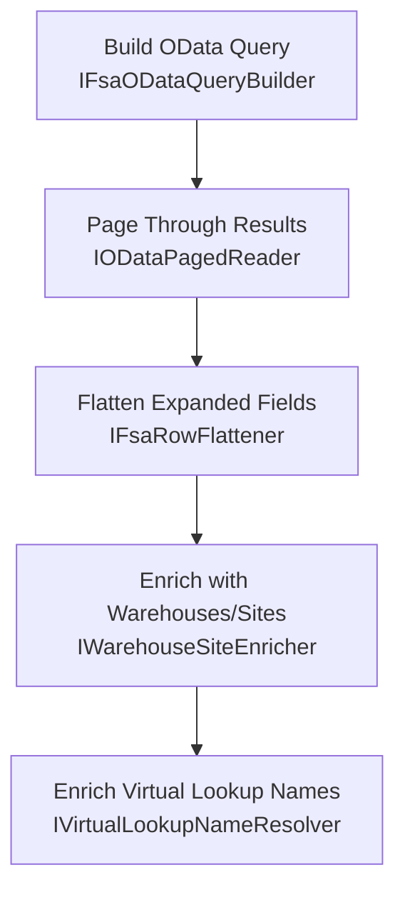

# FSA Client Abstractions Feature Documentation

## Overview

The **FSA Client Abstractions** define a set of interfaces that encapsulate the behaviors required to fetch, page, flatten, and enrich data from a Field Service (FSA) OData endpoint. These abstractions:

- Decouple query‐URL construction from HTTP execution.
- Provide a generic mechanism to page through OData results.
- Flatten complex JSON expands into top‐level fields.
- Enrich base JSON payloads with warehouse/site lookups and virtual lookup names.

By adhering to SRP/SOLID principles, they enable the main `FsaLineFetcher` workflow to remain thin and focused, while preserving backward compatibility with the existing `IFsaLineFetcher` contract.

---

## Architecture Overview



---

## Component Structure

### Abstractions Layer

#### 1. IFsaODataQueryBuilder

**Purpose:**

Builds relative OData query URLs for various FSA entity sets based on filters or identifiers.

| Method | Description | Returns |
| --- | --- | --- |
| BuildOpenWorkOrdersRelative(string filter, int pageSize) | Constructs the query for fetching open work orders with an OData filter and page size. | string |
| BuildWorkOrdersRelative(IReadOnlyCollection\<Guid> ids, int pageSize) | Builds URL for fetching specific work orders by GUID list with paging. | string |
| BuildWorkOrderProductsRelative(IReadOnlyCollection\<Guid> ids, int pageSize) | Builds URL for staging work‐order products with paging. | string |
| BuildWorkOrderServicesRelative(IReadOnlyCollection\<Guid> ids, int pageSize) | Builds URL for staging work‐order services with paging. | string |
| BuildProductsRelative(IReadOnlyCollection\<Guid> ids, int pageSize) | Constructs URL for fetching product metadata by GUID list. | string |
| BuildWorkOrderProductPresenceRelative(IReadOnlyCollection\<Guid> ids) | Query to check which work orders have associated products. | string |
| BuildWorkOrderServicePresenceRelative(IReadOnlyCollection\<Guid> ids) | Query to check which work orders have associated services. | string |
| BuildWarehousesByIdsRelative(IReadOnlyCollection\<Guid> ids) | Builds URL to fetch warehouse records by GUID list. | string |
| BuildOperationalSitesByIdsRelative(IReadOnlyCollection\<Guid> ids) | Builds URL to fetch operational sites by GUID list. | string |
| BuildVirtualLookupByIdsRelative(string entitySetName, string idAttribute, IReadOnlyCollection\<Guid> ids) | Constructs URL for fetching virtual‐entity lookup names based on entity set and lookup attribute. | string |


```csharp
public interface IFsaODataQueryBuilder
{
    string BuildOpenWorkOrdersRelative(string filter, int pageSize);
    // … other methods …
    string BuildVirtualLookupByIdsRelative(string entitySetName, string idAttribute, IReadOnlyCollection<Guid> ids);
}
```

#### 2. IODataPagedReader

**Purpose:**

Reads all pages of an OData endpoint, concatenating results into a single `JsonDocument`.

| Method | Description | Returns |
| --- | --- | --- |
| ReadAllPagesAsync(HttpClient http, string initialRelativeUrl, int maxPages, string logEntityName, CancellationToken ct) | Fetches pages until no next link or `maxPages` reached. | Task\<JsonDocument\> |


```csharp
public interface IODataPagedReader
{
    Task<JsonDocument> ReadAllPagesAsync(
        HttpClient http,
        string initialRelativeUrl,
        int maxPages,
        string logEntityName,
        CancellationToken ct);
}
```

#### 3. IFsaRowFlattener

**Purpose:**

Transforms complex expand shapes in Dataverse JSON into top‐level scalar fields, preserving legacy payload shape.

| Method | Description | Returns |
| --- | --- | --- |
| FlattenWorkOrderCompanyFromExpand(JsonDocument workOrdersDoc) | Flattens `msdyn_serviceaccount` expand into `cdm_companycode` and `cdm_companyid`. | JsonDocument |


```csharp
public interface IFsaRowFlattener
{
    JsonDocument FlattenWorkOrderCompanyFromExpand(JsonDocument workOrdersDoc);
}
```

#### 4. IWarehouseSiteEnricher

**Purpose:**

Enriches work‐order product lines by fetching warehouse and operational site details, then injecting aliases into the JSON.

| Method | Description | Returns |
| --- | --- | --- |
| EnrichWopLinesFromWarehousesAsync(HttpClient http, JsonDocument baseLines, CancellationToken ct) | Fetches warehouses and sites for each line, then enriches JSON. | Task\<JsonDocument\> |


```csharp
public interface IWarehouseSiteEnricher
{
    Task<JsonDocument> EnrichWopLinesFromWarehousesAsync(HttpClient http, JsonDocument baseLines, CancellationToken ct);
}
```

#### 5. IVirtualLookupNameResolver

**Purpose:**

Resolves and injects formatted lookup names (LineProperty, Department, ProductLine) directly from Dataverse response annotations.

| Method | Description | Returns |
| --- | --- | --- |
| EnrichLinesWithVirtualLookupNamesAsync(HttpClient http, JsonDocument baseLines, CancellationToken ct) | Reads formatted values from “@OData.Community.Display.V1.FormattedValue” and injects into JSON. | Task\<JsonDocument\> |


```csharp
public interface IVirtualLookupNameResolver
{
    Task<JsonDocument> EnrichLinesWithVirtualLookupNamesAsync(HttpClient http, JsonDocument baseLines, CancellationToken ct);
}
```

---

## Dependencies

- **System**
- **System.Collections.Generic**
- **System.Net.Http**
- **System.Text.Json**
- **System.Threading**
- **System.Threading.Tasks**

---

## Integration Points

- **FsaLineFetcherWorkflow** (in `FsaLineFetcher.cs`) consumes all these abstractions to implement the full FSA fetch and enrichment pipeline.
- **FsaLineFetcher** facade registers implementations in DI to preserve `IFsaLineFetcher` contract.
- **FsOptions** provides pagination settings (page size, max pages) to both query builder and paged reader.

---

## Key Classes Reference

| Class | Location | Responsibility |
| --- | --- | --- |
| IFsaODataQueryBuilder | `.../Adapters/Fscm/Clients/Refactor/FsaClientAbstractions.cs` | Build relative OData URLs for FSA entity sets. |
| IODataPagedReader | `.../Adapters/Fscm/Clients/Refactor/FsaClientAbstractions.cs` | Read and combine paged OData responses into one JSON payload. |
| IFsaRowFlattener | `.../Adapters/Fscm/Clients/Refactor/FsaClientAbstractions.cs` | Flatten expanded JSON shapes into top-level scalar fields. |
| IWarehouseSiteEnricher | `.../Adapters/Fscm/Clients/Refactor/FsaClientAbstractions.cs` | Enrich WOP lines with warehouse & site data. |
| IVirtualLookupNameResolver | `.../Adapters/Fscm/Clients/Refactor/FsaClientAbstractions.cs` | Inject formatted lookup names from Dataverse annotations. |


```card
{
    "title": "SOLID Principle",
    "content": "Each interface isolates one responsibility in the FSA data-fetch pipeline."
}
```

---

## Testing Considerations

- **Query Builder:** Validate that each `Build*Relative` method outputs correct OData query string for given IDs or filter.
- **Paged Reader:** Simulate multi-page OData responses and ensure concatenation logic stops correctly.
- **Row Flattener & Enrichers:** Provide sample JSON with expands/annotations, then verify injected fields match expected values.

---

## Error Handling

- All interfaces surface exceptions directly (e.g., HTTP failures, JSON parsing errors) to higher‐level workflows.
- Implementations should guard against null, malformed JSON, and missing required properties.

---

## Caching Strategy

> None at this abstraction layer. Any caching of warehouse/site lookups or virtual names should occur in higher‐level services if needed.

---

## Dependencies Overview

- Relies on **HttpClient** for OData calls.
- Leverages **JsonDocument/Utf8JsonWriter** for JSON transformations.
- Configuration via **FsOptions** for paging settings.

---

This documentation covers all interfaces in `FsaClientAbstractions.cs`, explaining their purpose, methods, and relationships within the FSA data ingestion pipeline.