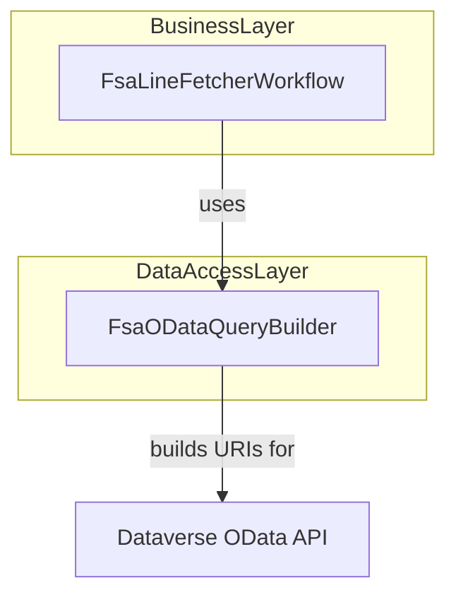

# FSA OData Query Builder Feature Documentation

## Overview

The **FsaODataQueryBuilder** centralizes the construction of OData query URIs for the Dataverse Web API. It encapsulates common patterns—selecting fields, expanding navigation properties, filtering by GUIDs or arbitrary filters, ordering, and paging—into reusable methods. This enables callers (e.g., `FsaLineFetcherWorkflow`) to request work orders, products, services, warehouses, and operational sites without duplicating query‐string logic.

By standardizing query shapes (including both standard and custom `rpc_*` attributes), this component ensures consistency across the application’s data‐access layer. It also preserves existing contracts defined by `IFsaODataQueryBuilder`, allowing safe refactoring and easier testing.

## Architecture Overview



## Component Structure

### Data Access Layer

#### **FsaODataQueryBuilder** (`src/Rpc.AIS.Accrual.Orchestrator.Infrastructure/Adapters/Fscm/Clients/Refactor/FsaODataQueryBuilder.cs`)

- **Implements:**

`IFsaODataQueryBuilder`

- **Purpose:**

Constructs relative OData query URLs for various entity sets in Dataverse, encapsulating

`$select`, `$expand`, `$filter`, `$orderby`, and `$top` clauses.

- **Key Dependencies:**- `DataverseSchema` (static class holding entity‐set and attribute name constants)
- `System.Linq` for building filters
- Standard .NET exceptions for argument validation

##### Public Methods

| Method | Description | Signature |
| --- | --- | --- |
| BuildOpenWorkOrdersRelative | Builds a query for open work orders, including header fields, invoice attributes, lookups, sorting, paging. | `string BuildOpenWorkOrdersRelative(string filter, int pageSize)` |
| BuildWorkOrdersRelative | Builds a query for specific work orders by their GUIDs, with similar header and invoice fields. | `string BuildWorkOrdersRelative(IReadOnlyCollection<Guid> ids, int pageSize)` |
| BuildWorkOrderProductsRelative | Builds a query for work order product lines by work order IDs, selecting product and pricing details. | `string BuildWorkOrderProductsRelative(IReadOnlyCollection<Guid> workOrderIds, int pageSize)` |
| BuildWorkOrderServicesRelative | Builds a query for work order service lines by work order IDs, selecting service and pricing details. | `string BuildWorkOrderServicesRelative(IReadOnlyCollection<Guid> workOrderIds, int pageSize)` |
| BuildProductsRelative | Builds a query for products by product IDs, selecting product metadata. | `string BuildProductsRelative(IReadOnlyCollection<Guid> productIds, int pageSize)` |
| BuildWorkOrderProductPresenceRelative | Builds a minimal “presence” query (top=1) for work order products to detect existence. | `string BuildWorkOrderProductPresenceRelative(IReadOnlyCollection<Guid> workOrderIds)` |
| BuildWorkOrderServicePresenceRelative | Builds a minimal “presence” query (top=1) for work order services to detect existence. | `string BuildWorkOrderServicePresenceRelative(IReadOnlyCollection<Guid> workOrderIds)` |
| BuildWarehousesByIdsRelative | Builds a query for warehouses by GUIDs, selecting ID, identifier, and operational site lookup. | `string BuildWarehousesByIdsRelative(IReadOnlyCollection<Guid> warehouseIds)` |
| BuildOperationalSitesByIdsRelative | Builds a query for operational sites by GUIDs, selecting site ID attributes. | `string BuildOperationalSitesByIdsRelative(IReadOnlyCollection<Guid> operationalSiteIds)` |
| BuildVirtualLookupByIdsRelative | Builds a generic lookup query by IDs, selecting the raw ID and `mserp_name` for virtual‐lookup entities. | `string BuildVirtualLookupByIdsRelative(string entitySetName, string idAttribute, IReadOnlyCollection<Guid> ids)` |


##### Private Helpers

- **BuildEntityByIdsRelative**

Generic builder for queries against any entity set by GUIDs, combining `$select`, optional `$expand`, `$filter`, `$orderby`, and `$top`.

- **BuildPresenceRelative**

Creates a minimal presence check query (`$top=1&$filter`) for boolean existence without fetching full records.

- **BuildOrGuidFilter**

Assembles an OR‐joined filter clause for GUID collections, e.g.

`"(field eq GUID1 or field eq GUID2)"`. Returns `"false"` if no valid GUIDs.

- **ToGuidLiteral**

Converts a `Guid` to its standard `"D"` string form (e.g. `"xxxxxxxx-xxxx-xxxx-xxxx-xxxxxxxxxxxx"`).

---

## Usage Example

```csharp
// Instantiate the builder
var qb = new FsaODataQueryBuilder();

// Build a query for open work orders modified after Jan 1, 2026 with a page size of 500
string relativeUrl = qb.BuildOpenWorkOrdersRelative(
    filter: "modifiedon gt 2026-01-01T00:00:00Z",
    pageSize: 500
);

// Resulting URI fragment:
// "msdyn_workorders?$select=msdyn_workorderid,msdyn_name,...&$expand=msdyn_serviceaccount($select=accountcompanyid)&$filter=modifiedon gt 2026-01-01T00:00:00Z&$orderby=modifiedon asc&$top=500"
```

---

## Key Classes Reference

| Class | Location | Responsibility |
| --- | --- | --- |
| FsaODataQueryBuilder | `Adapters/Fscm/Clients/Refactor/FsaODataQueryBuilder.cs` | Builds OData query URIs for various Dataverse entity sets. |
| IFsaODataQueryBuilder | `Adapters/Fscm/Clients/Refactor/FsaClientAbstractions.cs` | Defines the contract for OData query builders. |
| DataverseSchema | (Referenced static class in infrastructure) | Holds constants for entity‐set names and attribute names. |


---

## Error Handling

All public methods validate inputs and throw:

- `ArgumentException` when required strings (entity names, filters) are null or whitespace.
- `ArgumentOutOfRangeException` when numeric parameters (pageSize, top) are non-positive.
- `ArgumentNullException` when collections or IDs arguments are null.

This strict validation prevents malformed OData queries at runtime.

---

## Dependencies

- .NET Base Libraries:

`System`, `System.Collections.Generic`, `System.Linq`, `System.Threading.Tasks`

- **Microsoft.Extensions.Logging**: Used by callers (e.g., `FsaLineFetcherWorkflow`) for structured logging.
- **Dataverse Web API**: The generated query URIs target Dataverse’s OData endpoint.