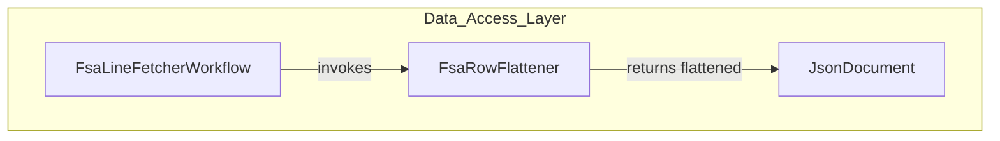

# FsaRowFlattener Feature Documentation

## Overview

The **FsaRowFlattener** component transforms detailed JSON payloads returned by Dataverse into a flat structure that downstream processors expect. 🔄

It specifically extracts company information from the `msdyn_serviceaccount` navigation property and writes it as two top-level fields:

- **cdm_companycode**: the formatted company code
- **cdm_companyid**: the raw lookup GUID string

This preserves the historic inline flattening behavior from older FsaLineFetcher implementations and ensures compatibility with the Core domain’s expected schema.

## Architecture Overview



## Component Structure

### Data Access Layer

#### **FsaRowFlattener** (`src/Rpc.AIS.Accrual.Orchestrator.Infrastructure/Adapters/Fscm/Clients/Refactor/FsaRowFlattener.cs`)

- **Purpose**

Implements `IFsaRowFlattener` to flatten expanded Dataverse JSON shapes into top-level scalar fields expected by the Core domain.

- **Implements**

`IFsaRowFlattener`

- **Dependencies**- `System.Text.Json` for JSON parsing/writing
- `DataverseSchema` constants for field names

**Key Method**

| Method | Description | Returns |
| --- | --- | --- |
| `FlattenWorkOrderCompanyFromExpand(JsonDocument workOrdersDoc)` | Flattens the `msdyn_serviceaccount` expand into `cdm_companycode` and `cdm_companyid` fields | `JsonDocument` |


```csharp
public JsonDocument FlattenWorkOrderCompanyFromExpand(JsonDocument workOrdersDoc)
{
    if (workOrdersDoc is null) throw new ArgumentNullException(nameof(workOrdersDoc));
    using var ms = new MemoryStream();
    using var writer = new Utf8JsonWriter(ms);
    var root = workOrdersDoc.RootElement;

    writer.WriteStartObject();
    foreach (var prop in root.EnumerateObject())
    {
        if (!prop.NameEquals("value"))
        {
            prop.WriteTo(writer);
            continue;
        }

        writer.WritePropertyName("value");
        writer.WriteStartArray();
        foreach (var row in prop.Value.EnumerateArray())
        {
            if (row.ValueKind != JsonValueKind.Object)
            {
                row.WriteTo(writer);
                continue;
            }

            writer.WriteStartObject();
            foreach (var c in row.EnumerateObject())
                c.WriteTo(writer);

            // Expand: msdyn_serviceaccount
            if (row.TryGetProperty(DataverseSchema.Nav_ServiceAccount, out var svc)
                && svc.ValueKind == JsonValueKind.Object)
            {
                // formatted company code
                var fmtKey = DataverseSchema.AccountCompanyLookupField
                             + DataverseSchema.ODataFormattedSuffix;
                if (svc.TryGetProperty(fmtKey, out var fmt)
                    && fmt.ValueKind == JsonValueKind.String
                    && !string.IsNullOrWhiteSpace(fmt.GetString()))
                {
                    writer.WriteString(DataverseSchema.FlatCompanyCodeField, fmt.GetString());
                }

                // raw company id (GUID)
                if (svc.TryGetProperty(DataverseSchema.AccountCompanyLookupField, out var raw)
                    && raw.ValueKind == JsonValueKind.String
                    && !string.IsNullOrWhiteSpace(raw.GetString()))
                {
                    writer.WriteString(DataverseSchema.FlatCompanyIdField, raw.GetString());
                }
            }

            writer.WriteEndObject();
        }
        writer.WriteEndArray();
    }
    writer.WriteEndObject();

    ms.Position = 0;
    return JsonDocument.Parse(ms);
}
```

## Schema Mappings

| Constant | Value | Purpose |
| --- | --- | --- |
| `Nav_ServiceAccount` | `"msdyn_serviceaccount"` | Navigation property to fetch company record |
| `AccountCompanyLookupField` | `"_msdyn_company_value"` | Raw lookup GUID field |
| `ODataFormattedSuffix` | `"@OData.Community.Display.V1.FormattedValue"` | Suffix for formatted lookup values |
| `FlatCompanyCodeField` | `"cdm_companycode"` | Output field for formatted company code |
| `FlatCompanyIdField` | `"cdm_companyid"` | Output field for raw company GUID |


These constants are defined in the centralized `DataverseSchema` class .

## Dependencies

- **System**
- **System.IO**
- **System.Text.Json**
- **Rpc.AIS.Accrual.Orchestrator.Infrastructure.Clients.DataverseSchema**
- **Rpc.AIS.Accrual.Orchestrator.Infrastructure.Clients.IFsaRowFlattener**

## Error Handling

- Throws **ArgumentNullException** if `workOrdersDoc` is null.
- Preserves non-object elements in the `value` array by writing them through unchanged.

## Testing Considerations

- **Null Input**: Verify `ArgumentNullException` is thrown.
- **Absent Expand**: When `msdyn_serviceaccount` is missing, output JSON must match input.
- **Invalid Rows**: Ensure non-object rows are forwarded unchanged.
- **Valid Expand**: Confirm correct extraction of both formatted code and raw ID into top-level fields.

## Key Classes Reference

| Class | Location | Responsibility |
| --- | --- | --- |
| **FsaRowFlattener** | `Infrastructure/Adapters/Fscm/Clients/Refactor/FsaRowFlattener.cs` | Flattens expanded Dataverse JSON into top-level scalar fields |
| **IFsaRowFlattener** | `Infrastructure/Adapters/Fscm/Clients/Refactor/FsaClientAbstractions.cs` | Defines the contract for row flattening behavior |
