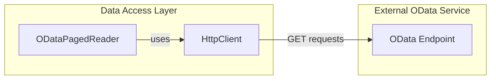
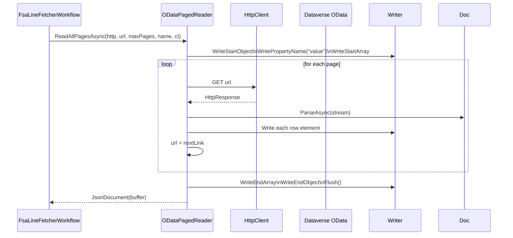

# OData Paged Reader Feature Documentation

## Overview

The **ODataPagedReader** provides a reusable mechanism for fetching and aggregating paged JSON data from an OData-compliant HTTP service (e.g., Microsoft Dataverse). It shields higher-level components from pagination details, transparently following `@odata.nextLink` until all pages—or a configurable maximum—are retrieved.

By consolidating multiple pages into a single in-memory `JsonDocument`, it simplifies downstream processing (flattening, enrichment, etc.) and centralizes error handling (throttling, missing payloads). This component is a core part of the **Accrual Orchestrator Infrastructure** data-access layer, used by services like `FsaLineFetcherWorkflow` and `WarehouseSiteEnricher`.

## Architecture Overview



## Component Structure

### Data Access Layer

#### **ODataPagedReader** (`src/Rpc.AIS.Accrual.Orchestrator.Infrastructure/Adapters/Fscm/Clients/Refactor/ODataPagedReader.cs`)

- **Purpose:**- Implements `IODataPagedReader`.
- Aggregates all pages of an OData query into one `JsonDocument`.
- Logs key events (throttling, missing data) and enforces a maximum page limit.

- **Constructor**

```csharp
  public ODataPagedReader(ILogger<ODataPagedReader> log)
```

- Injects an `ILogger` for warning and informational messages.
- Throws `ArgumentNullException` if `log` is null.

- **Key Methods**

| Method | Signature | Description |
| --- | --- | --- |
| ReadAllPagesAsync | `Task<JsonDocument> ReadAllPagesAsync(HttpClient http, string initialRelativeUrl, int maxPages, string logEntityName, CancellationToken ct)` | Starts pagination, writes `"value"` array header/footer, and delegates to `CopyPagedValuesIntoAsync`. |
| CopyPagedValuesIntoAsync | `Task<int> CopyPagedValuesIntoAsync(HttpClient http, string initialUrl, int maxPages, Utf8JsonWriter writer, string logEntityName, CancellationToken ct)` | Iterates HTTP GET calls, parses each page’s JSON, writes each element into the shared `Utf8JsonWriter`, and returns total items written. |


## Method Details

### ReadAllPagesAsync

```csharp
public async Task<JsonDocument> ReadAllPagesAsync(
    HttpClient http,
    string initialRelativeUrl,
    int maxPages,
    string logEntityName,
    CancellationToken ct)
```

- **Parameters**- `http`: Configured `HttpClient` instance (must not be null).
- `initialRelativeUrl`: Relative OData query URL (non-empty).
- `maxPages`: Maximum pages to fetch (positive integer).
- `logEntityName`: Identifier used in log messages.
- `ct`: `CancellationToken` to abort the operation.

- **Behavior**1. Validates arguments: throws on null or invalid values.
2. Creates an in-memory `MemoryStream` + `Utf8JsonWriter`.
3. Writes JSON object start and `"value"` array start.
4. Calls `CopyPagedValuesIntoAsync` to fill array.
5. Writes array end, object end, flushes writer.
6. Parses the buffer into `JsonDocument` and returns it.

- **Usage**

Higher-level orchestrators call this to obtain a consolidated `JsonDocument` containing all rows under a root `"value"` array.

### CopyPagedValuesIntoAsync

```csharp
private async Task<int> CopyPagedValuesIntoAsync(
    HttpClient http,
    string initialUrl,
    int maxPages,
    Utf8JsonWriter writer,
    string logEntityName,
    CancellationToken ct)
```

- **Pagination Loop**- Initializes `url = initialUrl`, `page = 0`, `total = 0`.
- While `url` is non-empty and `page < maxPages`:1. Issues `HttpRequestMessage(HttpMethod.Get, url)`.
2. On **429 Too Many Requests**, logs a warning and lets callers retry.
3. Calls `resp.EnsureSuccessStatusCode()` for other failures.
4. Parses response stream into a `JsonDocument`.
5. Extracts the `"value"` array; logs a warning and breaks if missing.
6. Enumerates each item in the array:- Writes it to `writer`.
- Increments `total`.
7. Reads `@odata.nextLink` for the next page (or sets `url = null`).
- Returns the total number of items written.

- **Error Handling**- Argument validation at entry.
- HTTP errors (non-2xx) throw via `EnsureSuccessStatusCode()`.
- Throttling (429) is logged but not thrown here.
- Missing `"value"` array triggers a warning and exits the loop.

## Sequence Diagram



## Dependencies

- **System.Net.Http**: issues GET requests and reads response streams.
- **System.Text.Json**: parses and writes JSON efficiently.
- **Microsoft.Extensions.Logging**: logs warnings and informational messages.

## Error Handling

- **Argument Validation**- Null or whitespace checks throw `ArgumentNullException` or `ArgumentException`.
- `maxPages <= 0` throws `ArgumentOutOfRangeException`.

- **HTTP Failures**- **429**: logs a warning; defers retry to caller.
- **Other 4xx/5xx**: `EnsureSuccessStatusCode` throws an `HttpRequestException`.

- **JSON Validation**- Missing or non-array `"value"` property logs a warning and aborts further paging.

```csharp
if (!doc.RootElement.TryGetProperty("value", out var arr)
    || arr.ValueKind != JsonValueKind.Array)
{
    _log.LogWarning(
        "Dataverse response does not contain 'value' array. Entity={Entity} Url={Url}",
        logEntityName, url);
    break;
}
```

## Testing Considerations

- **Pagination Scenarios**- Single-page responses (no `@odata.nextLink`).
- Multi-page responses with valid `@odata.nextLink`.
- Responses exceeding `maxPages` to verify early termination.

- **Throttling Simulation**- Return HTTP 429 on a page; assert that a warning is logged and retry logic in caller fires.

- **Malformed Payloads**- Missing `"value"` property or non-array; assert warning and partial aggregation.

- **Cancellation**- Trigger `ct.Cancel()` mid-fetch; verify `TaskCanceledException` bubbles up.

## Key Classes Reference

| Class | Location | Responsibility |
| --- | --- | --- |
| ODataPagedReader | `.../Infrastructure/Adapters/Fscm/Clients/Refactor/ODataPagedReader.cs` | Implements `IODataPagedReader`, aggregates paged OData JSON into a single `JsonDocument`. |
| IODataPagedReader | `.../Infrastructure/Adapters/Fscm/Clients/Refactor/FsaClientAbstractions.cs` (interface) | Defines the contract for paged OData reads (`ReadAllPagesAsync`). |


---

This documentation covers the **ODataPagedReader**’s role, structure, and behavior. It ensures that data-access components can reliably fetch large datasets from any OData service without duplicating pagination logic.