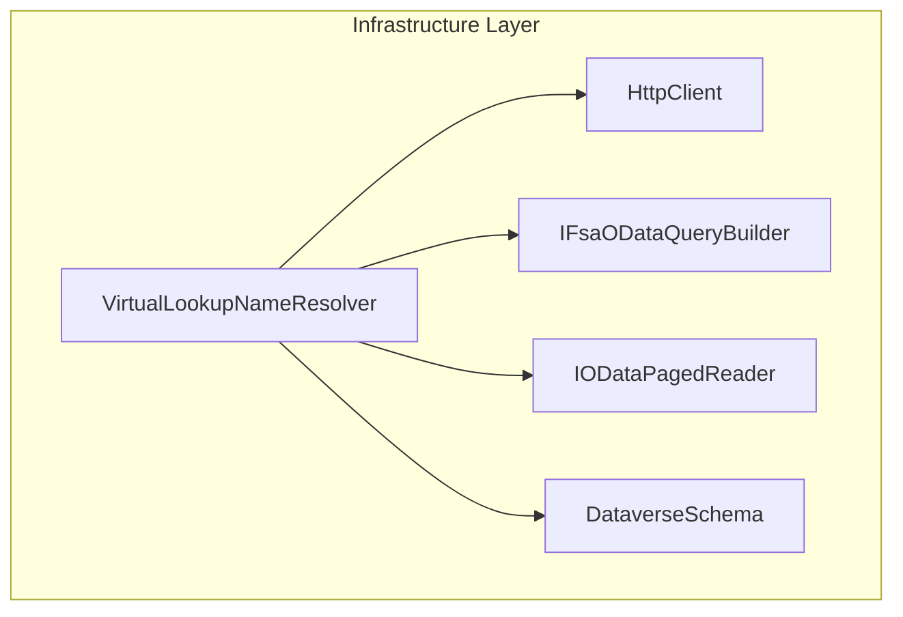

# VirtualLookupNameResolver Feature Documentation

## Overview

The **VirtualLookupNameResolver** enriches JSON payloads of FSA line records by extracting formatted lookup names directly from Dataverse responses. It reads `@OData.Community.Display.V1.FormattedValue` fields for line property, department, and product line without issuing additional HTTP calls. This optimization preserves the existing enrichment contract while improving performance and reliability in the FSA ingestion pipeline .

## Architecture Overview

This component lives in the Infrastructure Data Access layer and collaborates with core HTTP and OData helpers to process JSON payloads.



## Component Structure

### Data Access Layer

#### **VirtualLookupNameResolver** (`src/Rpc.AIS.Accrual.Orchestrator.Infrastructure/Adapters/Fscm/Clients/Refactor/VirtualLookupNameResolver.cs`)

- **Purpose:** Implements `IVirtualLookupNameResolver` to add flat lookup name fields to each JSON row .
- **Dependencies:**- `HttpClient _http`
- `ILogger<VirtualLookupNameResolver> _log`
- `IFsaODataQueryBuilder _qb`
- `IODataPagedReader _reader`
- **Constructor:** Validates non-null dependencies and assigns fields .
- **Key Method:**

```csharp
  Task<JsonDocument> EnrichLinesWithVirtualLookupNamesAsync(
      HttpClient http, JsonDocument baseLines, CancellationToken ct)
```

- Reads the `"value"` array.
- Copies each row’s properties.
- Invokes `WriteFormatted` for:- `DataverseSchema.Lookup_LineProperty` → `LinePropertyName`
- `DataverseSchema.Lookup_Department` → `DepartmentName`
- `DataverseSchema.Lookup_ProductLine` → `ProductLineName` .

Writes a flat string when the formatted suffix property exists and is non-empty.

- `TryGetValueArray(JsonDocument doc, out JsonElement array)`

Safely extracts the `"value"` array or signals none.

## Integration Points

- Implements the enrichment contract defined by `IVirtualLookupNameResolver` .
- Is injected into `FsaLineFetcherWorkflow` as `_virtualLookupResolver` for line-level enrichment .
- Relies on `DataverseSchema` constants for OData field naming .

## Key Classes Reference

| Class | Location | Responsibility |
| --- | --- | --- |
| VirtualLookupNameResolver | `.../Adapters/Fscm/Clients/Refactor/VirtualLookupNameResolver.cs` | Enriches JSON rows with flat lookup name fields |
| IVirtualLookupNameResolver | `.../Clients/Refactor/FsaClientAbstractions.cs` | Defines enrichment contract for virtual lookup names |
| DataverseSchema | `.../Clients/Refactor/DataverseSchema.cs` | Holds constants for lookup and formatted-value suffixes |


## Error Handling

- If the input document lacks a `"value"` array or it is not an array, the original `JsonDocument` is returned unchanged.
- The `WriteFormatted` method checks property existence, value kind, and string content to avoid exceptions.

## Dependencies

- **NuGet Packages:**- `Microsoft.Extensions.Logging`
- **Framework APIs:**- `System.Net.Http.HttpClient`
- `System.Text.Json.JsonDocument`, `JsonElement`, `Utf8JsonWriter`
- **Project Interfaces:**- `IFsaODataQueryBuilder`
- `IODataPagedReader`
- **Internal Classes:**- `DataverseSchema` for OData naming conventions

## Testing Considerations

- **No-Array Input:** Supplying a document without `"value"` should return it unmodified.
- **Missing Suffix Fields:** Rows without formatted suffix properties must remain intact without added fields.
- **Valid Enrichment:** Rows containing `@OData.Community.Display.V1.FormattedValue` entries for each lookup must produce corresponding flat string properties.
- **Large Payloads:** Buffering via `MemoryStream` must handle large arrays without data loss or corruption.