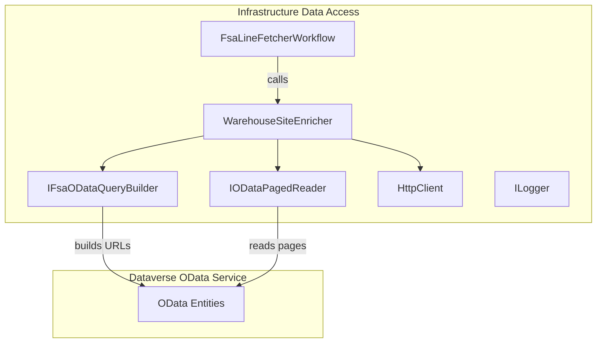
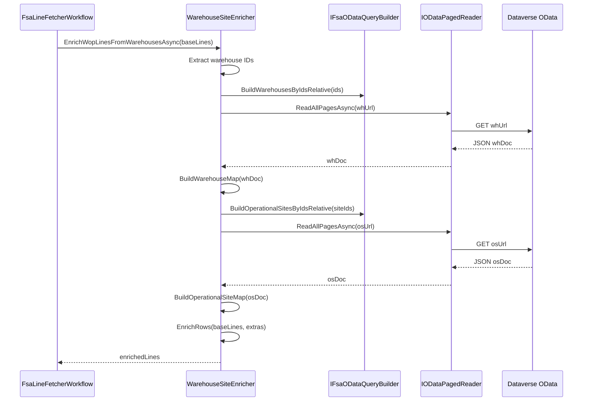

# Warehouse Site Enrichment Feature Documentation

## Overview

The **Warehouse Site Enrichment** component enriches work order product (WOP) lines with warehouse identifiers and operational site IDs. It consumes a JSON payload of WOP rows, fetches warehouse and site metadata via Dataverse OData, and injects extra fields into each row. This enrichment enables downstream processes (delta calculation, posting, reporting) to have accurate location data for each work order line.

This feature lives in the Infrastructure layer under the FSCM client adapters. It plugs into the FSA line-fetch workflow, ensuring that every work order product line carries both raw and alias fields for warehouse and site. Business value lies in delivering consistent, enriched payloads to the accrual orchestrator and journal posting subsystems.

## Architecture Overview

## Component Structure

### Data Access Layer

#### **WarehouseSiteEnricher** (`src/Rpc.AIS.Accrual.Orchestrator.Infrastructure/Adapters/Fscm/Clients/Refactor/WarehouseSiteEnricher.cs`)

- **Responsibilities**- Implements `IWarehouseSiteEnricher`.
- Extracts warehouse GUIDs from input JSON.
- Calls Dataverse to fetch warehouse metadata.
- Optionally fetches operational site formatted IDs.
- Merges identifier and site fields back into each JSON row.

- **Constructor Dependencies**- `HttpClient _http`
- `ILogger<WarehouseSiteEnricher> _log`
- `IFsaODataQueryBuilder _qb`
- `IODataPagedReader _reader`

- **Key Method**- `Task<JsonDocument> EnrichWopLinesFromWarehousesAsync(HttpClient http, JsonDocument baseLines, CancellationToken ct)`1. Validates presence of `"value"` array.
2. Gathers unique warehouse IDs.
3. Builds warehouse OData query via `_qb.BuildWarehousesByIdsRelative`.
4. Reads all pages with `_reader.ReadAllPagesAsync`.
5. Builds a map of `WarehouseInfo`.
6. If any `OperationalSiteId` exist:- Builds and executes site query.
- Updates map entries with formatted site IDs.
7. Calls `EnrichRows` to inject:- `msdyn_warehouseidentifier` (raw)
- `Warehouse` (alias)
- `msdyn_siteid` and `Site` (if available)

- **Private Helpers**- `record WarehouseInfo(string? Identifier, Guid? OperationalSiteId, string? SiteId)`
- `BuildWarehouseMap(JsonDocument whDoc)` parses warehouse entities.
- `BuildOperationalSiteMap(JsonDocument osDoc)` parses site entities.
- `TryGetValueArray(JsonDocument doc, out JsonElement array)` checks for `"value"` array.
- `EnrichRows(JsonDocument baseDoc, Func<JsonElement, IEnumerable<(string Name, string? Value)>> extraFactory)` merges extra fields.

### Interfaces

#### **IWarehouseSiteEnricher** (`FsaClientAbstractions.cs`)

Defines the contract for warehouse enrichment:

| Method | Description | Returns |
| --- | --- | --- |
| `EnrichWopLinesFromWarehousesAsync(HttpClient, JsonDocument, CancellationToken)` | Enriches WOP lines with warehouse and site data. | `Task<JsonDocument>` |

#### **IFsaODataQueryBuilder** (`FsaClientAbstractions.cs`)

Provides methods to build relative OData URLs:

- `BuildWarehousesByIdsRelative(IReadOnlyCollection<Guid> warehouseIds)`
- `BuildOperationalSitesByIdsRelative(IReadOnlyCollection<Guid> operationalSiteIds)`

#### **IODataPagedReader** (`FsaClientAbstractions.cs`)

Reads paged OData results into a single JSON document:

- `ReadAllPagesAsync(HttpClient http, string initialRelativeUrl, int maxPages, string logEntityName, CancellationToken ct)`

## Feature Flows

### Warehouse Enrichment Sequence

## Key Classes Reference

| Class | Location | Responsibility |
| --- | --- | --- |
| WarehouseSiteEnricher | `.../Infrastructure/Adapters/Fscm/Clients/Refactor/WarehouseSiteEnricher.cs` | Enriches WOP JSON with warehouse and site data. |
| IWarehouseSiteEnricher | `.../Infrastructure/Adapters/Fscm/Clients/Refactor/FsaClientAbstractions.cs` | Defines enrichment contract. |
| IFsaODataQueryBuilder | `.../Infrastructure/Adapters/Fscm/Clients/Refactor/FsaClientAbstractions.cs` | Builds OData query URLs. |
| IODataPagedReader | `.../Infrastructure/Adapters/Fscm/Clients/Refactor/FsaClientAbstractions.cs` | Reads paged OData into a single JSON. |
| WarehouseInfo | Nested in `WarehouseSiteEnricher.cs` | Holds identifier and site lookup data per warehouse. |

## Integration Points

- **FsaLineFetcherWorkflow** invokes this enricher as part of assembling the full WOP payload.
- **Dataverse OData Service** serves warehouse and operational site entities.

## Dependencies

- `Microsoft.Extensions.Logging` for logging OData queries and enrichment stats.
- `System.Text.Json` for JSON parsing and writing.
- `HttpClient` for HTTP transport.
- `IFsaODataQueryBuilder` and `IODataPagedReader` for OData URL construction and paging.

## Error Handling

- Checks for null or empty inputs and returns the original document if no enrichment applies.
- Logs warnings if Dataverse responses lack expected `"value"` arrays.
- Relies on `EnsureSuccessStatusCode()` within `IODataPagedReader` to surface HTTP errors.

## Caching Strategy

This component does not implement caching. It issues fresh OData queries per invocation to ensure real-time enrichment of WOP lines.

## Testing Considerations

- Validate that no enrichment occurs when no warehouse IDs are present.
- Simulate partial metadata (missing `OperationalSiteId`) to ensure enrichment gracefully skips site lookups.
- Test enrichment of multiple rows with duplicate warehouse IDs for correct deduplication.