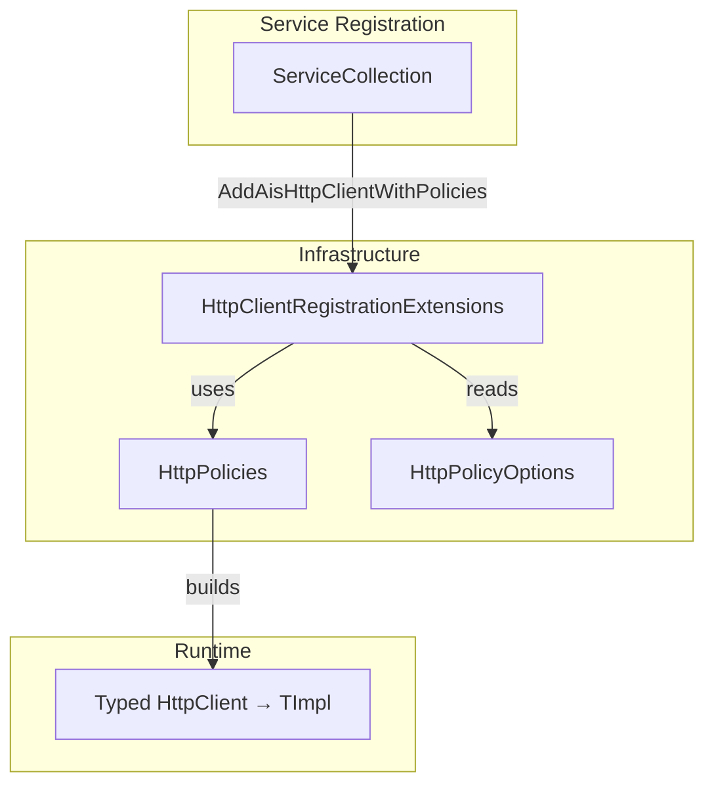

# HTTP Client Registration Extensions Feature Documentation

## Overview

The **HttpClientRegistrationExtensions** class centralizes the registration of typed `HttpClient` instances with standardized resilience policies. It provides a single extension method to:

- Configure handler lifetimes to minimize socket exhaustion.
- Apply consistent timeout and retry policies using Polly.
- Distinguish between two HTTP categories—**Dataverse** and **FSCM**—each with its own configuration.

This approach ensures that all outbound HTTP calls in the AIS accrual orchestrator adhere to organizational standards for performance and fault tolerance.

## Architecture Overview



## Component Structure

### HttpClientRegistrationExtensions (`src/.../HttpClientRegistrationExtensions.cs`)

Provides an extension on `IServiceCollection` to register typed HTTP clients with built-in timeout and retry policies .

```csharp
internal static class HttpClientRegistrationExtensions
{
    internal enum HttpCategory { Dataverse, Fscm }

    internal static IHttpClientBuilder AddAisHttpClientWithPolicies<TClient, TImpl>(
        this IServiceCollection services,
        string clientName,
        HttpCategory category)
        where TClient : class
        where TImpl : class, TClient
    {
        return services.AddHttpClient<TClient, TImpl>()
            .SetHandlerLifetime(TimeSpan.FromMinutes(10))
            .AddPolicyHandler((sp, req) =>
            {
                var opts = sp.GetRequiredService<IOptions<HttpPolicyOptions>>().Value;
                var cat = category == HttpCategory.Dataverse ? opts.Dataverse : opts.Fscm;
                return HttpPolicies.BuildTimeoutPolicy(TimeSpan.FromSeconds(cat.TimeoutSeconds));
            })
            .AddPolicyHandler((sp, req) =>
            {
                // IMPORTANT: Never retry HTTP POST (non-idempotent).
                if (req?.Method == HttpMethod.Post)
                    return Policy.NoOpAsync<HttpResponseMessage>();

                var opts = sp.GetRequiredService<IOptions<HttpPolicyOptions>>().Value;
                var cat = category == HttpCategory.Dataverse ? opts.Dataverse : opts.Fscm;
                return HttpPolicies.BuildRetryPolicy(sp, clientName, cat);
            });
    }
}
```

#### HttpCategory enum

- `Dataverse`: Applies settings from `HttpPolicyOptions.Dataverse`.
- `Fscm`: Applies settings from `HttpPolicyOptions.Fscm` .

#### AddAisHttpClientWithPolicies Method

- **Purpose:** Registers `TClient`/`TImpl` with:- A **10-minute** handler lifetime.
- A **timeout** policy based on the configured `TimeoutSeconds`.
- A **retry** policy with exponential backoff and jitter, skipping retries for `POST` requests.

- **Type Parameters:**- `TClient`: Public interface or abstract client type.
- `TImpl`: Concrete implementation of `TClient`.

- **Parameters:**- `services` (`IServiceCollection`): DI container.
- `clientName` (`string`): Logical name used in policy logging.
- `category` (`HttpCategory`): Chooses between Dataverse and FSCM settings.

### Resilience Policies

Centralized in the `HttpPolicies` static class:

| Policy Type | Builder Method | Source |
| --- | --- | --- |
| Timeout | `BuildTimeoutPolicy(TimeSpan timeout)` | Rpc.AIS.Accrual.Orchestrator.Infrastructure.Http.HttpPolicies |
| Retry | `BuildRetryPolicy(IServiceProvider, string, CategoryOptions)` | Rpc.AIS.Accrual.Orchestrator.Infrastructure.Http.HttpPolicies |


- **TimeoutPolicy:** Optimistic timeout that cancels request after the configured duration.
- **RetryPolicy:** Handles transient HTTP errors, `429` responses, and timeouts; uses exponential backoff capped by `MaxBackoffSeconds`.

## Integration Points

- Intended for use in startup/DI setup (e.g., `Program.cs`) to replace ad-hoc `AddHttpClient` calls.
- Ensures all HTTP clients across Dataverse and FSCM boundaries share consistent policy behavior.

## Dependencies

- **Polly**: Builds resilience policies.
- **Microsoft.Extensions.Http**: Provides `AddHttpClient`.
- **Microsoft.Extensions.Options**: Binds `HttpPolicyOptions` from configuration.
- **Rpc.AIS.Accrual.Orchestrator.Infrastructure.Http**: Contains `HttpPolicies`.
- **Rpc.AIS.Accrual.Orchestrator.Infrastructure.Options**: Contains `HttpPolicyOptions`.

## Key Classes Reference

| Class | Location | Responsibility |
| --- | --- | --- |
| HttpClientRegistrationExtensions | src/Rpc.AIS.Accrual.Orchestrator.Infrastructure/Adapters/Fscm/Http/Http/HttpClientRegistrationExtensions.cs | Extension methods for registering HttpClients with policies. |
| HttpCategory (nested enum) | Same as above | Selects between Dataverse and FSCM policy categories. |
| HttpPolicies | src/Rpc.AIS.Accrual.Orchestrator.Infrastructure/Adapters/Fscm/Http/Http/HttpPolicies.cs | Builds Polly timeout and retry policies. |


## Testing Considerations

- **Policy Application:** Verify that registered clients honor configured timeouts and retries.
- **POST Behavior:** Ensure `POST` requests do not trigger retries.
- **Category Selection:** Test both `Dataverse` and `Fscm` branches to confirm correct option binding.
- **Handler Lifetime:** Confirm that underlying `HttpMessageHandler` instances are reused for 10 minutes.