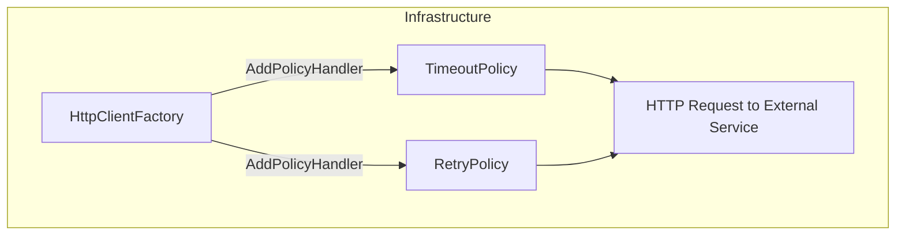

# HTTP Resilience Policies Feature Documentation

## Overview

This feature centralizes HTTP resilience logic for the Orchestrator infrastructure. It provides two key policies for `HttpClient`:

- **Timeout**: Cancels requests that exceed a configured duration.
- **Retry**: Automatically retries transient failures, network issues, and throttling (HTTP 429) with exponential backoff and jitter.

By encapsulating these behaviors, the application achieves consistent error handling and improves reliability when communicating with external services.

## Architecture Overview



## Component Structure

### 1. Resilience Policies

#### **HttpPolicies** (`src/Rpc.AIS.Accrual.Orchestrator.Infrastructure.Adapters.Fscm.Http.Http.HttpPolicies.cs`)

- **Purpose**: Builds reusable **timeout** and **retry** policies for `HttpClient`.
- **Namespace**: `Rpc.AIS.Accrual.Orchestrator.Infrastructure.Http`

##### Key Methods

| Method | Description | Returns |
| --- | --- | --- |
| **BuildTimeoutPolicy**(TimeSpan timeout) ⚡ | Creates an **optimistic** timeout policy using Polly. | `IAsyncPolicy<HttpResponseMessage>` |
| **BuildRetryPolicy**(IServiceProvider sp, string clientName, HttpPolicyOptions.CategoryOptions opt) 🔁 | Builds a retry policy with exponential backoff, 20% jitter, and logging. Handles 5xx, 408, network errors, timeouts, and HTTP 429. | `IAsyncPolicy<HttpResponseMessage>` |


##### Implementation Details

- **Timeout**

Uses `Policy.TimeoutAsync<HttpResponseMessage>(timeout, TimeoutStrategy.Optimistic)`.

- **Retry**- **Handles**:- Transient HTTP errors (5xx, 408, `HttpRequestException`)
- `TimeoutRejectedException` from Polly
- HTTP status **429** (Too Many Requests)
- **Backoff**: `2^attempt` seconds capped at `MaxBackoffSeconds`.
- **Jitter**: ±20% random variation to avoid request bursts.
- **Delays**: Precomputed `TimeSpan[]` based on retries count.
- **Logging**: Emits a warning on each retry with attempt count, status, and delay.
- **Retry-After**: Honors the `Retry-After` HTTP header to override backoff when present.

### 2. Options Model

#### **HttpPolicyOptions.CategoryOptions**

(`src/Rpc.AIS.Accrual.Orchestrator.Infrastructure.Options.HttpPolicyOptions.cs`)

- **Purpose**: Holds configuration for timeout, retry count, and backoff cap, loaded via `IOptions<HttpPolicyOptions>`.

| Property | Type | Default | Description |
| --- | --- | --- | --- |
| `TimeoutSeconds` | int | 60 | Total timeout (seconds) for a single HTTP attempt. |
| `Retries` | int | 5 | Number of retry attempts after the initial failure. |
| `MaxBackoffSeconds` | int | 30 | Maximum backoff (seconds) for exponential delays. |


### 3. Integration Points

`HttpPolicies` are applied when registering `HttpClient` instances:

```csharp
services.AddHttpClient<MyClient, MyClientImpl>()
    .SetHandlerLifetime(TimeSpan.FromMinutes(10))
    .AddPolicyHandler((sp, req) =>
        HttpPolicies.BuildTimeoutPolicy(
            TimeSpan.FromSeconds(opt.TimeoutSeconds)))
    .AddPolicyHandler((sp, req) =>
        // Skip retries on non-idempotent POST
        req.Method == HttpMethod.Post
            ? Policy.NoOpAsync<HttpResponseMessage>()
            : HttpPolicies.BuildRetryPolicy(sp, clientName, opt));
```

```card
{
    "title": "Non-idempotent Requests",
    "content": "Retry policies are skipped for HTTP POST to avoid duplicate side effects."
}
```

## Error Handling

- **Transient Errors**: Automatic retries on HTTP 5xx, 408, and network exceptions.
- **Timeouts**: Requests cancelled optimistically after the configured timeout.
- **Throttling**: Retries on HTTP 429, honoring the `Retry-After` header when provided.

## Dependencies

- **Polly** and **Polly.Extensions.Http** for resilience policies.
- **Microsoft.Extensions.Logging** for retry logging.
- **Rpc.AIS.Accrual.Orchestrator.Infrastructure.Options** for configuration classes.

## Key Classes Reference

| Class | Location | Responsibility |
| --- | --- | --- |
| **HttpPolicies** | `Infrastructure/Adapters/Fscm/Http/Http/HttpPolicies.cs` | Builds HTTP timeout and retry policies for `HttpClient`. |
| **CategoryOptions** | `Infrastructure/Options/HttpPolicyOptions.cs` | Configuration model for policy parameters. |


## Testing Considerations

- **Timeout Behavior**: Verify requests are cancelled after `TimeoutSeconds`.
- **Retry Logic**: Simulate HTTP 5xx, network failures, and 429 to confirm correct retry count and delays.
- **Jitter Bounds**: Assert delays vary within ±20% of the base exponential delay.
- **Retry-After Handling**: Mock `Retry-After` header to ensure backoff override.