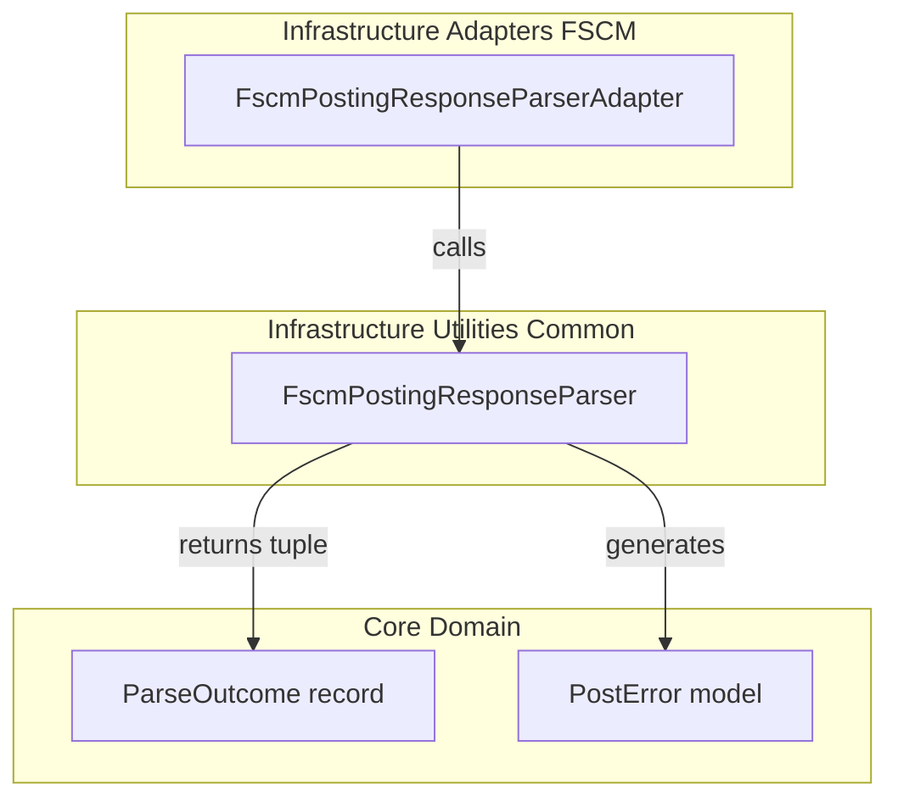

# FSCM Posting Response Parser Feature Documentation

## Overview

The **FscmPostingResponseParser** centralizes logic for interpreting responses from FSCM’s journal posting API. It parses raw JSON response bodies into a structured result tuple containing:

- A success flag (`Ok`)
- An optional `JournalId`
- A human-readable `Message`
- A list of parse errors (`ParseErrors`)

This extraction from `PostingHttpClient` enforces the Single Responsibility Principle, keeps HTTP orchestration separate, and enables reuse in unit tests .

## Architecture Overview



## Component Structure

### 1. Infrastructure Utilities

#### **FscmPostingResponseParser** (`src/Rpc.AIS.Accrual.Orchestrator.Infrastructure/CrossCutting/Common/FscmPostingResponseParser.cs`)

- **Purpose**

Parses FSCM journal posting JSON response bodies into a standardized tuple for downstream processing .

- **Key Methods**- `TryParse(string responseBody)`: Parses the JSON, applies FSCM schema rules, and returns `(bool Ok, string? JournalId, string? Message, List<PostError> ParseErrors)` .
- `TryGetBool(JsonElement root, string prop, out bool value)`: Safe retrieval of boolean flags from JSON.
- `TryGetString(JsonElement root, string prop)`: Extracts string or raw text from various JSON value kinds.
- `HasProperty(JsonElement root, string prop)`: Checks for property existence without reading its value.

### 2. Infrastructure Adapters

#### **IFscmPostingResponseParser** & **ParseOutcome** & **FscmPostingResponseParserAdapter**

(`src/Rpc.AIS.Accrual.Orchestrator.Infrastructure/Adapters/Fscm/Clients/Posting/IFscmPostingResponseParser.cs`)

- **Interface: IFscmPostingResponseParser**

```csharp
  public interface IFscmPostingResponseParser
  {
      ParseOutcome Parse(string responseBody);
  }
```

- **Record: ParseOutcome**

Carries parsed data for further processing.

| Property | Type | Description |
| --- | --- | --- |
| Ok | bool | Indicates overall success |
| JournalId | string? | Extracted journal identifier, if present |
| Message | string | Success or error message |
| ParseErrors | IReadOnlyList<PostError> | List of parsing-related errors |


- **Adapter: FscmPostingResponseParserAdapter**

Implements the interface by delegating to the static parser and wrapping its tuple into `ParseOutcome` .

```csharp
  public sealed class FscmPostingResponseParserAdapter : IFscmPostingResponseParser
  {
      public ParseOutcome Parse(string responseBody)
      {
          var (ok, journalId, message, parseErrors) = FscmPostingResponseParser.TryParse(responseBody);
          return new ParseOutcome(ok, journalId, message ?? (ok ? "OK" : "Parse failed"), parseErrors);
      }
  }
```

## Data Models

### PostError (Core Domain)

Defined alongside `PostResult`, this record captures individual error details during posting or parsing .

```csharp
public sealed record PostError(
    string Code,
    string Message,
    string? StagingId,
    string? JournalId,
    bool JournalDeleted,
    string? DeleteMessage
);
```

### ParseOutcome

Described above under adapters; presents a parsed view of the HTTP response body, ready for consumption by `PostOutcomeProcessor`.

## Error Handling

- **JSON Parsing Failures**

If `responseBody` is not valid JSON, the parser treats the HTTP 2xx as success but returns a single `PostError` with code `FSCM_POST_RESPONSE_PARSE_SKIPPED` and embeds the raw response in `DeleteMessage` .

- **Schema-Based Flags**

The parser honors explicit success flags (`isSuccess` / `Success` / etc.). Absent these, it infers success from `StatusCode == 0` and empty `Error` fields, overriding only if those fields indicate failure.

## Dependencies

- **NuGet Packages**- System.Text.Json (`JsonDocument`, `JsonElement`)
- **Internal**- `Rpc.AIS.Accrual.Orchestrator.Core.Domain.PostError`
- `Rpc.AIS.Accrual.Orchestrator.Infrastructure.Adapters.Fscm.Clients.Posting.IFscmPostingResponseParser`

## Testing Considerations

Extracting parsing logic into this static class simplifies unit tests by allowing direct invocation of `TryParse` without HTTP concerns. Test cases can supply various JSON payloads to verify flag detection, message selection, and error list generation.

## Key Classes Reference

| Class | Location | Responsibility |
| --- | --- | --- |
| FscmPostingResponseParser | src/.../CrossCutting/Common/FscmPostingResponseParser.cs | Parses raw JSON response bodies |
| IFscmPostingResponseParser | src/.../Adapters/Fscm/Clients/Posting/IFscmPostingResponseParser.cs | Defines parsing contract |
| ParseOutcome | same as above | Carries parsing results |
| FscmPostingResponseParserAdapter | same as above | Bridges static parser to interface |
| PostError | src/Rpc.AIS.Accrual.Orchestrator.Core.Domain/PostResult.cs | Domain model for error details |
