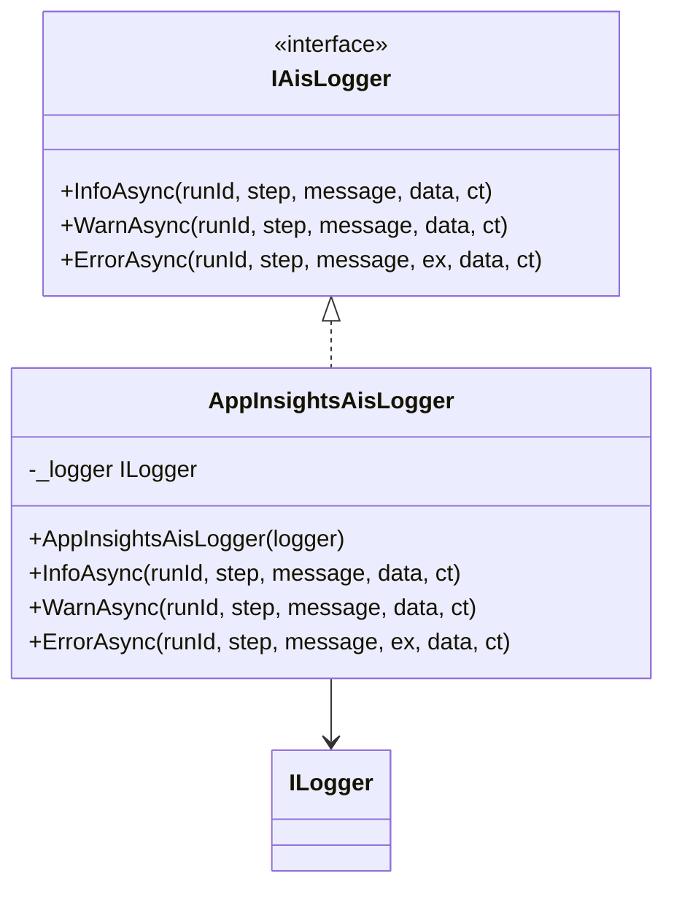

# AppInsights AIS Logger Feature Documentation

## Overview

The **AppInsights AIS Logger** provides a concrete implementation of the `IAisLogger` contract, routing structured telemetry through the standard `ILogger` abstraction. In Azure Functions, messages logged via this class automatically flow into Application Insights when the function app is configured accordingly.

By centralizing AIS logging logic in one class, the feature ensures consistent message formatting across informational, warning, and error levels. This improves traceability by embedding contextual fields such as RunId and Step in every log entry.

## Architecture Overview



This diagram shows how `AppInsightsAisLogger` implements the `IAisLogger` interface and depends on `ILogger<T>` to emit structured logs.

## Component Structure

### Infrastructure Logging

#### **AppInsightsAisLogger** (`src/Rpc.AIS.Accrual.Orchestrator.Infrastructure/Logging/AppInsightsAisLogger.cs`)

- **Purpose**

Implements the `IAisLogger` contract by writing structured log entries through `ILogger<T>`. Ensures every entry includes the step name, run identifier, message text, and optional data payload.

- **Dependencies**- `Microsoft.Extensions.Logging`
- `Rpc.AIS.Accrual.Orchestrator.Core.Abstractions`

- **Key Property**

| Name | Type | Description |
| --- | --- | --- |
| _logger | ILogger<AppInsightsAisLogger> | Underlying logger used to emit telemetry |


- **Constructor**

```csharp
  public AppInsightsAisLogger(ILogger<AppInsightsAisLogger> logger)
  {
      _logger = logger ?? throw new ArgumentNullException(nameof(logger));
  }
```

Validates that the injected `ILogger` is non-null before use.

- **Methods**

| Method | Signature | Responsibility |
| --- | --- | --- |
| InfoAsync | Task InfoAsync(string runId, string step, string message, object? data, CancellationToken ct) | Emits an Information-level log entry. |
| WarnAsync | Task WarnAsync(string runId, string step, string message, object? data, CancellationToken ct) | Emits a Warning-level log entry. |
| ErrorAsync | Task ErrorAsync(string runId, string step, string message, Exception? ex, object? data, CancellationToken ct) | Emits an Error-level log entry including exception. |


Each method formats the entry as:

```plaintext
  {Step} | RunId={RunId} | {Message} | {@Data}
```

ErrorAsync additionally includes the exception object.

## Key Classes Reference

| Class | Location | Responsibility |
| --- | --- | --- |
| AppInsightsAisLogger | src/Rpc.AIS.Accrual.Orchestrator.Infrastructure/Logging/AppInsightsAisLogger.cs | Implements `IAisLogger` via `ILogger` to App Insights. |
| IAisLogger | src/Rpc.AIS.Accrual.Orchestrator.Core.Abstractions/IAisLogger.cs | Defines async logging contract for AIS telemetry. |


## Dependencies

- **Microsoft.Extensions.Logging**

Provides the `ILogger<T>` abstraction used to emit structured log events.

- **Rpc.AIS.Accrual.Orchestrator.Core.Abstractions**

Contains the `IAisLogger` interface defining the logging contract.

## Error Handling

- Constructor enforces non-null `ILogger`, throwing `ArgumentNullException` if missing.
- Logging methods never throw; they return a completed `Task`, deferring actual error handling to the logging pipeline.

## Testing Considerations

- In unit tests, replace `AppInsightsAisLogger` with a **no-op** or **fake** `IAisLogger` implementation to avoid external dependencies.
- The repository includes `NoopAisLogger` for this purpose, which completes tasks immediately without emitting logs.