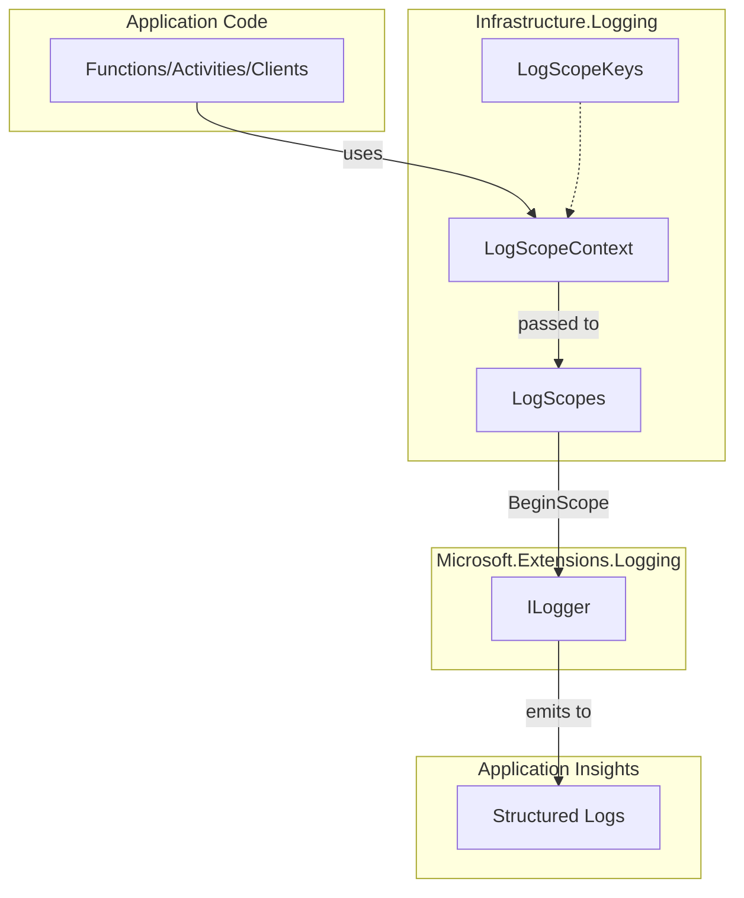

# LogScopeContext Feature Documentation

## Overview

The **LogScopeContext** record struct centralizes a small, stable set of fields for structured logging across Functions, Activities, and Clients. It ensures that log entries carry consistent context—such as run identifiers, triggers, and domain signals—without bloating telemetry. This consistency enhances traceability and diagnostics in Application Insights or any `ILogger`-based sink.

Within the **Infrastructure.Logging** layer, `LogScopeContext` works alongside `LogScopes` and `LogScopeKeys`. Client code creates a `LogScopeContext`, optionally enriches it via fluent setters, and passes it to `LogScopes.BeginFunctionScope` to initiate an `ILogger` scope.

## Architecture Overview



## Component Structure

### Infrastructure.Logging

#### **LogScopeContext**

*Location:* `src/Rpc.AIS.Accrual.Orchestrator.Infrastructure/Logging/LogScopeContext.cs`

- **Purpose:** Carry normalized fields for a log scope.
- **Responsibility:** Provide a compact, immutable context object for structured logging.

**Properties:**

| Name | Type | Description |
| --- | --- | --- |
| Function | `string?` | Name of the Function or client module. |
| Activity | `string?` | Activity label (e.g., for Durable Function activities). |
| Operation | `string?` | Business operation (e.g., "PostJob", "CustomerChange"). |
| Trigger | `string?` | Trigger source (e.g., "Http", "Timer", "AdHocAll"). |
| Step | `string?` | Optional pipeline step (e.g., "ValidateAndPost"). |
| RunId | `string?` | Unique identifier for the current run or invocation. |
| CorrelationId | `string?` | Correlation identifier for end-to-end request tracing. |
| SourceSystem | `string?` | Originating system name. |
| WorkOrderGuid | `Guid?` | Optional Work Order GUID. |
| WorkOrderId | `string?` | Optional Work Order identifier. |
| SubProjectId | `string?` | Optional Sub-Project identifier. |
| DurableInstanceId | `string?` | Durable Function instance identifier. |
| JournalType | `JournalType?` | Domain-specific journal type signal. |


**Convenience Factories & Fluent Setters:**

| Method | Description |
| --- | --- |
| `ForHttp(function, runId, correlationId, sourceSystem)` | Create context for **HTTP**-triggered operations. |
| `ForTimer(function, runId, correlationId, mode)` | Create context for **Timer**-triggered operations. |
| `WithWorkOrder(Guid woGuid)` | Set `WorkOrderGuid`. |
| `WithSubProject(string subProjectId)` | Set `SubProjectId`. |
| `WithDurableInstance(string instanceId)` | Set `DurableInstanceId`. |
| `WithStep(string step)` | Set pipeline `Step`. |
| `WithJournal(JournalType jt)` | Set domain `JournalType`. |


```csharp
// Example: Initialize HTTP context and add WorkOrder and Step
var ctx = LogScopeContext
    .ForHttp("CustomerChange", runId, correlationId, sourceSystem)
    .WithWorkOrder(woGuid)
    .WithStep("ValidateAndPost");
```

#### **LogScopes**

*Location:* `src/Rpc.AIS.Accrual.Orchestrator.Infrastructure/Logging/LogScopes.cs`

- **Purpose:** Build and begin structured log scopes from `LogScopeContext`.
- **Key Method:**- `BeginFunctionScope(ILogger logger, LogScopeContext ctx)`1. Constructs a `Dictionary<string, object?>` of all non-null context fields.
2. Calls `logger.BeginScope` with that dictionary.

#### **LogScopeKeys**

*Location:* `src/Rpc.AIS.Accrual.Orchestrator.Infrastructure/Logging/LogScopeKeys.cs`

- **Purpose:** Define constant key names used in log-scope dictionaries.
- **Sample Constants:**- `RunId`, `CorrelationId`, `SourceSystem`
- `Function`, `Activity`, `Operation`
- `WorkOrderGuid`, `WorkOrderId`, `SubProjectId`, `JournalType`

## Key Classes Reference

| Class | Location | Responsibility |
| --- | --- | --- |
| **LogScopeContext** | `Infrastructure/Logging/LogScopeContext.cs` | Defines the standard set of fields for a logging scope. |
| **LogScopes** | `Infrastructure/Logging/LogScopes.cs` | Provides methods to begin `ILogger` scopes based on context. |
| **LogScopeKeys** | `Infrastructure/Logging/LogScopeKeys.cs` | Centralizes dictionary key constants for structured logging. |
| **JournalType** | `Core/Domain/JournalType.cs` | Enum of domain-specific journal types used in logging contexts. |


## Dependencies

- **System**: Base types, e.g., `Guid`.
- **Rpc.AIS.Accrual.Orchestrator.Core.Domain**: Supplies the `JournalType` enum.
- **Microsoft.Extensions.Logging**: `ILogger` and scope API.

## Usage Example

Below is a snippet from a Durable Function activity demonstrating scope initialization:

```csharp
using Rpc.AIS.Accrual.Orchestrator.Infrastructure.Logging;

[Function(nameof(TryExtractSubprojectGuid))]
public Task<Guid?> TryExtractSubprojectGuid([ActivityTrigger] InputDto input)
{
    // Begin a Timer-triggered log scope
    using var scope = LogScopes.BeginFunctionScope(
        logger: _log,
        ctx: LogScopeContext
            .ForTimer(nameof(TryExtractSubprojectGuid), input.RunId, input.CorrelationId, input.SourceSystem)
            .WithWorkOrder(input.WorkOrderGuid)
            .WithDurableInstance(input.DurableInstanceId)
    );

    // Activity implementation...
    return Task.FromResult<Guid?>(null);
}
```