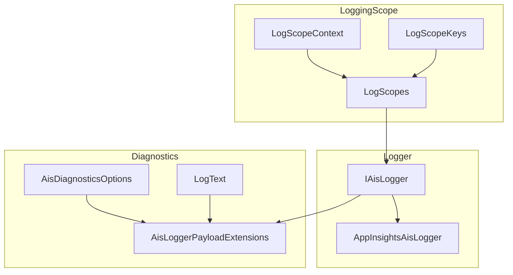

# Logging & Diagnostics Infrastructure Documentation

## Overview

The **Logging & Diagnostics** feature provides structured, consistent logging across Azure Functions and supporting components in the accrual orchestrator. It enables:

- 📋 **Contextual Scoping**: Attach rich metadata (RunId, CorrelationId, Function, Activity, etc.) to all log entries.
- ☁️ **Application Insights Integration**: Emit structured traces via ILogger for Application Insights.
- 🔐 **Payload Safety**: Helpers to safely log large JSON payloads (hash, snippet, chunks) without exceeding trace size limits.
- ✂️ **Log Trimming**: Utilities to trim overly long strings and normalize GUIDs for cleaner logs.

This infrastructure underpins all functions, activities, and clients, ensuring logs are small, stable, and broadly useful for monitoring and troubleshooting.

---

## Architecture Overview



---

## Component Structure

### 1. Logging Scope Keys

#### **LogScopeKeys** (src/Rpc.AIS.Accrual.Orchestrator.Infrastructure/Logging/LogScopeKeys.cs)

Defines constant keys used in all logging scopes:

| Key | Description |
| --- | --- |
| RunId | Unique identifier for this run |
| CorrelationId | Correlation across functions/pipelines |
| SourceSystem | Originating system name |
| Function | Name of the Azure Function |
| Activity | Activity within a function |
| Operation | Logical operation name |
| Trigger | Trigger type (Http, Timer, Durable) |
| Step | Pipeline step name (optional) |
| WorkOrderGuid | Domain GUID for WorkOrder |
| WorkOrderId | Business identifier for WorkOrder |
| SubProjectId | Sub-project identifier (optional) |
| DurableInstanceId | Durable Functions instance ID |
| JournalType | Domain-specific journal type |


---

### 2. Logging Scope Context

#### **LogScopeContext** (src/Rpc.AIS.Accrual.Orchestrator.Infrastructure/Logging/LogScopeContext.cs)

Represents all possible fields for a logging scope. Only non-null values are emitted.

| Property | Type | Description |
| --- | --- | --- |
| Function | string? | Function name |
| Activity | string? | Activity name within function |
| Operation | string? | Logical operation (e.g., PostJob) |
| Trigger | string? | Trigger source (Http, Timer, Durable) |
| Step | string? | Pipeline/sub-step name |
| RunId | string? | Unique run identifier |
| CorrelationId | string? | Correlation identifier |
| SourceSystem | string? | System of origin |
| WorkOrderGuid | Guid? | Work order GUID |
| WorkOrderId | string? | Work order business ID |
| SubProjectId | string? | Sub-project identifier |
| DurableInstanceId | string? | Durable Functions instance ID |
| JournalType | JournalType? | Domain journal type (enum) |


**Convenience Factories & Fluent Setters**

- `ForHttp(...)`, `ForTimer(...)`
- `.WithWorkOrder(…)`, `.WithSubProject(…)`, `.WithDurableInstance(…)`, `.WithStep(…)`, `.WithJournal(…)`

---

### 3. Logging Scopes

#### **LogScopes** (src/Rpc.AIS.Accrual.Orchestrator.Infrastructure/Logging/LogScopes.cs)

Static helper to begin a structured logging scope:

| Method | Signature | Description |
| --- | --- | --- |
| `BeginFunctionScope(ILogger, LogScopeContext)` | `IDisposable BeginFunctionScope(ILogger logger, LogScopeContext ctx)` | Creates a scope with all non-null context properties |
| `RemoveNulls` | `void RemoveNulls(Dictionary<string, object?> dict)` | Internal: strips out null-valued entries |
| `[Obsolete] BeginFunctionScope(...)` | Legacy overload accepting individual parameters (migration aid) | Wraps to the preferred overload |


*Only non-null entries are kept to minimize scope size.*

---

### 4. Logger Abstraction

#### **IAisLogger** (src/Rpc.AIS.Accrual.Orchestrator.Core.Abstractions/IAisLogger.cs)

Defines the contract for AIS logging operations:

| Method | Signature | Description |
| --- | --- | --- |
| `InfoAsync` | `Task InfoAsync(string runId, string step, string message, object? data, CancellationToken ct)` | Log informational message |
| `WarnAsync` | `Task WarnAsync(string runId, string step, string message, object? data, CancellationToken ct)` | Log warning message |
| `ErrorAsync` | `Task ErrorAsync(string runId, string step, string message, Exception? ex, object? data, CancellationToken ct)` | Log error with exception |


---

### 5. Logger Implementation

#### **AppInsightsAisLogger** (src/Rpc.AIS.Accrual.Orchestrator.Infrastructure/Logging/AppInsightsAisLogger.cs)

Concrete implementation of IAisLogger using ILogger<T>. Writes structured logs that flow into Application Insights:

```csharp
public sealed class AppInsightsAisLogger : IAisLogger
{
    private readonly ILogger<AppInsightsAisLogger> _logger;
    public Task InfoAsync(...)  { _logger.LogInformation("{Step} | RunId={RunId} | {Message} | {@Data}", ...); return Task.CompletedTask; }
    public Task WarnAsync(...)  { _logger.LogWarning(   "{Step} | RunId={RunId} | {Message} | {@Data}", ...); return Task.CompletedTask; }
    public Task ErrorAsync(...) { _logger.LogError(ex,   "{Step} | RunId={RunId} | {Message} | {@Data}", ...); return Task.CompletedTask; }
}
```

---

### 6. Utilities

#### **LogText** (src/Rpc.AIS.Accrual.Orchestrator.Core.Utilities/LogText.cs)

String helpers for log safety:

| Method | Signature | Description |
| --- | --- | --- |
| `TrimForLog` | `string TrimForLog(string? s, int maxChars=4000)` | Truncates long strings and appends " ..." |
| `NormalizeGuidString` | `string NormalizeGuidString(string? maybeGuid)` | Trims braces and whitespace from GUID string |


#### **AisDiagnosticsOptions** (src/Rpc.AIS.Accrual.Orchestrator.Core.Options/AisDiagnosticsOptions.cs)

Configuration flags controlling JSON payload logging:

| Property | Type | Default | Description |
| --- | --- | --- | --- |
| LogPayloadBodies | bool | — | Whether to log full payload bodies |
| LogMultiWoPayloadBody | bool | — | Allow full-body logging when multiple WOs present |
| IncludeDeltaReasonKey | bool | — | Include reason key in delta payload logs |
| PayloadChunkChars | int | — | Maximum characters per chunk when logging full body |
| PayloadSnippetChars | int | 4000 | Maximum characters for snippet logs |


#### **AisLoggerPayloadExtensions** (src/Rpc.AIS.Accrual.Orchestrator.Core.Utilities/AisLoggerPayloadExtensions.cs)

Extension methods on IAisLogger for safe JSON payload logging:

```csharp
public static async Task LogJsonPayloadAsync(
    this IAisLogger logger,
    string runId,
    string step,
    string message,
    string payloadType,
    string workOrderGuid,
    string? workOrderNumber,
    string json,
    bool logBody,
    int snippetChars,
    int chunkChars,
    CancellationToken ct)
{
    // 1️⃣ Always log summary with length + SHA256
    await logger.InfoAsync(runId, step, message, new {...}, ct);
    if (!logBody || json.Length==0) return;

    // 2️⃣ Log a short snippet
    await logger.InfoAsync(runId, step, $"{message} (snippet)", new {...}, ct);

    // 3️⃣ Log full payload in chunks
    for (int i=0; i<totalChunks; i++)
        await logger.InfoAsync(runId, step, $"{message} (chunk)", new {...}, ct);
}
private static string Sha256Hex(string s) => /* compute SHA256 as hex */;
```

---

## Key Classes Reference

| Class | Location | Responsibility |
| --- | --- | --- |
| LogScopeKeys | src/…/Infrastructure/Logging/LogScopeKeys.cs | Defines constant scope key names |
| LogScopeContext | src/…/Infrastructure/Logging/LogScopeContext.cs | Holds normalized scope fields; factory methods |
| LogScopes | src/…/Infrastructure/Logging/LogScopes.cs | Begins structured logging scopes |
| IAisLogger | src/…/Core/Abstractions/IAisLogger.cs | Abstraction for AIS logging |
| AppInsightsAisLogger | src/…/Infrastructure/Logging/AppInsightsAisLogger.cs | ILogger-based implementation of IAisLogger |
| LogText | src/…/Core/Utilities/LogText.cs | Utilities for trimming and normalizing log text |
| AisDiagnosticsOptions | src/…/Core/Options/AisDiagnosticsOptions.cs | Configuration for payload logging behavior |
| AisLoggerPayloadExtensions | src/…/Core/Utilities/AisLoggerPayloadExtensions.cs | Helpers for chunked and snippet payload logging |


---

## Dependencies

- Microsoft.Extensions.Logging
- System.Text.Json
- System.Security.Cryptography
- Rpc.AIS.Accrual.Orchestrator.Core.Domain (for JournalType)
- Rpc.AIS.Accrual.Orchestrator.Core.Abstractions (for IAisLogger)

---

## Error Handling

- All public API methods validate non-null arguments and throw `ArgumentNullException` when required.
- Legacy overload of `BeginFunctionScope` is marked `[Obsolete]` to guide migration.
- Payload logging guards against null/empty JSON and negative chunk sizes.

---

## Testing Considerations

- A **NoopAisLogger** test double implements IAisLogger with no-op methods, allowing injection without side effects.
- Log scope tests can verify that `LogScopes.BeginFunctionScope` omits null values from the dictionary.

---