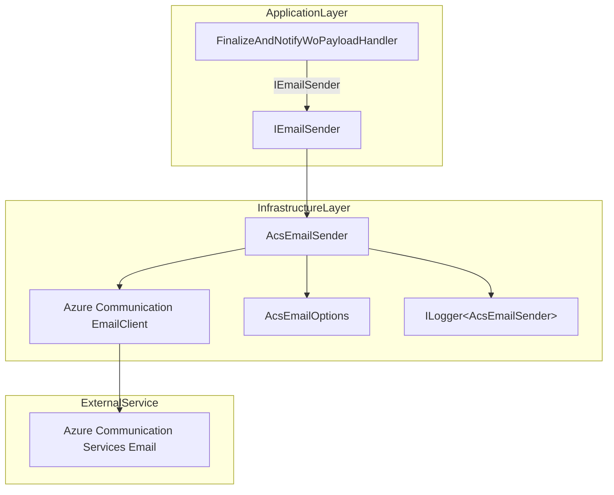
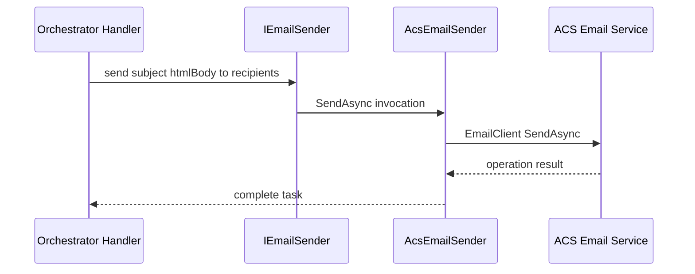

# Azure Communication Services Email Sender

## Overview ✉️

The **AcsEmailSender** enables the AIS Accrual Orchestrator to dispatch HTML email notifications via Azure Communication Services. It ensures production safety by honoring cancellation tokens, validating and normalizing recipients, and logging all actions without failing the orchestration. When disabled or misconfigured, it logs debug or warning messages and skips sending.

## Architecture Overview



## Component Structure

### Application Layer

#### IEmailSender (`src/Rpc.AIS.Accrual.Orchestrator.Core.Abstractions/IEmailSender.cs`)

- **Purpose:** Defines the contract for sending emails within the orchestrator.
- **Method:**- `Task SendAsync(string subject, string htmlBody, IReadOnlyList<string> to, CancellationToken ct);`

### Infrastructure Layer

#### AcsEmailOptions (`src/Rpc.AIS.Accrual.Orchestrator.Infrastructure/Options/AcsEmailOptions.cs`)

- **Purpose:** Holds configuration settings for ACS email sending.
- **Properties:**

| Property | Type | Description |
| --- | --- | --- |
| Enabled | bool | Enables or disables email sending. |
| ConnectionString | string | ACS Email connection string (use Key Vault references). |
| FromAddress | string | Verified sender email address in ACS Email (e.g., no-reply@domain.com). |
| FromDisplayName | string | Optional display name for the sender. |
| WaitUntilCompleted | bool | If true, waits for ACS to finish processing; false returns once accepted to improve perf. |


#### AcsEmailSender (`src/Rpc.AIS.Accrual.Orchestrator.Infrastructure/Notifications/AcsEmailSender.cs`)

- **Purpose:** Implements `IEmailSender` using the Azure Communication Services SDK.
- **Constructor:**

```csharp
  public AcsEmailSender(
      EmailClient client,
      AcsEmailOptions opt,
      ILogger<AcsEmailSender> logger)
```

- Throws `ArgumentNullException` if any dependency is null.

- **SendAsync Method:**

```csharp
  public async Task SendAsync(
      string subject,
      string htmlBody,
      IReadOnlyList<string> to,
      CancellationToken ct)
```

**Responsibilities:**

- **Feature toggle:** Checks `_opt.Enabled`; skips if disabled.
- **Recipient validation:**- Skips and logs if `to` is null or empty.
- Trims, filters blanks, deduplicates addresses.
- Logs and returns if no valid addresses remain.
- **Sender validation:** Logs warning if `_opt.FromAddress` is missing.
- **Cancellation**: Calls `ct.ThrowIfCancellationRequested()`.
- **Message construction:** Creates `EmailContent`, `EmailRecipients`, and `EmailMessage`.
- **Sending:**- Determines `WaitUntil.Started` or `WaitUntil.Completed` based on `_opt.WaitUntilCompleted`.
- Calls `_client.SendAsync`, logs operation ID on acceptance.
- **Error handling:**- Catches `OperationCanceledException`, logs and rethrows.
- Catches `RequestFailedException`, logs ACS-specific error code and status.
- Catches any other exception, logs unexpected failures.

## Sequence Diagram: Email Sending Flow



## Dependencies

- **Azure.Communication.Email**: `EmailClient`, `EmailMessage`, `EmailContent`, `EmailRecipients`, and related types.
- **Microsoft.Extensions.Logging**: `ILogger<T>` for logging at debug, information, warning, and error levels.
- **Rpc.AIS.Accrual.Orchestrator.Core.Abstractions**: `IEmailSender` interface.
- **Rpc.AIS.Accrual.Orchestrator.Infrastructure.Options**: `AcsEmailOptions` for configuration binding.

## Key Classes Reference

| Class | Location | Responsibility |
| --- | --- | --- |
| IEmailSender | src/Rpc.AIS.Accrual.Orchestrator.Core.Abstractions/IEmailSender.cs | Defines the email-sending contract for orchestrator services. |
| AcsEmailOptions | src/Rpc.AIS.Accrual.Orchestrator.Infrastructure/Options/AcsEmailOptions.cs | Holds configuration for ACS Email integration. |
| AcsEmailSender | src/Rpc.AIS.Accrual.Orchestrator.Infrastructure/Notifications/AcsEmailSender.cs | Sends emails via ACS SDK and handles validation and errors. |


```card
{
    "title": "Configuration Required",
    "content": "Ensure AcsEmail:FromAddress is set to a verified sender address before enabling email sending."
}
```