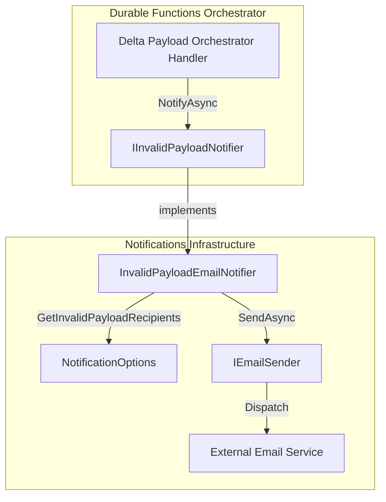
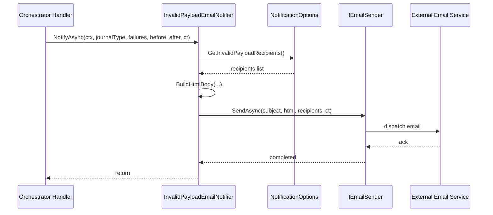

# Invalid Payload Email Notifier Feature Documentation

## Overview

The Invalid Payload Email Notifier ensures that any records failing AIS-side validation for delta payloads are reported immediately via email before any posting attempts to FSCM. This proactive alerting mechanism prevents invalid work orders or lines from reaching downstream systems, reducing error remediation effort and avoiding duplicate or corrupt postings. It integrates into the orchestrator’s validation pipeline, leveraging configured distribution lists to notify stakeholders of data issues.

## Architecture Overview



## Component Structure

### Notification Components

#### InvalidPayloadEmailNotifier (`src/Rpc.AIS.Accrual.Orchestrator.Infrastructure/Notifications/InvalidPayloadEmailNotifier.cs`)

- **Purpose:** Implements `IInvalidPayloadNotifier` to send email alerts for AIS-side validation failures in delta payloads. Prevents invalid records from being sent to FSCM.
- **Dependencies:**- `IEmailSender` for actual email dispatch
- `NotificationOptions` for retrieving the invalid-payload distribution list
- `ILogger<InvalidPayloadEmailNotifier>` for structured logging
- **Key Methods:**- `NotifyAsync(RunContext context, JournalType journalType, IReadOnlyList<WoPayloadValidationFailure> failures, int workOrdersBefore, int workOrdersAfter, CancellationToken ct)`- Validates inputs; retrieves recipients; logs details; builds HTML body; invokes `IEmailSender.SendAsync`
- `BuildHtmlBody(RunContext context, JournalType journalType, IReadOnlyList<WoPayloadValidationFailure> failures, int workOrdersBefore, int workOrdersAfter)`- Generates an HTML email body, including a table of each failure (WorkOrder GUID, number, line GUID, code, message)

#### NotificationOptions (`src/Rpc.AIS.Accrual.Orchestrator.Infrastructure/Options/NotificationOptions.cs`)

- **Purpose:** Holds settings for error and invalid-payload distribution lists.
- **Configuration Properties:**- `InvalidPayloadDistributionList` (semicolon/comma-separated string)
- `InvalidPayloadDistributionListArray` (string array)
- **Key Methods:**- `GetInvalidPayloadRecipients()`: splits `InvalidPayloadDistributionList`, falls back to its array or to general error list via `GetRecipients()`
- `GetRecipients()`: splits `ErrorDistributionList` or falls back to `ErrorDistributionListArray`

### Core Abstractions

| Class | Location | Responsibility |
| --- | --- | --- |
| `IInvalidPayloadNotifier` | `.../Core/Abstractions/IInvalidPayloadNotifier.cs` | Defines the `NotifyAsync` contract for invalid-payload notifications |
| `IEmailSender` | `.../Core/Abstractions/IEmailSender.cs` | Defines `SendAsync` for sending emails |
| `WoPayloadValidationFailure` | `.../Core/Domain/Validation/WoPayloadValidationFailure.cs` | Represents a single AIS-side validation failure |
| `NotificationOptions` | `.../Infrastructure/Options/NotificationOptions.cs` | Provides retrieval of configured distribution lists |


## Data Models

### WoPayloadValidationFailure

| Property | Type | Description |
| --- | --- | --- |
| `WorkOrderGuid` | `Guid` | Unique identifier of the work order |
| `WorkOrderNumber` | `string?` | Human-readable work order number |
| `JournalType` | `JournalType` | Type of journal (Item, Expense, Hour) |
| `WorkOrderLineGuid` | `Guid?` | Identifier of the work order line |
| `Code` | `string` | Validation code |
| `Message` | `string` | Detailed error message |
| `Disposition` | `ValidationDisposition` | Handling disposition (e.g., Invalid, Retryable, FailFast) |


## Feature Flow

### Invalid Payload Notification Sequence



## Error Handling

- Throws `ArgumentNullException` if `context` is null.
- Returns immediately if `failures` is `null` or empty.
- Logs a warning and skips sending if no recipients are configured:

> “Invalid payload failures exist but no DL configured. RunId={RunId} CorrelationId={CorrelationId} JournalType={JournalType} FailureCount={FailureCount}”

- Propagates any exceptions from `IEmailSender.SendAsync`, allowing calling code to handle or log them.

## Integration Points

- **Dependency Injection:** Registered as

```csharp
  services.AddSingleton<IInvalidPayloadNotifier, InvalidPayloadEmailNotifier>();
```

in the application’s startup configuration .

- **Orchestrator Usage:** Invoked by the delta-payload orchestrator (e.g., in `WoPostingPreparationPipeline` or similar handlers) to alert on AIS-side validation failures before posting.

## Dependencies

- `Microsoft.Extensions.Logging`
- `Rpc.AIS.Accrual.Orchestrator.Core.Domain.RunContext`
- `Rpc.AIS.Accrual.Orchestrator.Core.Domain.JournalType`
- `Rpc.AIS.Accrual.Orchestrator.Core.Domain.Validation.WoPayloadValidationFailure`
- `Rpc.AIS.Accrual.Orchestrator.Core.Abstractions.IEmailSender`
- `Rpc.AIS.Accrual.Orchestrator.Infrastructure.Options.NotificationOptions`

## Testing Considerations

- **No Failures:** Ensure `NotifyAsync` does nothing when `failures` is empty.
- **No Recipients:** Configure `InvalidPayloadDistributionList` empty; verify warning log and no email sent.
- **Successful Send:** Use a test `IEmailSender` to capture subject/body; assert recipients list and content correctness.
- **HTML Encoding:** Verify that special characters in `WorkOrderNumber` or `Message` are properly HTML-encoded in the email body.

# Key Classes Reference

| Class | Location | Responsibility |
| --- | --- | --- |
| InvalidPayloadEmailNotifier | `Infrastructure/Notifications/InvalidPayloadEmailNotifier.cs` | Sends HTML email alerts for AIS-side delta payload validation |
| NotificationOptions | `Infrastructure/Options/NotificationOptions.cs` | Retrieves configured distribution lists for notifications |
| WoPayloadValidationFailure | `Core/Domain/Validation/WoPayloadValidationFailure.cs` | Data model for an AIS-side payload validation failure |
| IInvalidPayloadNotifier | `Core/Abstractions/IInvalidPayloadNotifier.cs` | Interface defining invalid-payload notification contract |
| IEmailSender | `Core/Abstractions/IEmailSender.cs` | Interface defining email sending behavior |
