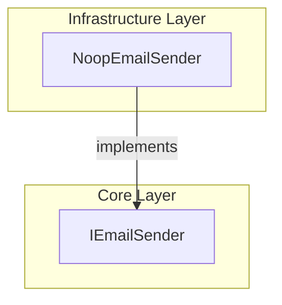

# NoopEmailSender Feature Documentation

## Overview

The **NoopEmailSender** class provides a no-operation email sender implementation for scenarios where a real email service isn’t configured.

It implements the `IEmailSender` interface and logs email metadata (recipients, subject, body length) to the console.

This supports local development, testing, and fallback scenarios without sending actual emails.

## Architecture Overview



## Component Structure

### Infrastructure Layer

#### **NoopEmailSender** (`src/Rpc.AIS.Accrual.Orchestrator.Infrastructure/Notifications/NoopEmailSender.cs`)

- **Purpose**

Acts as a placeholder email sender by logging email details to the console instead of dispatching real messages.

- **Dependencies**- `Rpc.AIS.Accrual.Orchestrator.Core.Abstractions` (`IEmailSender`)
- `System.Threading` (`CancellationToken`)
- `System.Threading.Tasks` (`Task`)
- `System` (`Console`, `IReadOnlyList<string>`)

- **Key Method**

```csharp
  public Task SendAsync(
      string subject,
      string htmlBody,
      IReadOnlyList<string> to,
      CancellationToken ct)
  {
      Console.WriteLine(
          $"EMAIL (noop) TO={string.Join(';', to)} " +
          $"SUBJECT={subject} BODYLEN={htmlBody?.Length ?? 0}"
      );
      return Task.CompletedTask;
  }
```

- Logs the recipient list, subject, and HTML body length.
- Honors the `CancellationToken` by accepting it as a parameter (though it isn’t actively monitored).

### Core Abstractions

#### **IEmailSender** (`src/Rpc.AIS.Accrual.Orchestrator.Application/Ports/Common/Abstractions/IEmailSender.cs`)

- **Purpose**

Defines the contract for sending email notifications across orchestration components.

- **Method Signature**

| Method | Description | Returns |
| --- | --- | --- |
| SendAsync | Sends an email with subject, HTML body, and recipients | `Task` |


## Integration Points

- Registered via dependency injection as the default `IEmailSender` when no concrete sender (e.g., ACS, SendGrid) is configured.
- Consumed by notification services such as `InvalidPayloadEmailNotifier` and orchestration handlers that call `SendAsync`.

## Key Classes Reference

| Class | Location | Responsibility |
| --- | --- | --- |
| NoopEmailSender | `src/Rpc.AIS.Accrual.Orchestrator.Infrastructure/Notifications/NoopEmailSender.cs` | Logs email details to console; placeholder sender |
| IEmailSender | `src/Rpc.AIS.Accrual.Orchestrator.Application/Ports/Common/Abstractions/IEmailSender.cs` | Declares email sending contract |


## Error Handling

- **No exceptions** are thrown by `SendAsync`; it always completes successfully.
- No explicit catch blocks; any console write failures will bubble up (rare in practice).

## Testing Considerations

- Capture console output to verify `SendAsync` invocation and logged metadata.
- Stateless and external-service-free, enabling fast and isolated unit tests.

## Caching Strategy

- **Not applicable.** There is no caching in this component.

## State Management

- **Stateless implementation.** No internal state persists across calls.

## API Integration

- **Not applicable.** This component does not expose or consume HTTP endpoints.

## Feature Flows

- **Not applicable.** No user-driven flows or UI interactions.

## Analytics & Tracking

- **Not applicable.** Does not emit analytics or telemetry directly.