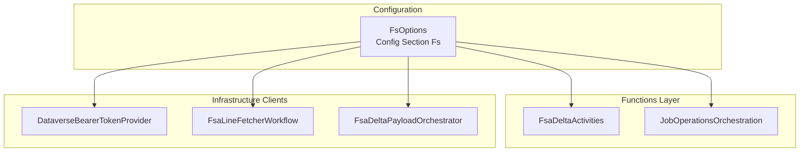

# FsOptions Configuration Documentation

## Overview

The **FsOptions** class centralizes all configuration settings for Field Service (FSA) ingestion and Dataverse authentication. It unifies paging, filtering, authentication, and helper endpoint options in one place. By binding to the `Fs` section of configuration, it ensures consistent settings across functions, HTTP clients, and orchestration activities.

Centralized configuration reduces errors and simplifies environment-specific overrides. FsOptions is bound at startup in `Program.cs` and injected wherever FSA ingestion or Dataverse access is required. This approach streamlines maintenance and supports feature toggles for future enhancements.

## Architecture Overview



## Configuration Section

### FsOptions Class (`src/Rpc.AIS.Accrual.Orchestrator.Infrastructure/Options/FsOptions.cs`)

- **Purpose**: Holds all runtime settings for Dataverse API calls, paging, filtering, authentication, and optional helper functions.
- **Binding Name**: `Fs` (via `SectionName` constant).
- **Default Values**: Sensible defaults for page size, timeouts, and separators.

```csharp
namespace Rpc.AIS.Accrual.Orchestrator.Infrastructure.Options;

/// <summary>
/// Unified options for Field Service / Dataverse side of AIS.
/// Combines separate ingestion, auth, and endpoint settings.
/// </summary>
public sealed class FsOptions
{
    public const string SectionName = "Fs";
    // Dataverse API (OData)
    public string DataverseApiBaseUrl { get; set; } = "";
    public string? WorkOrderFilter { get; set; }
    public bool ApplyFscmDeltaBeforePosting { get; set; } = false;
    public int PageSize { get; set; } = 500;
    public int MaxPages { get; set; } = 20;
    public int PreferMaxPageSize { get; set; } = 5000;
    public int OrFilterChunkSize { get; set; } = 25;
    public string WorkTypeSeparator { get; set; } = " ";

    // Dataverse AAD app (client credentials)
    public string TenantId { get; set; } = "";
    public string ClientId { get; set; } = "";
    public string ClientSecret { get; set; } = "";

    // FSA Transactions Function (optional helper endpoint)
    public string? FsaBaseUrl { get; set; }
    public string? FsaPath { get; set; }
    public string? FsaFunctionKey { get; set; }
    public int FsaDurablePollSeconds { get; set; } = 2;
    public int FsaDurableTimeoutSeconds { get; set; } = 600;

    // Phase-3 toggles (backward compatible)
    public bool RequireSubProjectForProcessing { get; set; } = false;
    public bool DisableVirtualLookupResolution { get; set; } = false;
}
```

#### Properties

| Property | Type | Default | Description |
| --- | --- | --- | --- |
| DataverseApiBaseUrl | string | `""` | Base URL for Dataverse Web API (e.g. `https://org.crm.dynamics.com/api/data/v9.2`). |
| WorkOrderFilter | string? | `null` | OData filter expression for selecting work orders. |
| ApplyFscmDeltaBeforePosting | bool | `false` | Toggle to build delta payload before posting journals. |
| PageSize | int | `500` | Number of records per Dataverse page. |
| MaxPages | int | `20` | Maximum number of pages to fetch from Dataverse. |
| PreferMaxPageSize | int | `5000` | Hint for server-side max page size via `Prefer` header. |
| OrFilterChunkSize | int | `25` | Chunk size for OData OR filters when batching by work order IDs. |
| WorkTypeSeparator | string | `" "` | Separator for splitting work type display names. |
| TenantId | string | `""` | Azure AD tenant ID for Dataverse authentication. |
| ClientId | string | `""` | Azure AD application (client) ID. |
| ClientSecret | string | `""` | Azure AD client secret. |
| FsaBaseUrl | string? | `null` | Base URL for FSA Transactions Function helper. |
| FsaPath | string? | `null` | Relative path for FSA durable function. |
| FsaFunctionKey | string? | `null` | Function key for FSA helper endpoint. |
| FsaDurablePollSeconds | int | `2` | Poll interval in seconds for durable client. |
| FsaDurableTimeoutSeconds | int | `600` | Overall timeout in seconds for durable operations. |
| RequireSubProjectForProcessing | bool | `false` | Feature toggle to require sub-project lookup before processing work orders. |
| DisableVirtualLookupResolution | bool | `false` | Feature toggle to skip virtual lookup name resolution (saves extra Dataverse calls). |


## Usage

### Option Binding in Program.cs

FsOptions is bound at startup to support legacy keys under `FsaIngestion:*` and `Dataverse:Auth:*`. Required settings are validated on start.

```csharp
services.AddOptions<FsOptions>()
    .Configure<IConfiguration>((o, c) =>
    {
        o.DataverseApiBaseUrl = c["FsaIngestion:DataverseApiBaseUrl"] ?? "";
        o.WorkOrderFilter       = c["FsaIngestion:WorkOrderFilter"];
        if (int.TryParse(c["FsaIngestion:PageSize"], out var ps))            o.PageSize = ps;
        if (int.TryParse(c["Dataverse:Auth:TenantId"], out var _))          o.TenantId = c["Dataverse:Auth:TenantId"]!;
        o.ClientId              = c["Dataverse:Auth:ClientId"]   ?? "";
        o.ClientSecret          = c["Dataverse:Auth:ClientSecret"] ?? "";
    })
    .Validate(o =>
        !string.IsNullOrWhiteSpace(o.DataverseApiBaseUrl) &&
        !string.IsNullOrWhiteSpace(o.TenantId) &&
        !string.IsNullOrWhiteSpace(o.ClientId) &&
        !string.IsNullOrWhiteSpace(o.ClientSecret),
        "Missing required FS config. Required: FsaIngestion:DataverseApiBaseUrl and Dataverse:Auth:*")
    .ValidateOnStart();
```

### Consumption

FsOptions is injected into:

- **FsaDeltaActivities**: Reads `DataverseApiBaseUrl`, `PageSize`, and `MaxPages` before orchestrating delta payloads.

```csharp
  public FsaDeltaActivities(ILogger<FsaDeltaActivities> log, IOptions<FsOptions> ingestion, ...)
  {
      var opt = ingestion.Value;
      _http.BaseAddress = new Uri(opt.DataverseApiBaseUrl!);
      _log.LogInformation("PageSize={PageSize}, MaxPages={MaxPages}", opt.PageSize, opt.MaxPages);
  }
```

- **DataverseBearerTokenProvider**: Constructs AAD credential from `TenantId`, `ClientId`, and `ClientSecret`.
- **FsaLineFetcherWorkflow**: Configures HTTP client base address and OData headers based on `DataverseApiBaseUrl`, `PreferMaxPageSize`, and `OrFilterChunkSize`.
- **JobOperationsOrchestration**: Uses `ApplyFscmDeltaBeforePosting` toggle to adjust orchestration flow.
- **FsaDeltaPayloadOrchestrator**: Passes `WorkOrderFilter` into core use case run options.

## Key Classes Reference

| Class | Location | Responsibility |
| --- | --- | --- |
| FsOptions | `Infrastructure/Options/FsOptions.cs` | Defines all Field Service and Dataverse configuration settings. |
| FsaDeltaActivities | `Functions/Functions/FsaDeltaActivities.cs` | Durable Activity wrapper injecting FsOptions for delta fetch. |
| DataverseBearerTokenProvider | `Infrastructure/Clients/DataverseBearerTokenProvider.cs` | Provides cached AAD token using FsOptions credentials. |
| FsaLineFetcherWorkflow | `Infrastructure/Clients/FsaLineFetcher.cs` | Builds and executes FSA OData queries using FsOptions settings. |
| JobOperationsOrchestration | `Functions/Durable/Orchestrators/JobOperationsOrchestration.cs` | Controls whether to apply FSCM delta before posting based on FsOptions. |
| FsaDeltaPayloadOrchestrator | `Functions/Services/FsaDeltaPayloadOrchestrator.cs` | Adapts core use case to use `WorkOrderFilter` from FsOptions. |


## Card

```card
{
    "title": "Configuration Centralized",
    "content": "FsOptions unifies all FSA and Dataverse settings under one section for consistency."
}
```