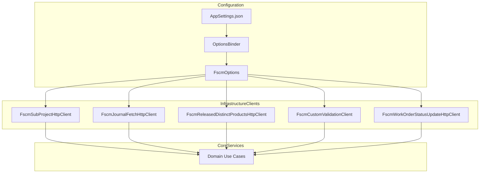

# FSCM Options Feature Documentation

## Overview

FSCM Options centralize configuration for all FSCM-related integrations in AIS. They unify authentication settings, HTTP endpoints, OData parameters, feature toggles, and accounting-period options. By binding a single options class (`FscmOptions`), services and HTTP clients read consistent settings, simplifying maintenance and deployment across environments .

`FscmOptions` also contains a nested `FscmAccountingPeriodOptions` class. This nested type configures period resolution logic for delta and reversal workflows, making period lookups, window sizing, and closed-period behavior customizable .

## Architecture Overview



## Component Structure

### Configuration Models

#### **FscmOptions** (`src/Rpc.AIS.Accrual.Orchestrator.Infrastructure/Options/FscmOptions.cs`)

Purpose:

- Provides a single configuration source for FSCM integrations.
- Groups base URLs, endpoint paths, OData entity sets, auth credentials, feature toggles, and nested accounting-period config.

Key Members:

| Property | Type | Default | Description |
| --- | --- | --- | --- |
| SectionName | const string | "Fscm" | Configuration section key |
| BaseUrl | string | "" | Default FSCM API host |
| PostingPath | string | "" | Base path for posting operations |
| PostingBaseUrlOverride | string? | null | Optional override for posting base URL |
| JournalValidatePath<br/>JournalCreatePath<br/>JournalPostPath<br/>JournalPostCustomPath | string | "" | Endpoints for validate, create, and post steps |
| UpdateInvoiceAttributesPath | string | "" | Endpoint to update invoice attributes |
| UpdateProjectStatusPath | string | "" | Endpoint to update project status |
| InvoiceAttributeDefinitionsPath | string | "" | Path to fetch invoice attribute definitions |
| InvoiceAttributeValuesPath | string | "" | Path to fetch current invoice attribute values |
| ReleasedDistinctProductsEntitySet | string | "CDSReleasedDistinctProducts" | OData entity set for distinct product categories |
| ReleasedDistinctProductsOrFilterChunkSize | int | 25 | OR-filter chunk size for released products |
| JournalHistoryOrFilterChunkSize | int | 25 | OR-filter chunk size for journal history fetch |
| WoPayloadValidationPath | string | "" | Custom endpoint for work-order payload validation |
| WoPayloadValidationBaseUrlOverride | string? | null | Override base URL for WO payload validation |
| SubProjectPath<br/>SingleWorkOrderPath<br/>WorkOrderStatusUpdatePath | string | "" | Paths for subproject, single WO, and status-update operations |
| SubProjectBaseUrlOverride<br/>SingleWorkOrderBaseUrlOverride<br/>WorkOrderStatusUpdateBaseUrlOverride | string? | null | Optional per-operation base-URL overrides |
| TenantId<br/>ClientId<br/>ClientSecret | string | "" | AAD client-credentials for FSCM authentication |
| DefaultScope | string | "" | Default AAD token scope |
| ScopesByHost | Dictionary<string,string> | empty | Per-host scope overrides |
| BaselineEnabled | bool | false | Toggle for baseline scaffolding |
| BaselineODataBaseUrl | string | "" | Base URL for baseline OData fetch |
| BaselineInProgressFilter | string | "" | OData filter for in-progress baselines |
| BaselineEntitySets | string[] | empty array | Entity sets used for baseline scaffolding |
| Periods | FscmAccountingPeriodOptions | new instance | Nested configuration for accounting period resolution |
| AttributeTypeGlobalAttributesEntitySet | string | "AttributeTypeGlobalAttributes" | OData entity set for global invoice-attribute mappings |


Key Method:

```csharp
public string ResolveBaseUrl(string? specificOverride) =>
    !string.IsNullOrWhiteSpace(specificOverride) ? specificOverride! : BaseUrl;
```

- Returns the override if provided; otherwise returns `BaseUrl` .

#### **FscmAccountingPeriodOptions** (nested in `FscmOptions`)

Purpose:

- Configures lookup and classification of FSCM accounting periods.
- Controls period and ledger retrieval, reversal logic, date window sizing, and backward-compat settings.

Key Properties by Category:

| Category | Property | Type | Default | Description |
| --- | --- | --- | --- | --- |
| **Fiscal Calendar** | FiscalCalendarEntitySet | string | "FiscalCalendarsEntity" | OData entity set for calendars |
| FiscalCalendarNameField<br/>FiscalCalendarIdField | string | "Description"<br/>"CalendarId" | Field names for calendar lookup |
| FiscalCalendarName<br/>FiscalCalendarIdOverride | string? | "Fiscal Calendar"<br/>"Fis Cal" | Calendar display name and direct ID override |
| **Fiscal Period** | FiscalPeriodEntitySet | string | "FiscalPeriods" | Entity set for period records |
| FiscalPeriodYearField<br/>FiscalPeriodNameField<br/>FiscalPeriodStartDateField<br/>FiscalPeriodEndDateField | string | "FiscalYear"<br/>"PeriodName"<br/>"StartDate"<br/>"EndDate" | Field names for period attributes |
| FiscalPeriodCalendarField | string | "Calendar" | Link to calendar |
| **Ledger Period Status** | LedgerFiscalPeriodEntitySet | string | "LedgerFiscalPeriodsV2" | Entity set for ledger period status |
| LedgerFiscalPeriodLedgerField<br/>LedgerFiscalPeriodCalendarField<br/>LedgerFiscalPeriodYearField<br/>LedgerFiscalPeriodPeriodField<br/>LedgerFiscalPeriodLegalEntityField<br/>LedgerFiscalPeriodStatusField | string | "LedgerName"<br/>"Calendar"<br/>"YearName"<br/>"PeriodName"<br/>"LegalEntityId"<br/>"PeriodStatus" | Field names for ledger-period status lookup |
| Ledger | string | "001" | Default ledger code |
| OpenPeriodStatusValue | string | "Open" | Status value indicating open period |
| OpenPeriodStatusValues | List<string>? | null | Optional multiple status values |
| **Company Filter** | DataAreaField | string? | "DataAreaId" | Field name for company filter |
| DataAreaId | string? | null | Company code to filter by |
| **Closed Reversal Policy** | EnableAccountingPeriodChecks | bool | true | Toggle period checks (open vs closed) |
| UseLocalTimeZoneForTransactionDate | bool | false | Use local time zone for transaction-date derivation |
| LocalTimeZoneId | string | "Asia/Kolkata" | IANA time zone for local date |
| ClosedReversalDateStrategy | string | "CurrentOpenPeriodStart" | Strategy for reversal-date assignment in closed periods |
| OutOfWindowDateCacheSize | int | 512 | Cache size for out-of-window date classification |
| **Window Sizing** | LookbackDays<br/>LookaheadDays | int | 120<br/>120 | Days before/after run date to fetch period data |
| LedgerStatusOrFilterChunkSize | int | 40 | OR-filter chunk size for ledger status queries |
| **Backward Compatibility** | OpenStatusCode | int | 743860002 | Legacy open-status code |
| FiscalPeriodIdField | string | "FiscalPeriodId" | Legacy period ID field |
| LedgerFiscalPeriodPeriodField_Legacy | string | "FiscalPeriodId" | Legacy ledger-period field |


## Integration Points

- **Options Binding**: In `Functions/Program.cs`, `services.AddOptions<FscmOptions>()` binds the `"Fscm"` section from configuration and applies validations on start .
- **Startup Validation**: A custom `IValidateOptions<FscmOptions>` implementation ensures required endpoints and placeholders are valid before the app starts.
- **HTTP Clients**: Multiple typed clients read `FscmOptions`:- `FscmSubProjectHttpClient`, `FscmBaselineFetcher`, `FscmGlobalAttributeMappingHttpClient`
- `FscmJournalFetchHttpClient`, `FscmWorkOrderStatusUpdateHttpClient`, `FscmInvoiceAttributesHttpClient`
- `FscmReleasedDistinctProductsHttpClient`, `FscmCustomValidationClient`

Each sets `HttpClient.BaseAddress = new Uri(fscmOptions.BaseUrl)` or override and attaches `FscmAuthHandler` for AAD token injection.

- **Domain Services**: Core use cases such as `FsaDeltaPayloadUseCase` and `WoDeltaPayloadService` consume FSCM settings for journal pipelines, baseline logic, and reversal planning.

## Key Classes Reference

| Class | Location | Responsibility |
| --- | --- | --- |
| FscmOptions | src/Rpc.AIS.Accrual.Orchestrator.Infrastructure/Options/FscmOptions.cs | Central configuration model for FSCM integrations. |
| FscmAccountingPeriodOptions | Same file as above | Nested config for period resolution and reversal logic. |
| FscmOptionsStartupValidator | Functions/Program.cs | Validates required FSCM endpoints and settings at startup. |


## Dependencies

- Microsoft Extensions Options for configuration binding and validation.
- Typed `HttpClient` registrations with `FscmAuthHandler` for AAD token acquisition.
- Memory caching and resilience policies are configured alongside these options in `Functions/Program.cs`.

## Testing Considerations

- Unit tests for any code consuming `FscmOptions` should use an in-memory `IOptions<FscmOptions>` instance with representative values.
- The `ResolveBaseUrl` method can be tested by setting override and default values.
- Validation logic in `FscmOptionsStartupValidator` should be covered to ensure placeholder detection and endpoint uniqueness.