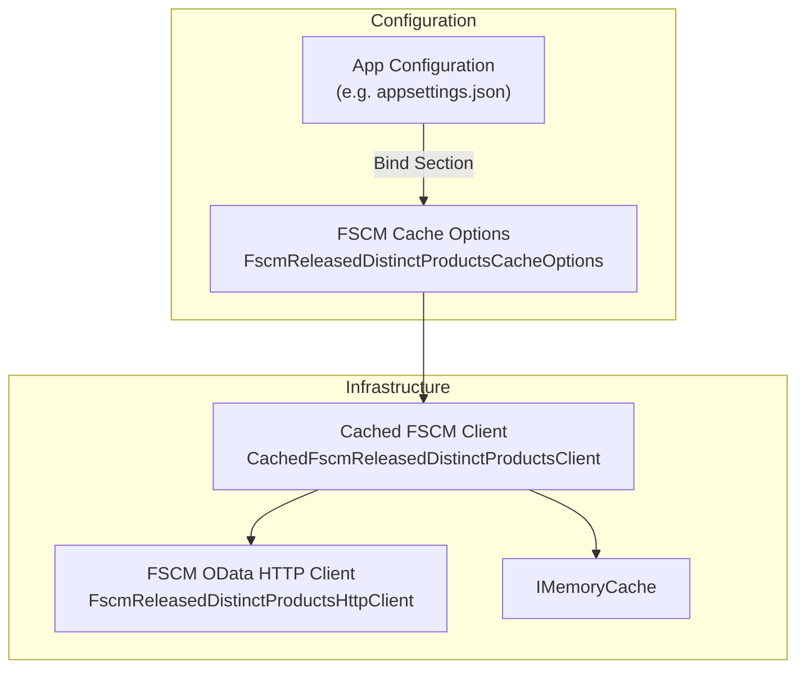

# FSCM Released Distinct Products Cache Options Feature Documentation

## Overview

This configuration class defines the cache policy for the FSCM “ReleasedDistinctProducts” OData endpoint, which maps ItemNumber → CategoryId. By centralizing TTLs and size limits, it dramatically reduces repeated OData calls on a warm host.

It supports both positive (found) and negative (not found) caching, preventing unnecessary network traffic for missing entries.

## Architecture Overview



## Component Structure

### Configuration Options

#### **FscmReleasedDistinctProductsCacheOptions**

`src/Rpc.AIS.Accrual.Orchestrator.Infrastructure/Options/FscmReleasedDistinctProductsCacheOptions.cs`

- **Purpose & Responsibilities**- Encapsulates cache settings for the FSCM CDSReleasedDistinctProducts lookup.
- Controls feature toggle, time-to-live, and batch size limits.

- **Key Properties**

| Property | Type | Default | Description |
| --- | --- | --- | --- |
| SectionName | string | `"Fscm:ReleasedDistinctProductsCache"` | Configuration section key. |
| Enabled | bool | `true` | Enables or disables the caching decorator. |
| Ttl | TimeSpan | 24 hours | Time-to-live for positive (found) cache entries. |
| NegativeTtl | TimeSpan | 1 hour | Time-to-live for negative (not found) entries. |
| MaxItemCountPerCall | int | 200 000 | Maximum ItemNumbers per single lookup call to guard allocations. |


- **Class Definition**

```csharp
using System;

namespace Rpc.AIS.Accrual.Orchestrator.Infrastructure.Options;

/// <summary>
/// Cache policy for FSCM CDSReleasedDistinctProducts (ItemNumber → CategoryId mapping).
/// This cache is intended to dramatically reduce repeated OData calls across runs on the same warm host.
/// </summary>
public sealed class FscmReleasedDistinctProductsCacheOptions
{
    public const string SectionName = "Fscm:ReleasedDistinctProductsCache";

    /// <summary>
    /// Enables caching decorator.
    /// </summary>
    public bool Enabled { get; init; } = true;

    /// <summary>
    /// TTL for positive (found) entries. Default 24 hours.
    /// </summary>
    public TimeSpan Ttl { get; init; } = TimeSpan.FromHours(24);

    /// <summary>
    /// TTL for negative (not found) entries. Default 60 minutes.
    /// Prevents repeated calls for ItemNumbers that FSCM does not return.
    /// </summary>
    public TimeSpan NegativeTtl { get; init; } = TimeSpan.FromHours(1);

    /// <summary>
    /// Upper bound on the number of ItemNumbers accepted per call.
    /// Helps prevent accidental huge allocations. Default 200k.
    /// </summary>
    public int MaxItemCountPerCall { get; init; } = 200_000;
}
```

## Integration Points

- **Registration**

In `Program.cs`, the options are bound to the `"Fscm:ReleasedDistinctProductsCache"` section and validated on startup:

```csharp
  services.AddMemoryCache();
  services.AddOptions<FscmReleasedDistinctProductsCacheOptions>()
      .Bind(cfg.GetSection(FscmReleasedDistinctProductsCacheOptions.SectionName))
      .Validate(o => o.Ttl > TimeSpan.Zero,      "Ttl must be > 0")
      .Validate(o => o.NegativeTtl > TimeSpan.Zero, "NegativeTtl must be > 0")
      .Validate(o => o.MaxItemCountPerCall > 0,  "MaxItemCountPerCall must be > 0")
      .ValidateOnStart();
```

- **Consumption**

Injected into `CachedFscmReleasedDistinctProductsClient` via

`IOptions<FscmReleasedDistinctProductsCacheOptions>` to drive cache behavior.

## Caching Strategy

- **Positive Cache**

Entries with matching category IDs are stored for `Ttl` (default 24 h).

- **Negative Cache**

Missing ItemNumbers yield “not found” entries cached for `NegativeTtl` (default 1 h).

- **Batch Size Guard**

Lookups exceeding `MaxItemCountPerCall` (200 000) throw an exception to prevent resource exhaustion.

```card
{
    "title": "MaxItemCountPerCall Limit",
    "content": "Default of 200 000 prevents excessive batch sizes and potential memory issues."
}
```

## Dependencies

- Microsoft.Extensions.Options
- Microsoft.Extensions.Caching.Memory
- System

## Testing Considerations

- **Toggle Behavior**: Verify that setting `Enabled`=false bypasses cache entirely.
- **TTL Enforcement**: Ensure entries expire after configured intervals.
- **Negative Caching**: Confirm missing items are not repeatedly fetched within `NegativeTtl`.
- **Batch Limit**: Passing over 200 000 ItemNumbers should raise an `InvalidOperationException`.

## Key Classes Reference

| Class | Location | Responsibility |
| --- | --- | --- |
| FscmReleasedDistinctProductsCacheOptions | `Infrastructure/Options/FscmReleasedDistinctProductsCacheOptions.cs` | Defines cache policy for FSCM released products. |
