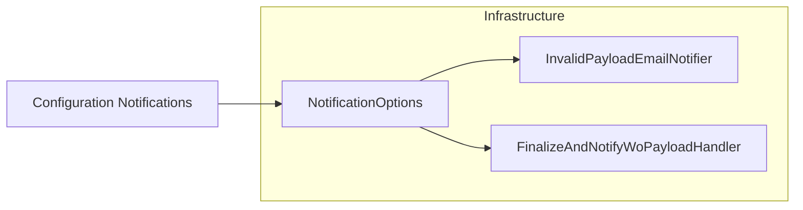

# NotificationOptions Feature Documentation

## Overview

The **NotificationOptions** feature centralizes email distribution list settings for error handling and invalid payload reporting. It binds to the **Notifications** configuration section and supports both modern string-based lists and legacy array bindings. Consumers call its methods to retrieve cleaned, deduplicated recipient lists for use in email notifiers across the orchestrator.

## Architecture Overview



## Configuration Section

Configuration is bound using the constant **SectionName**. Settings are typically defined in `appsettings.json` or `local.settings.json`.

```json
{
  "Notifications": {
    "ErrorDistributionList": "ops-team@domain.com;support@domain.com",
    "InvalidPayloadDistributionList": "payload-team@domain.com"
  }
}
```

## Properties

| Property | Type | Default | Description |
| --- | --- | --- | --- |
| **SectionName** | `string` | `"Notifications"` | Configuration section key. |
| **ErrorDistributionList** | `string` | `string.Empty` | Delimited list (`;` `,` or space) of recipients for general error emails. |
| **ErrorDistributionListArray** | `string[]` | `Array.Empty` | Legacy array binding for error recipients. |
| **InvalidPayloadDistributionList** | `string` | `string.Empty` | Delimited list of recipients for invalid payload notifications. |
| **InvalidPayloadDistributionListArray** | `string[]` | `Array.Empty` | Legacy array binding for invalid payload recipients. |


## Methods

### GetRecipients()

Fetches and normalizes the general error recipients.

- **Signature**

```csharp
  public IReadOnlyList<string> GetRecipients()
```

- **Behavior**1. If **ErrorDistributionList** is non-empty, split by `;`, `,`, or space, trim entries, remove duplicates (case-insensitive).
2. Else, if **ErrorDistributionListArray** has entries, trim non-blank values, remove duplicates.
3. Else, return empty list.

### GetInvalidPayloadRecipients()

Fetches and normalizes invalid-payload recipients, falling back to general list.

- **Signature**

```csharp
  public IReadOnlyList<string> GetInvalidPayloadRecipients()
```

- **Behavior**1. If **InvalidPayloadDistributionList** is non-empty, split and dedupe.
2. Else if **InvalidPayloadDistributionListArray** has entries, trim and dedupe.
3. Else, return result of `GetRecipients()`.

## Integration Points

- **InvalidPayloadEmailNotifier** (Infrastructure/Notifications/InvalidPayloadEmailNotifier.cs)

Uses `GetInvalidPayloadRecipients()` to determine email targets for invalid payload failures.

- **FinalizeAndNotifyWoPayloadHandler** (Functions/Durable/Activities/Handlers/FinalizeAndNotifyWoPayloadHandler.cs)

Calls `GetRecipients()` to fetch error DL for orchestration completion notifications.

## Usage Example

```csharp
// 1. Bind in Startup or Program.cs
builder.Services.Configure<NotificationOptions>(
    configuration.GetSection(NotificationOptions.SectionName));

// 2. Inject and use
public class SomeService
{
    private readonly NotificationOptions _options;
    public SomeService(IOptions<NotificationOptions> opts)
        => _options = opts.Value;

    public void NotifyErrors()
    {
        var recipients = _options.GetRecipients();
        // send email...
    }
}
```

## Class Diagram

```mermaid
classDiagram
    NotificationOptions {
        +const string SectionName
        +string ErrorDistributionList
        +string[] ErrorDistributionListArray
        +string InvalidPayloadDistributionList
        +string[] InvalidPayloadDistributionListArray
        +IReadOnlyList<string> GetRecipients()
        +IReadOnlyList<string> GetInvalidPayloadRecipients()
    }
```

## Dependencies

- `System`
- `System.Collections.Generic`
- `System.Linq`

## Testing Considerations

- Validate splitting on `;`, `,`, and spaces.
- Confirm case-insensitive duplicate removal.
- Test fallback from string to array and from invalid-payload to general list when empty.