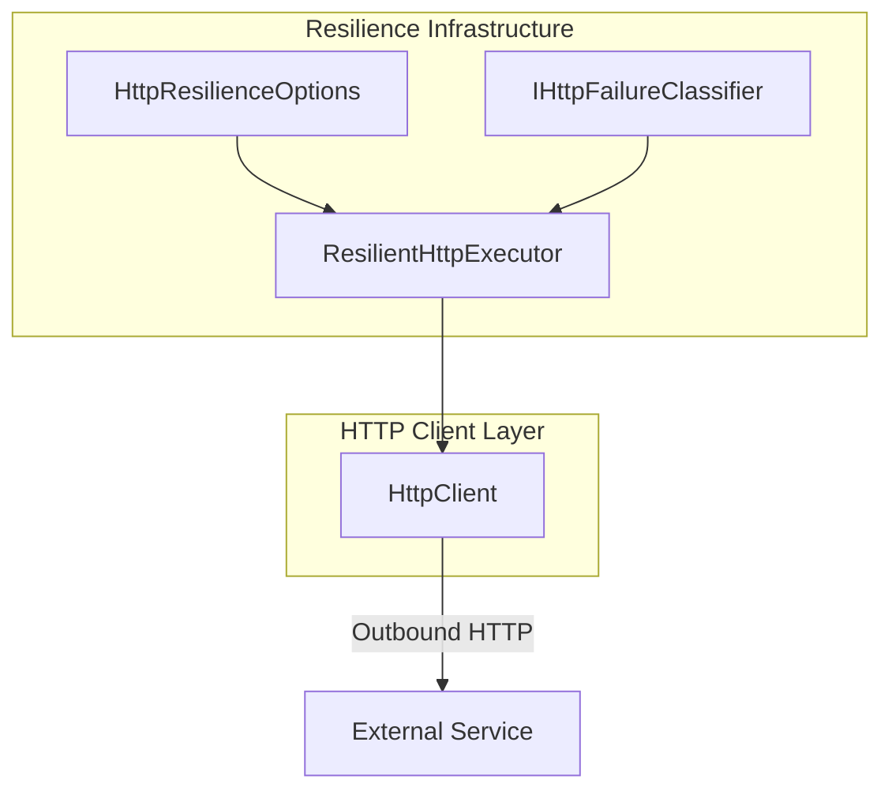

# HTTP Resilience Options Feature Documentation

## Overview

The **HTTP Resilience Options** centralize configuration for retry, backoff, and simple circuit-breaker behavior across all HTTP calls in the orchestrator. By defining deterministic, dependency-free defaults, they help:

- Ensure reliable communication with external services.
- Prevent duplicate side effects (e.g., non-idempotent postings).
- Allow fine-tuning of retry counts, delays, and failure thresholds in one place.

These options feed directly into the `ResilientHttpExecutor`, enabling consistent resilience policies throughout the application.

## Architecture Overview



## Component Structure

### ⚙️ HttpResilienceOptions (`src/Rpc.AIS.Accrual.Orchestrator.Infrastructure/Resilience/HttpResilienceOptions.cs`)

**Purpose & Responsibilities**

- Defines enterprise-grade defaults for HTTP retry and circuit-breaker policies.
- Keeps behavior simple and deterministic to avoid unexpected changes.

**Configuration Section**

- **SectionName:** `"Ais:HttpResilience"`

**Properties**

| Property | Type | Default | Description |
| --- | --- | --- | --- |
| **MaxAttempts** | int | 5 | Maximum number of attempts for a single request (initial try + retries). |
| **BaseDelay** | TimeSpan | `TimeSpan.FromSeconds(1)` | Base delay duration used in exponential backoff. |
| **MaxDelay** | TimeSpan | `TimeSpan.FromSeconds(30)` | Upper cap for backoff delays. |
| **CircuitBreakerFailureThreshold** | int | 10 | Number of consecutive failures required to open the circuit. |
| **CircuitBreakerOpenDuration** | TimeSpan | `TimeSpan.FromSeconds(30)` | Duration the circuit remains open before allowing a trial request. |
| **UseJitter** | bool | true | Apply ±20% random jitter to backoff delays to avoid thundering-herd retries. |
| **NoRetryOperations** | string[] | `["FSCM_JOURNAL_CREATE", "FSCM_JOURNAL_POST", "FSCM_CreateSubProject"]` | List of non-idempotent operation names that must never be retried (e.g., FSCM journal create/post) |


### 🔗 Integration

- **Binding & Validation**

The options are bound from configuration (with legacy support) and validated at startup:

```csharp
  services.AddOptions<HttpResilienceOptions>()
      .Configure<IConfiguration>((opt, cfg) =>
      {
          cfg.GetSection(HttpResilienceOptions.SectionName).Bind(opt);
          cfg.GetSection("HttpResilience").Bind(opt);
      })
      .ValidateOnStart();
```

- **Consumption**

Injected into `ResilientHttpExecutor` (alongside an `IHttpFailureClassifier` and `ILogger`) to govern retry loops, backoff delays, jitter application, and circuit-breaker state.

## Key Classes Reference

| Class | Location | Responsibility |
| --- | --- | --- |
| **HttpResilienceOptions** | `.../Infrastructure/Resilience/HttpResilienceOptions.cs` | Centralizes configuration for retries, backoff, jitter, circuit breaking, and non-retryable ops. |
| **ResilientHttpExecutor** | `.../Infrastructure/Resilience/ResilientHttpExecutor.cs` | Executes HTTP calls with retry logic, exponential backoff, optional jitter, and a simple circuit breaker. |
| **IHttpFailureClassifier** | `.../Infrastructure/Resilience/IHttpFailureClassifier.cs` | Interface defining retryability for HTTP responses and exceptions. |


## Dependencies

- **Namespaces:**- `System`
- `Rpc.AIS.Accrual.Orchestrator.Infrastructure.Resilience`

- **Injects:**- `IOptions<HttpResilienceOptions>`
- `IHttpFailureClassifier`
- `ILogger<ResilientHttpExecutor>`

---

This document outlines the configuration surface for HTTP resilience within the orchestrator, showing how to adjust retry behavior, backoff characteristics, and circuit-breaker thresholds in a single, well-defined options class.