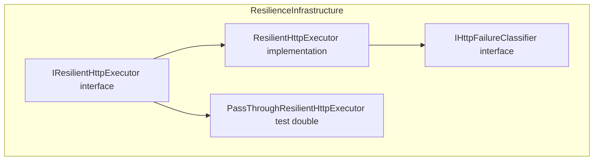

# Resilient HTTP Executor Interface Documentation

## Overview

The **IResilientHttpExecutor** interface defines a contract for executing HTTP requests with built-in resilience (retries, circuit-breaker) in the accrual orchestrator. By abstracting retry, backoff, jitter and circuit-breaker logic behind a simple `SendAsync` method, it allows business code to remain focused on domain concerns rather than transient-fault handling.

This interface lives in the **Infrastructure → Resilience** layer of the application. Implementations plug in centrally configured policies, enabling consistent HTTP behavior across the system and easy substitution of test doubles in unit tests.

---

## Architecture Overview



---

## Interface Definition

```csharp
namespace Rpc.AIS.Accrual.Orchestrator.Infrastructure.Resilience;

public interface IResilientHttpExecutor
{
    Task<HttpResponseMessage> SendAsync(
        HttpClient http,
        Func<HttpRequestMessage> requestFactory,
        RunContext ctx,
        string operationName,
        CancellationToken ct);
}
```

**SendAsync**

Executes an HTTP request with resilience policies applied (retry, backoff, circuit-breaker).

### Method Signature

| Parameter | Type | Description |
| --- | --- | --- |
| `http` | `HttpClient` | The HTTP client instance to send requests. |
| `requestFactory` | `Func<HttpRequestMessage>` | Factory producing a fresh `HttpRequestMessage` per attempt. |
| `ctx` | `RunContext` | Carries `RunId` & `CorrelationId` for structured logging and tracing. |
| `operationName` | `string` | Logical operation name; used in logs and to disable retries for non-idempotent operations. |
| `ct` | `CancellationToken` | Token to observe cancellation. |


**Return:**

`Task<HttpResponseMessage>` containing the final HTTP response (success or non-retryable failure).

---

## 🔌 Purpose & Responsibilities

- **Centralize resilience**: Encapsulate retry/back-off/jitter and circuit-breaker state in one place.
- **Enable consistency**: Ensure all HTTP clients use the same transient-fault policies.
- **Increase testability**: Swap out production executor for a pass-through implementation in tests.

---

## Implementations & Test Doubles

| Class | Path | Role |
| --- | --- | --- |
| **ResilientHttpExecutor** | src/Rpc.AIS.Accrual.Orchestrator.Infrastructure/Resilience/ResilientHttpExecutor.cs | Production executor with retry + circuit-breaker. |
| **PassThroughResilientHttpExecutor** | tests/Rpc.AIS.Accrual.Orchestrator.Tests/TestDoubles/PassThroughResilientHttpExecutor.cs | Test double that directly forwards to `HttpClient`. |


---

## 🔗 Integration Points

- **Dependency Injection**

Registered in the DI container so services can request `IResilientHttpExecutor`.

- **HttpPolicies**

An alternate policy-based approach (via Polly) lives in `HttpPolicies.cs`, but does *not* implement this interface.

- **IHttpFailureClassifier**

Used by `ResilientHttpExecutor` to determine which HTTP responses or exceptions are retryable.

- **RunContext (Core.Domain)**

Supplies correlation identifiers for enriched logging.

---

## ⚙️ Usage Example

```csharp
// 1. Resolve from DI
var executor = serviceProvider.GetRequiredService<IResilientHttpExecutor>();
var client   = httpClientFactory.CreateClient("fscm");

// 2. Define request factory
HttpRequestMessage CreateRequest() =>
    new HttpRequestMessage(HttpMethod.Get, "/api/journals");

// 3. Execute with resilience
HttpResponseMessage response = await executor.SendAsync(
    client,
    CreateRequest,
    new RunContext("run-123", "corr-456"),
    operationName: "FSCM_JOURNAL_FETCH",
    ct: cancellationToken);

if (response.IsSuccessStatusCode)
{
    string json = await response.Content.ReadAsStringAsync(cancellationToken);
    // Process payload…
}
```

---

## Dependencies

- **System.Net.Http**
- **System.Threading** & **System.Threading.Tasks**
- **Rpc.AIS.Accrual.Orchestrator.Core.Domain.RunContext**

---

## 🧪 Testing Considerations

- Inject **PassThroughResilientHttpExecutor** to bypass retry/circuit logic.
- Mock `HttpClient` responses to simulate transient faults and verify retry behavior in `ResilientHttpExecutor` tests.
- Use the `operationName` parameter to confirm non-idempotent operations do not retry.