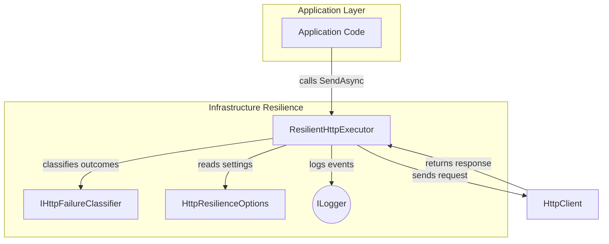

# Resilient HTTP Executor Feature Documentation

## Overview

The **ResilientHttpExecutor** provides a lightweight, dependency-free mechanism to send HTTP requests with built-in retry and circuit-breaker logic. It protects downstream services from transient failures (timeouts, 5xx, 408, 429) by retrying idempotent requests with exponential backoff and optional jitter, while preventing duplicate side effects for non-idempotent or explicitly excluded operations.

By integrating with the `IResilientHttpExecutor` interface, application code gains centralized resilience behavior. Configuration is driven by `HttpResilienceOptions`, and retryability is determined by a pluggable `IHttpFailureClassifier`. Detailed logs capture retry attempts, circuit-breaker state, and failures, aiding observability and diagnostics.

## Architecture Overview



## Component Structure

### ResilientHttpExecutor

**Path:** `src/Rpc.AIS.Accrual.Orchestrator.Infrastructure/Resilience/ResilientHttpExecutor.cs`

- **Purpose:**

Implements `IResilientHttpExecutor` to wrap `HttpClient.SendAsync` with retry and circuit-breaker capabilities.

- **Key Fields:**- `_classifier` (`IHttpFailureClassifier`): Determines if a response or exception should trigger a retry.
- `_opt` (`HttpResilienceOptions`): Holds settings for max attempts, delays, circuit thresholds, and no-retry operations.
- `_logger` (`ILogger<ResilientHttpExecutor>`): Emits structured logs for retries, failures, and circuit events.
- `_consecutiveFailures` (`int`): Tracks consecutive failure count across calls.
- `_openUntil` (`DateTimeOffset?`): When set, marks the circuit as open until the specified time.

- **Constructor:**

```csharp
  public ResilientHttpExecutor(
      IHttpFailureClassifier classifier,
      IOptions<HttpResilienceOptions> options,
      ILogger<ResilientHttpExecutor> logger)
```

- Validates non-null classifier and logger.
- Reads `HttpResilienceOptions` or falls back to defaults.

---

#### SendAsync

```csharp
Task<HttpResponseMessage> SendAsync(
    HttpClient http,
    Func<HttpRequestMessage> requestFactory,
    RunContext ctx,
    string operationName,
    CancellationToken ct)
```

- **Parameters:**- `http`: The `HttpClient` used for sending requests.
- `requestFactory`: Factory delegate to create fresh `HttpRequestMessage` per attempt.
- `ctx`: `RunContext` containing `RunId` and `CorrelationId` for logging.
- `operationName`: Identifier used to disable retries for specific operations.
- `ct`: `CancellationToken` to abort retries.

- **Behavior Highlights:**1. **Circuit-Breaker Gate:**

Throws immediately if `_openUntil` is in the future.

1. **Determine Max Attempts:**

Uses `_opt.MaxAttempts` (minimum 1).

Disables retries (forces 1 attempt) if:

- HTTP method is POST (non-idempotent).
- `operationName` matches any entry in `_opt.NoRetryOperations`.

---

#### IsNoRetryOperation

- **Signature:**

```csharp
  private bool IsNoRetryOperation(string operationName)
```

- **Purpose:**

Disables retries for operations known to be non-idempotent (e.g., journal create/post).

- **Logic:**

Compares `operationName` (trimmed, case-insensitive) against `_opt.NoRetryOperations`.

---

#### RegisterSuccess

- **Signature:**

```csharp
  private void RegisterSuccess()
```

- **Purpose:**

Resets the circuit-breaker by clearing failure count and open timestamp.

- **Effect:**

`_consecutiveFailures = 0; _openUntil = null;`

---

#### RegisterFailureFinal

- **Signature:**

```csharp
  private void RegisterFailureFinal(Exception? ex)
```

- **Purpose:**

Records a terminal failure. Opens the circuit if failure threshold reached.

- **Behavior:**- Increments `_consecutiveFailures`.
- If ≥ `_opt.CircuitBreakerFailureThreshold`:- Sets `_openUntil = now + _opt.CircuitBreakerOpenDuration`.
- Logs a warning with failure count, open-until, and last error message.

---

#### RegisterRetryAsync

- **Signature:**

```csharp
  private Task RegisterRetryAsync(
      RunContext ctx,
      string op,
      int attempt,
      int maxAttempts,
      long? elapsedMs,
      string? status,
      Exception? ex)
```

- **Purpose:**

Logs each retryable failure and enforces the circuit threshold.

- **Behavior:**- Increments `_consecutiveFailures`.
- Logs a warning including operation, attempt numbers, status, timing, run context, and cumulative failures.
- Opens circuit if threshold met.

---

#### DelayBeforeRetryAsync

- **Signature:**

```csharp
  private async Task DelayBeforeRetryAsync(int attempt, CancellationToken ct)
```

- **Purpose:**

Implements **exponential backoff** with optional **random jitter**.

- **Algorithm:**1. Calculate `delayMs = BaseDelay × 2^(min(attempt,8)−1)`, capped at `MaxDelay`.
2. If `UseJitter`, apply a random ±200ms adjustment.
3. Await `Task.Delay(TimeSpan.FromMilliseconds(delayMs), ct)`.

## Dependencies

- **IHttpFailureClassifier** (infrastructure): Central logic for classifying transient HTTP failures and exceptions.
- **HttpResilienceOptions**: Configuration model for retry counts, delays, circuit-breaker thresholds, and non-retryable operations.
- **ILogger<ResilientHttpExecutor>**: Structured logging for retries, successes, failures, and circuit events.
- **RunContext**: Carries `RunId` and `CorrelationId` through retry attempts.
- **HttpClient**: Underlying HTTP transport client.
- **RandomNumberGenerator**: Source of randomness for jitter in backoff delays.

## Error Handling

- **Transient Responses:**

5xx, 408 (Request Timeout), and 429 (Too Many Requests) are considered retryable via `_classifier`.

- **Transient Exceptions:**

`HttpRequestException` and `TaskCanceledException` trigger retries.

- **Circuit Breaker:**

After `_opt.CircuitBreakerFailureThreshold` consecutive failures, the executor rejects new requests until `_opt.CircuitBreakerOpenDuration` elapses.

## Key Classes Reference

| Class | Location | Responsibility |
| --- | --- | --- |
| ResilientHttpExecutor | `src/Rpc.AIS.Accrual.Orchestrator.Infrastructure/Resilience/ResilientHttpExecutor.cs` | Executes HTTP calls with retry and circuit-breaker behavior. |


## Caching Strategy

This component does **not** implement any caching.

## Testing Considerations

No direct unit tests for `ResilientHttpExecutor` are included in the provided context. Testing should simulate transient failures, circuit-breaker open state, and verify logging and backoff timing.